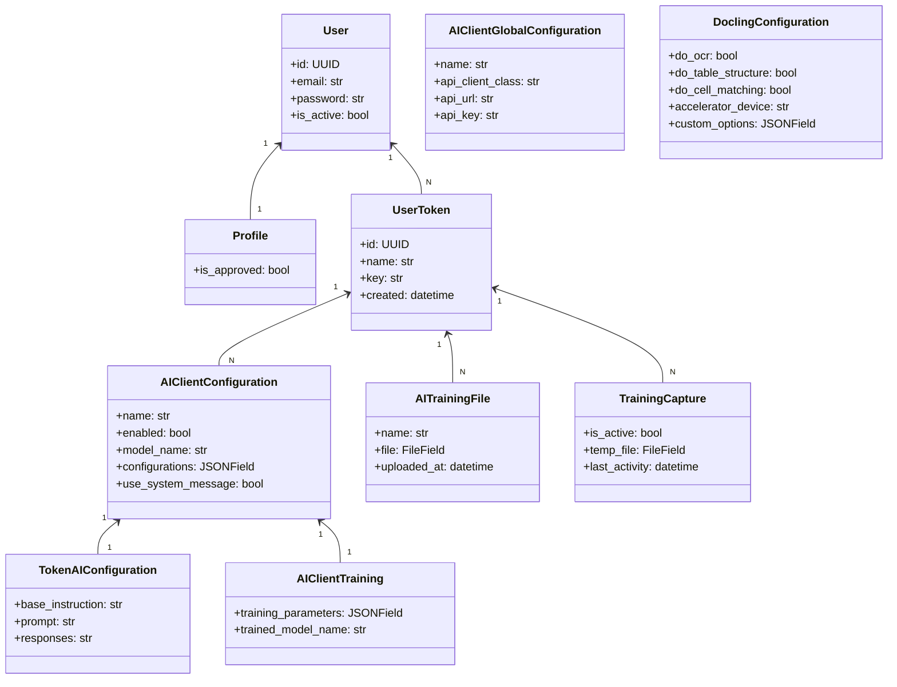
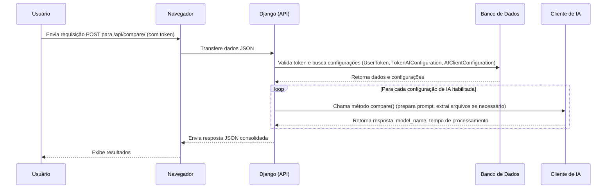

<p align="center">

</p>

# EnsinaNet.AI


O **EnsinaNet.AI** é uma aplicação web desenvolvida em Django que permite corrigir atividades de redes de computadores utilizando múltiplos serviços de inteligência artificial (IA). A aplicação integra autenticação personalizada, gerenciamento de tokens e uma API REST robusta que orquestra chamadas a diversos provedores de IA – como OpenAI, Azure, Anthropic, Google Gemini, Llama e Perplexity – possibilitando análises detalhadas e customizáveis por usuário.

---

## Índice

- [Funcionalidades Principais](#funcionalidades-principais)
  - [Autenticação e Tokens](#autenticação-e-tokens)
  - [Configuração de IA](#configuração-de-ia)
  - [API de Comparação](#api-de-comparação)
  - [Versionamento da API](#versionamento-da-api)
  - [Interface Pública](#interface-pública)
- [Instalação e Configuração](#instalação-e-configuração)
  - [Pré-requisitos](#pré-requisitos)
  - [Passos de Instalação](#passos-de-instalação)
  - [Variáveis de Ambiente](#variáveis-de-ambiente)
- [Uso da API](#uso-da-api)
- [Estrutura do Projeto](#estrutura-do-projeto)
- [Diagramas](#diagramas)
- [Testes](#testes)
- [Tecnologias Utilizadas](#tecnologias-utilizadas)
- [Contribuindo](#contribuindo)
- [Documentação Adicional](#documentação-adicional)
- [FAQ](#faq)
- [Licença](#licença)
- [Contato e Suporte](#contato-e-suporte)

---

## Funcionalidades Principais

### Autenticação e Tokens
- **Login via Email:** Utiliza um backend customizado (`accounts/backends.py`) que permite autenticação usando o email.
- **Confirmação de Email:** O cadastro exige que o usuário confirme seu endereço de email para ativar a conta.
- **Perfis e Aprovação:** Cada usuário tem um `Profile` associado, que pode ser aprovado pelo administrador.
- **Tokens de API:** Usuários aprovados podem criar tokens exclusivos (modelo `UserToken`) para acessar os endpoints da API. Estes tokens podem ser gerenciados (criados, editados e excluídos) através da interface.

### Configuração de IA
- **Múltiplos Clientes de IA:** O sistema suporta diversos provedores configurados globalmente (em `ai_config/models.py`):
  - **OpenAI** (GPT-3.5, GPT-4)
  - **Azure**
  - **Anthropic**
  - **Google Gemini**
  - **Llama**
  - **Perplexity**
- **Configuração Específica por Token:** Para cada token, é possível definir:
  - **Modelo:** Escolha do modelo de IA (ex.: `gpt-3.5-turbo`, `gemini-pro`).
  - **Parâmetros Personalizados:** Ajuste de parâmetros como `temperature`, `top_k`, etc.
  - **Instrução Base (System Message):** Definição de uma instrução base que, se suportada pelo provedor, orienta a resposta.
  - **Prompt Personalizado:** Texto que complementa a instrução para a IA.
  - **Upload de Arquivos de Treinamento:** Permite enviar arquivos (JSON) para treinamento.
- **Captura de Exemplos:** Mecanismo (modelo `TrainingCapture`) que permite capturar, durante o uso da API, exemplos (prompt e resposta) para posterior fine-tuning.
- **Upload de Arquivos:** Permite enviar arquivos (PDF, DOCX) para extração de texto (utilizando Docling via `api/utils/docling_doc_converter.py` e `api/utils/doc_extractor.py`).

### API de Comparação

  #### Versionamento da API

  O EnsinaNet.AI implementa versionamento de API para garantir compatibilidade com diferentes versões de clientes e possibilitar atualizações sem impactar usuários existentes.

  ##### Métodos de Versionamento Implementados

  - **`URLPathVersioning`**: A versão é definida diretamente na URL, por exemplo:
    ```
    /api/v1/compare/
    /api/v2/compare/
    ```
  - **`NamespaceVersioning`**: Cada versão da API é organizada em namespaces distintos, permitindo modularidade na evolução dos endpoints.

  ##### Como Utilizar as Versões da API

  Para acessar uma versão específica da API, inclua a versão na URL da requisição. Exemplo para a versão 1:

  ```bash
  curl -X POST http://127.0.0.1:8000/api/v1/compare/ \
    -H "Authorization: Token SEU_TOKEN_AQUI" \
    -H "Content-Type: application/json" \
    -d '{
          ....
        }'
  ```

  ##### Benefícios do Versionamento

  - Permite mudanças na API sem impactar clientes que utilizam versões anteriores.
  - Oferece flexibilidade para evolução e aprimoramento dos endpoints.
  - Facilita a manutenção e introdução de novas funcionalidades sem quebras de compatibilidade.

  ---

  #### Versão 1
  - **Endpoint Principal:** `/api/v1/compare/` (método POST).
  - **Autenticação:** As requisições devem incluir o token no header:
    ```http
    Authorization: Token <seu_token>
    ```
  - **Formato da Requisição (JSON):**  
    O payload deve conter dois objetos principais:
    - `instructor`: Dados do instrutor.
    - `students`: Objeto onde cada chave representa um identificador único para um aluno e o valor é um objeto com os dados do aluno.
    
    *Observação:* Cada campo enviado pode ser um texto simples ou um objeto do tipo _file_. Caso seja um arquivo, o objeto deverá conter as chaves:
    - `"type": "file"`
    - `"name"`: Nome do arquivo (para inferir o formato, ex.: `.pdf`, `.docx`)
    - `"content"`: Conteúdo codificado em base64.
    
    **Exemplo de Request:**
    ```json
      {
        "instructor": {
            "lab": {
                "config": "'PC-B': 'set pcname PC-B \n ip 192.168.1.11 24', 'S1': ' ' ",
                "network": " {'2': {'PC-B': 'eth0', 'S2': 'e0/0'}, '1': {'S1': 'e0/0', 'PC-A': 'eth0'}"
            },
            "instruction": {
                "name": "Nome do arquivo de instrução",
                "content": "Conteúdo do arquivo de instrução codificado em base64",
                "type": "file"
            }
        },
        "students": {
            "aluno1": {
                "lab": {
                  "config": "'PC-B': 'set pcname PC-B \n ip 192.168.1.11 24', 'S1': ' ' ",
                  "network": " {'2': {'PC-B': 'eth0', 'S2': 'e0/0'}, '1': {'S1': 'e0/0', 'PC-A': 'eth0'}"
                },
                "answers": {
                    "name": "Nome do arquivo de resposta",
                    "content": "Conteúdo do arquivo de resposta codificado em base64",
                    "type": "file"
                }
            },
            "aluno2": {
                "answers": {
                    "name": "Nome do arquivo de resposta",
                    "content": "Conteúdo do arquivo de resposta codificado em base64",
                    "type": "file"
                }
            },
            "aluno3": {
                "lab": {
                  "config": "'PC-B': 'set pcname PC-B \n ip 192.168.1.11 24', 'S1': ' ' ",
                  "network": " {'2': {'PC-B': 'eth0', 'S2': 'e0/0'}, '1': {'S1': 'e0/0', 'PC-A': 'eth0'}"
                },
            },
            
        }
    }
    ```

  - **Formato da Resposta (JSON):**
    A resposta retorna, para cada aluno, um objeto com os resultados de cada cliente de IA configurado e habilitado:

    ```json
      {
          "students": {
              "aluno1": {
                  "OpenAi": {
                      "response": "Resultado da comparação...(Em Markdown)",
                      "model_name": "gpt-3.5-turbo",
                      "configurations": { "temperature": 0.7 },
                      "processing_time": 0.123
                  },
                  "Gemini": {
                      "response": "Outro resultado... (Em Markdown)",
                      "model_name": "gemini-pro",
                      "configurations": {},
                      "processing_time": 0.234
                  }
              },
              "aluno2": {
                  "OpenAi": {
                      "response": "Resultado da comparação...",
                      "model_name": "gpt-4",
                      "configurations": { "temperature": 0.5 },
                      "processing_time": 0.456
                  },
                  "Gemini": {
                      "error": "Descrição do erro específico",
                  }
              },
              "aluno3": {
                  "OpenAi": {
                      "error": "Descrição do erro específico",
                  },
                  "Gemini": {
                      "response": "Outro resultado... (Em Markdown)",
                      "model_name": "gemini-pro",
                      "configurations": {},
                      "processing_time": 0.234
                  }
              }
          }
      }
      ```
      *Nota:* Se ocorrer um erro, o objeto correspondente incluirá um campo `"error"` com a mensagem.

      Se ocorrer um erro geral na consulta só a mensagem de erro serra enviada. 
      ```json
      {
        "error": "Descrição do erro Geral", 
      }
      ```


### Interface Pública
- **Página Inicial:** Exibe informações básicas sobre a API, exemplos de uso e links para login/registro.

---

## Instalação e Configuração

### Pré-requisitos
- Python 3.10+
- Git
- Virtualenv (recomendado)
- Banco de Dados (por padrão, SQLite; para produção, considere PostgreSQL)
- Redis (para cache, se configurado)

### Passos de Instalação

1. **Clone o Repositório:**
   ```bash
   git clone https://github.com/diegogrosmann/EnsinaNet.AI.git
   cd EnsinaNet.AI
   ```

2. **Crie e Ative um Ambiente Virtual:**
   ```bash
   python -m venv venv
   # Linux/macOS:
   source venv/bin/activate
   # Windows:
   venv\Scripts\activate
   ```

3. **Instale as Dependências:**
   ```bash
   pip install -r requirements.txt
   ```

4. **Configure as Variáveis de Ambiente:**

   Crie um arquivo `.env` na raiz (ao lado do `manage.py`) e defina as variáveis necessárias, por exemplo:
   ```env
   SECRET_KEY=sua_chave_secreta_super_segura
   DEBUG=True
   ALLOWED_HOSTS=*
   
   # Configurações de Email (exemplo com Gmail):
   EMAIL_HOST=smtp.gmail.com
   EMAIL_PORT=587
   EMAIL_USE_TLS=True
   EMAIL_HOST_USER=seu_email@gmail.com
   EMAIL_HOST_PASSWORD=sua_senha_de_aplicativo
   DEFAULT_FROM_EMAIL=seu_email@gmail.com
   ADMIN_EMAIL=admin@seusite.com

   # Configuração do Google Cloud (para Gemini):
   GOOGLE_APPLICATION_CREDENTIALS=path/to/your/credentials.json

   # Chaves de API para provedores de IA:
   OPENAI_API_KEY=sk-...
   ANTHROPIC_API_KEY=...
   # Adicione outras chaves conforme necessário (Azure, Llama, Perplexity, etc.)
   ```

5. **Configure Arquivos Estáticos:**

   No arquivo `myproject/settings.py`, configure:
   ```python
   STATIC_ROOT = os.path.join(BASE_DIR, 'staticfiles')
   ```
   E execute:
   ```bash
   python manage.py collectstatic
   ```

6. **Execute as Migrações:**
   ```bash
   python manage.py migrate
   ```

7. **Crie um Superusuário:**
   ```bash
   python manage.py createsuperuser
   ```

8. **Inicie o Servidor de Desenvolvimento:**
   ```bash
   python manage.py runserver
   ```
   Acesse a aplicação em [http://127.0.0.1:8000/](http://127.0.0.1:8000/)

---

## Uso da API

### Autenticação
- Crie um token de API na área de gerenciamento (após fazer login).
- Use o token nas requisições, enviando-o no header:
  ```http
  Authorization: Token <seu_token>
  ```

### Exemplo de Uso com cURL
### Exemplo de Uso com cURL (Versão 1 da API)
```bash
curl -X POST http://127.0.0.1:8000/api/v1/compare/ \
  -H "Authorization: Token SEU_TOKEN_AQUI" \
  -H "Content-Type: application/json" \
  -d '{
        "instructor": {
            "instruction": { "type": "text", "content": "Compare as configurações de rede." },
            "config": { "type": "file", "name": "config_instrutor.txt", "content": "BASE64_ENCODED_CONTENT" }
        },
        "students": {
            "aluno1": {
                "config": { "type": "file", "name": "config_aluno1.txt", "content": "BASE64_ENCODED_CONTENT" },
                "network": { "type": "text", "content": "Rede do aluno 1" }
            }
        }
      }'
```

### Exemplo de Response
A resposta será um JSON com os resultados de cada cliente de IA configurado:
```json
{
    "students": {
        "aluno1": {
            "OpenAi": {
                "response": "Resultado da comparação...",
                "model_name": "gpt-3.5-turbo",
                "configurations": { "temperature": 0.7 },
                "processing_time": 0.123
            },
            "Gemini": {
                "response": "Outro resultado...",
                "model_name": "gemini-pro",
                "configurations": {},
                "processing_time": 0.234
            }
        }
    }
}
```

---

## Estrutura do Projeto

```plaintext
EnsinaNet.AI/
├── accounts/              # Autenticação, perfis, tokens, views, formulários, signals, etc.
│   ├── backends.py        # Autenticação personalizada via email
│   ├── context_processors.py
│   ├── forms.py
│   ├── models.py          # Profile, UserToken
│   ├── signals.py
│   ├── templates/         # Templates para registro, login, gerenciamento, emails
│   ├── urls.py
│   ├── views.py
│   └── migrations/
├── ai_config/             # Configuração de IA, treinamento, arquivos, etc.
│   ├── forms.py
│   ├── models.py          # AIClientGlobalConfiguration, AIClientConfiguration, TokenAIConfiguration, AITrainingFile, AIClientTraining, TrainingCapture, DoclingConfiguration
│   ├── storage.py         # OverwriteStorage (para sobrescrever arquivos)
│   ├── templatetags/       # Filtros customizados (ex: basename)
│   ├── templates/         # Templates para configurações de IA e treinamento
│   ├── urls.py
│   ├── utils.py           # Funções utilitárias, ex: perform_training
│   └── migrations/
├── api/                   # Endpoints da API REST
│   ├── constants.py       # Definições de configuração para clientes de IA
│   ├── exceptions.py      # Exceções customizadas
│   ├── middleware.py      # Middleware para tratamento global de erros
│   ├── urls.py
│   ├── views.py           # Endpoint /api/compare/
│   ├── utils/
│   │   ├── clientsIA.py   # Clientes de IA (OpenAiClient, GeminiClient, etc.)
│   │   ├── doc_extractor.py  # Extração de texto de arquivos (utilizando Docling)
│   │   └── docling_doc_converter.py
│   └── exception_handlers.py
├── public/                # Interface pública (página inicial, etc.)
│   ├── templates/
│   │   └── public/        # Templates públicos
│   ├── urls.py
│   ├── views.py
│   └── migrations/
├── _build/html/           # Documentação gerada pelo Sphinx
├── docs/                  # (Opcional) Arquivos fonte da documentação Sphinx
├── manage.py              # Script para comandos administrativos do Django
├── myproject/             # Configurações gerais do projeto
│   ├── settings.py
│   ├── urls.py
│   ├── asgi.py
│   ├── wsgi.py
│   └── __init__.py
└── requirements.txt       # Lista de dependências do projeto
```

---

## Diagramas

### Diagrama de Classes



### Diagrama de Sequência (Processo de Comparação)



---

## Testes

> **Atenção:** Atualmente, não há testes implementados. Contribuições para a criação de testes unitários e de integração são muito bem-vindas!

Para executar os testes (quando disponíveis), utilize:
```bash
python manage.py test
```

---

## Tecnologias Utilizadas

- **Django (v4.2+)**: Framework web principal.
- **Django REST Framework (v3.15+)**: Criação dos endpoints REST.
- **Allauth e dj-rest-auth**: Gerenciamento de autenticação e registro de usuários.
- **Clientes de IA**: OpenAI, Azure OpenAI, Anthropic, Google Gemini, Llama, Perplexity.
- **Docling (v2.17.0)**: Extração de texto de documentos (PDF, DOCX).
- **python-dotenv (v1.0.1)**: Gerenciamento de variáveis de ambiente.
- **Requests (v2.32.3)**: Realização de requisições HTTP.
- **Gunicorn (v22.0.0)**: Servidor WSGI para produção.
- **Bootstrap (v5.3.2)**: Framework CSS para a interface.
- **TinyMCE (django-tinymce v4.1.0)**: Editor de texto (opcional).
- **Sphinx**: Geração de documentação (opcional).

---

## Contribuindo

Contribuições são muito bem-vindas! Para contribuir:

1. Faça um _fork_ deste repositório.
2. Crie uma branch para sua feature ou correção:
   ```bash
   git checkout -b feature/minha-feature
   ```
3. Faça _commits_ com suas alterações, seguindo as convenções de código (PEP 8).
4. Execute os testes (quando implementados):
   ```bash
   python manage.py test
   ```
5. Envie sua branch para o repositório remoto:
   ```bash
   git push origin feature/minha-feature
   ```
6. Abra um Pull Request no repositório original, descrevendo suas alterações e referências a issues (se houver).

---

## Documentação Adicional

A documentação completa (gerada pelo Sphinx) está disponível na pasta `_build/html/` ou online (link a ser definido). Para gerar a documentação localmente:

```bash
cd docs
make html
```

---

## FAQ

**Como recuperar minha senha?**  
Utilize a opção "Esqueci minha senha" na página de login para receber instruções via email.

**Meu token não está funcionando. O que fazer?**  
- Verifique se sua conta foi aprovada pelo administrador.  
- Confirme se o token foi criado corretamente na área de gerenciamento.  
- Assegure-se de enviar o token corretamente no header `Authorization`.

**Como configurar um novo cliente de IA?**  
Acesse o painel de administração (`/admin/`), vá para a seção "Global - Clientes de IA" e adicione uma nova configuração global, informando o nome, a classe do cliente (ex.: OpenAi, Gemini) e a chave de API. Em seguida, associe essa configuração ao seu token na área de gerenciamento de tokens.

**Como carregar um arquivo de treinamento?**  
Na área de gerenciamento de tokens, selecione o token desejado e utilize o formulário de upload para enviar o arquivo de treinamento. O arquivo deve ser codificado em base64 quando enviado via API.

**Quais formatos de arquivo são suportados?**  
A API suporta a extração de texto de arquivos PDF e DOCX, utilizando Docling.

**Como funciona a captura de exemplos (TrainingCapture)?**  
Durante o uso da API, se a captura estiver ativa, os exemplos (prompt e resposta) serão salvos temporariamente para que possam ser usados no treinamento futuro.

---

## Licença

Este projeto está licenciado sob a **MIT License**.

```
MIT License

Copyright (c) 2025 Diego Grosmann

Permission is hereby granted, free of charge, to any person obtaining a copy
of this software and associated documentation files (the "Software"), to deal
in the Software without restriction, including without limitation the rights
to use, copy, modify, merge, publish, distribute, sublicense, and/or sell
copies of the Software, and to permit persons to whom the Software is
furnished to do so, subject to the following conditions:

[O aviso de copyright acima e
este aviso de permissão devem ser incluídos em todas as cópias ou partes significativas do Software.]
```

---

## Contato e Suporte

Para dúvidas ou suporte, abra uma _issue_ no GitHub ou envie um email para [diegogrosmann@gmail.com].
