<p align="center">

</p>

# EnsinaNet.AI


## Visão Geral

O **EnsinaNet.AI** é uma aplicação web desenvolvida em Django que permite corrigir atividades de redes de computadores utilizando múltiplos serviços de inteligência artificial (IA). A aplicação integra autenticação personalizada, gerenciamento de tokens e uma API REST robusta que orquestra chamadas a diversos provedores de IA – como OpenAI, Azure, Anthropic, Google Gemini, Llama e Perplexity – possibilitando análises detalhadas e customizáveis por usuário.

## Índice

- [Visão Geral](#visão-geral)
- [Funcionalidades Principais](#funcionalidades-principais)
  - [Autenticação e Tokens](#autenticação-e-tokens)
  - [Configuração de IA](#configuração-de-ia)
  - [API de Comparação](#api-de-comparação)
    - [Versionamento da API](#versionamento-da-api)
    - [Versão 1](#versão-1)
  - [Interface Pública](#interface-pública)
- [Guia de Início Rápido](#guia-de-início-rápido)
  - [Pré-requisitos](#pré-requisitos)
  - [Instalação](#instalação)
  - [Configuração](#configuração)
- [Documentação da API](#documentação-da-api)
- [Arquitetura](#arquitetura)
  - [Estrutura de Diretórios](#estrutura-de-diretórios)
  - [Diagramas](#diagramas)
- [Desenvolvimento](#desenvolvimento)
  - [Como Contribuir](#como-contribuir)
  - [Testes](#testes)
  - [Tecnologias Utilizadas](#tecnologias-utilizadas)
- [Testes](#testes)
- [Suporte](#suporte)
  - [FAQ](#faq)
  - [Documentação Adicional](#documentação-adicional)
  - [Contato](#contato)
- [Informações Legais](#informações-legais)
  - [Licença](#licença)

---

## Funcionalidades Principais

### Autenticação e Tokens
- **Login via Email:** Utiliza um backend customizado (`accounts/backends.py`) que permite autenticação usando o email.
- **Confirmação de Email:** O cadastro exige que o usuário confirme seu endereço de email para ativar a conta.
- **Perfis e Aprovação:** Cada usuário tem um `Profile` associado, que pode ser aprovado pelo administrador.
- **Tokens de API:** Usuários aprovados podem criar tokens exclusivos (modelo `UserToken`) para acessar os endpoints da API. Estes tokens podem ser gerenciados (criados, editados e excluídos) através da interface.

### Configuração de IA
- **Múltiplos Clientes de IA:** O sistema suporta diversos provedores configurados globalmente (em `ai_config/models.py`):
  - **OpenAI**
  - **Azure**
  - **Anthropic**
  - **Google Gemini**
  - **Llama**
  - **Perplexity**
- **Configuração Específica por Token:** Para cada token, é possível definir:
  - **Modelo:** Escolha do modelo de IA (ex.: `gpt-3.5-turbo`, `gemini-pro`).
  - **Parâmetros Personalizados:** Ajuste de parâmetros como `temperature`, `top_k`, etc.
  - **Instrução Base (System Message):** Definição de uma instrução base que, se suportada pelo provedor, orienta a resposta.
  - **Prompt Personalizado:** Texto que complementa a instrução para a IA.
  - **Upload de Arquivos de Treinamento:** Permite enviar arquivos (JSON) para treinamento.
- **Captura de Exemplos:** Mecanismo (modelo `TrainingCapture`) que permite capturar, durante o uso da API, exemplos (prompt e resposta) para posterior fine-tuning.

### API de Comparação

  #### Versionamento da API

  O EnsinaNet.AI implementa versionamento de API para garantir compatibilidade com diferentes versões de clientes e possibilitar atualizações sem impactar usuários existentes.

  ##### Métodos de Versionamento Implementados

  - **`URLPathVersioning`**: A versão é definida diretamente na URL, por exemplo:
    ```
    /api/v1/compare/
    /api/v2/compare/
    ```
  - **`NamespaceVersioning`**: Cada versão da API é organizada em namespaces distintos, permitindo modularidade na evolução dos endpoints.

  ##### Como Utilizar as Versões da API

  Para acessar uma versão específica da API, inclua a versão na URL da requisição. Exemplo para a versão 1:

  ```bash
  curl -X POST http://127.0.0.1:8000/api/v1/compare/ \
    -H "Authorization: Token SEU_TOKEN_AQUI" \
    -H "Content-Type: application/json" \
    -d '{
          ....
        }'
  ```

  ---

  #### Versão 1
  - **Endpoint Principal:** `/api/v1/compare/` (método POST)
  - **Autenticação:** Requer token no header:
    ```http
    Authorization: Token <seu_token>
    ```
  - **Formato da Requisição (JSON):**
    O payload deve conter:
    - `instructor`: Dados do instrutor (config, network, instruction)
    - `students`: Objeto com dados dos alunos

    ```json
    {
      "instructor": {
        "lab": {
          "config": {
            "PC-B": "set pcname PC-B \n ip 192.168.1.11 24",
            "S1": ""
          },
          "network": {
            "1": {
              "PC-B": "eth0",
              "S2": "e0/0"
            },
            "2": {
              "S1": "e0/0",
              "PC-A": "eth0"
            }
          }
        },
        "instruction": {
          "type": "file",
          "name": "instructions.pdf",
          "content": "base64_encoded_content"
        }
      },
      "students": {
        "aluno1": {
          // Similar structure to instructor
        }
      }
    }
    ```

  - **Resposta:**
    ```json
    {
      "students": {
        "aluno1": {
          "OpenAi": {
            "response": "Resultado formatado em Markdown",
            "model_name": "gpt-3.5-turbo",
            "configurations": { "temperature": 0.7 },
            "processing_time": 0.123
          }
        }
      }
    }
    ```

### Interface Pública
- **Página Inicial:** Exibe informações básicas sobre a API, exemplos de uso e links para login/registro.

---

## Guia de Início Rápido

### Pré-requisitos
- Python 3.10+
- Git
- Virtualenv (recomendado)
- Banco de Dados (por padrão, SQLite; para produção, considere PostgreSQL)
- Redis (para cache, se configurado)

### Instalação

1. **Clone o Repositório:**
   ```bash
   git clone https://github.com/diegogrosmann/EnsinaNet.AI.git
   cd EnsinaNet.AI
   ```

2. **Crie e Ative um Ambiente Virtual:**
   ```bash
   python -m venv venv
   # Linux/macOS:
   source venv/bin/activate
   # Windows:
   venv\Scripts\activate
   ```

3. **Instale as Dependências:**
   ```bash
   pip install -r requirements.txt
   ```

4. **Configure as Variáveis de Ambiente:**

    Crie um arquivo `.env` na raiz do projeto (ao lado do `manage.py`) copiando o conteúdo do arquivo `.env.example` e preencha as variáveis necessárias.

    Use o comando:

    ```bash
      # Linux/macOS:
      cp .env.example .env
      # Windows:
      copy .env.example .env
    ```

    Gere uma chave secreta forte com Django: 
    ```bash
      # Linux/macOS:
      python -c 'from django.core.management.utils import get_random_secret_key; print(get_random_secret_key())'
      # Windows:
      python -c "from django.core.management.utils import get_random_secret_key; print(get_random_secret_key())"
    ```

    Edite o arquivo `.env` e defina as variáveis:
    ```env
      SECRET_KEY=#Insira a chave gerada
      EMAIL_HOST_USER=smtp.gmail.com
      EMAIL_HOST_PASSWORD=sua_senha
      ADMIN_EMAIL=seu_email@gmail.com
      DEFAULT_FROM_EMAIL=NetEnsina.AI <seu_email@gmail.com>
    ```


5. **Configure Arquivos Estáticos:**

   No arquivo `myproject/settings.py`, configure:
   ```python
   STATIC_ROOT = os.path.join(BASE_DIR, 'staticfiles')
   ```
   E execute:
   ```bash
   python manage.py collectstatic
   ```

6. **Execute as Migrações:**
   ```bash
   python manage.py migrate
   ```

7. **Crie um Superusuário:**
   ```bash
   python manage.py createsuperuser
   ```

8. **Inicie o Servidor de Desenvolvimento:**
   ```bash
   python manage.py runserver
   ```
   Acesse a aplicação em [http://127.0.0.1:8000/](http://127.0.0.1:8000/)

---

## Arquitetura

### Estrutura de Diretórios

```plaintext
.
├── accounts/                                    # App de gerenciamento de usuários e autenticação
│   ├── backends.py                             # Backend customizado para autenticação por email
│   ├── views.py                               # Views para registro, login e gerenciamento de tokens
│   ├── models.py                              # Modelos para Profile e UserToken
│   ├── forms.py                               # Formulários de autenticação e gerenciamento
│   └── templates/                             # Templates relacionados a contas e autenticação
├── ai_config/                                  # App de configuração das IAs
│   ├── utils.py                               # Utilitários para treinamento e configuração de IA
│   ├── models.py                              # Modelos para configurações e treinamento de IA
│   ├── views.py                               # Views para gerenciamento de configurações de IA
│   └── templates/                             # Templates para configuração e treinamento
├── api/                                        # App principal da API REST
│   ├── v1/                                    # Implementação da versão 1 da API
│   │   ├── views.py                           # Views da API v1 (endpoint compare)
│   │   └── urls.py                            # Roteamento da API v1
│   ├── utils/                                 # Utilitários da API
│   │   ├── clientsIA.py                       # Implementação dos clientes de IA (OpenAI, Gemini, etc)
│   │   ├── doc_extractor.py                   # Extrator de texto de documentos
│   │   └── docling_doc_converter.py           # Conversor de documentos usando Docling
│   ├── constants.py                           # Constantes e configurações da API
│   └── exceptions.py                          # Exceções customizadas da API
├── public/                                     # App para páginas públicas
│   ├── views.py                               # Views para páginas públicas
│   └── templates/                             # Templates públicos (landing page)
├── templates/                                  # Templates globais do projeto
│   └── base.html                              # Template base para herança
├── myproject/                                 # Configurações do projeto Django
│   ├── urls.py                                # URLs principais do projeto
│   └── settings.py                            # Configurações do Django
├── manage.py                                  # Script de gerenciamento do Django
├── requirements.txt                           # Dependências do projeto
└── static/                                    # Arquivos estáticos
    └── img/                                   # Imagens do projeto
        └── logo_slogan.png                    # Logo do projeto
```

### Diagramas

### Diagrama de Classes

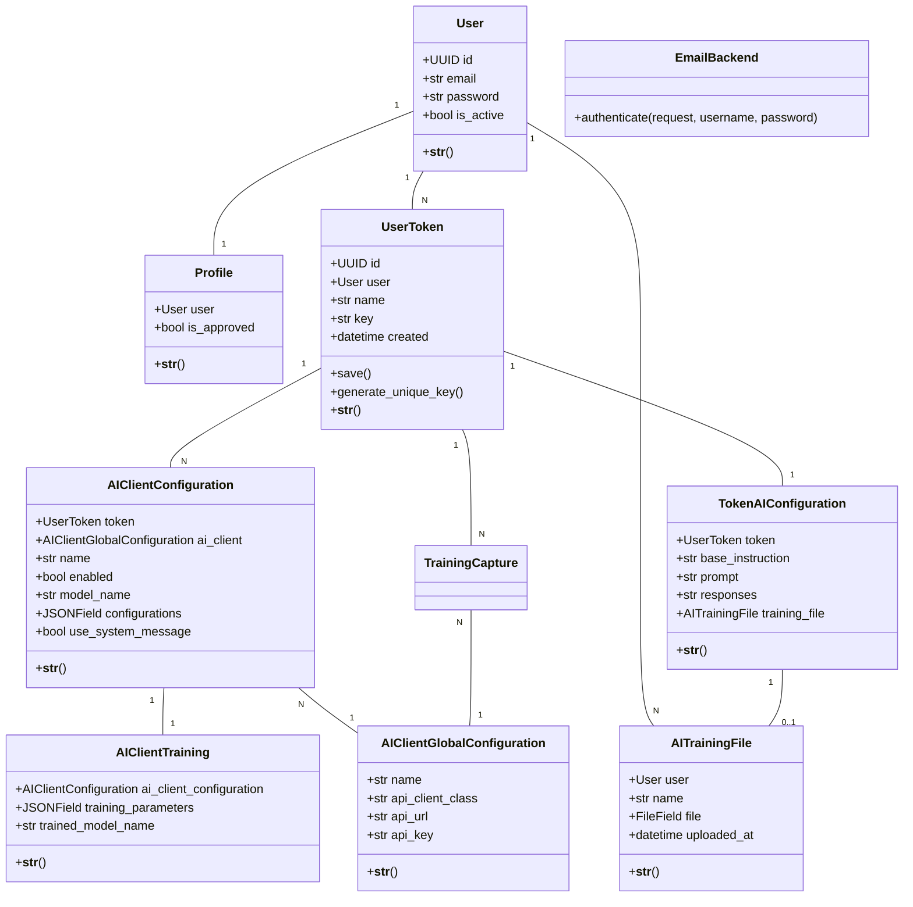
```mermaid
classDiagram
    %% Accounts App
    class User {
        +UUID id
        +str email
        +str password
        +bool is_active
        +__str__()
    }
    class Profile {
        +User user
        +bool is_approved
        +__str__()
    }
    class UserToken {
        +UUID id
        +User user
        +str name
        +str key
        +datetime created
        +save()
        +generate_unique_key()
        +__str__()
    }
    class EmailBackend {
        +authenticate(request, username, password)
    }

    %% AI Config App
    class AIClientGlobalConfiguration {
        +str name
        +str api_client_class
        +str api_url
        +str api_key
        +__str__()
    }
    class AIClientConfiguration {
        +UserToken token
        +AIClientGlobalConfiguration ai_client
        +str name
        +bool enabled
        +str model_name
        +JSONField configurations
        +bool use_system_message
        +__str__()
    }
    class TokenAIConfiguration {
        +UserToken token
        +str base_instruction
        +str prompt
        +str responses
        +AITrainingFile training_file
        +__str__()
    }
    class AITrainingFile {
        +User user
        +str name
        +FileField file
        +datetime uploaded_at
        +__str__()
    }
    class AIClientTraining {
        +AIClientConfiguration ai_client_configuration
        +JSONField training_parameters
        +str trained_model_name
        +__str__()
    }
    
    %% Relationships
    User "1" -- "1" Profile
    User "1" -- "N" UserToken
    User "1" -- "N" AITrainingFile
    UserToken "1" -- "N" AIClientConfiguration
    UserToken "1" -- "1" TokenAIConfiguration
    UserToken "1" -- "N" TrainingCapture
    AIClientConfiguration "1" -- "1" AIClientTraining
    AIClientConfiguration "N" -- "1" AIClientGlobalConfiguration
    TrainingCapture "N" -- "1" AIClientGlobalConfiguration
    TokenAIConfiguration "1" -- "0..1" AITrainingFile

```

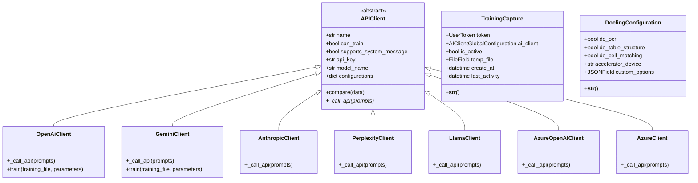
```mermaid
classDiagram
    %% API App
    class APIClient {
        <<abstract>>
        +str name
        +bool can_train
        +bool supports_system_message
        +str api_key
        +str model_name
        +dict configurations
        +compare(data)
        +_call_api(prompts)*
    }
    class OpenAiClient {
        +_call_api(prompts)
        +train(training_file, parameters)
    }
    class GeminiClient {
        +_call_api(prompts)
        +train(training_file, parameters)
    }
    class AnthropicClient {
        +_call_api(prompts)
    }
    class PerplexityClient {
        +_call_api(prompts)
    }
    class LlamaClient {
        +_call_api(prompts)
    }
    class AzureOpenAIClient {
        +_call_api(prompts)
    }
    class AzureClient {
        +_call_api(prompts)
    }

    class TrainingCapture {
        +UserToken token
        +AIClientGlobalConfiguration ai_client
        +bool is_active
        +FileField temp_file
        +datetime create_at
        +datetime last_activity
        +__str__()
    }
    class DoclingConfiguration {
        +bool do_ocr
        +bool do_table_structure
        +bool do_cell_matching
        +str accelerator_device
        +JSONField custom_options
        +__str__()
    }

    %% API Client Inheritance
    APIClient <|-- OpenAiClient
    APIClient <|-- GeminiClient
    APIClient <|-- AnthropicClient
    APIClient <|-- PerplexityClient
    APIClient <|-- LlamaClient
    APIClient <|-- AzureOpenAIClient
    APIClient <|-- AzureClient
```

### Diagramas de Sequência

#### 1. Autenticação e Gerenciamento de Usuários

##### 1.1. Processo de Registro e Confirmação de Email
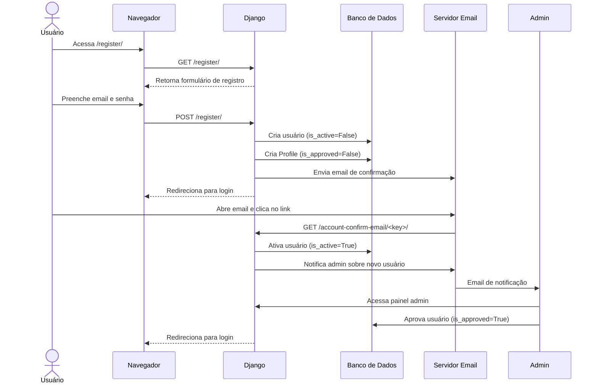
```mermaid
sequenceDiagram
    actor U as Usuário
    participant N as Navegador
    participant D as Django
    participant DB as Banco de Dados
    participant E as Servidor Email
    participant A as Admin

    U->>N: Acessa /register/
    N->>D: GET /register/
    D-->>N: Retorna formulário de registro
    U->>N: Preenche email e senha
    N->>D: POST /register/
    D->>DB: Cria usuário (is_active=False)
    D->>DB: Cria Profile (is_approved=False)
    D->>E: Envia email de confirmação
    D-->>N: Redireciona para login
    U->>E: Abre email e clica no link
    E->>D: GET /account-confirm-email/<key>/
    D->>DB: Ativa usuário (is_active=True)
    D->>E: Notifica admin sobre novo usuário
    E->>A: Email de notificação
    A->>D: Acessa painel admin
    A->>DB: Aprova usuário (is_approved=True)
    D-->>N: Redireciona para login
```

##### 1.2. Processo de Login com Email
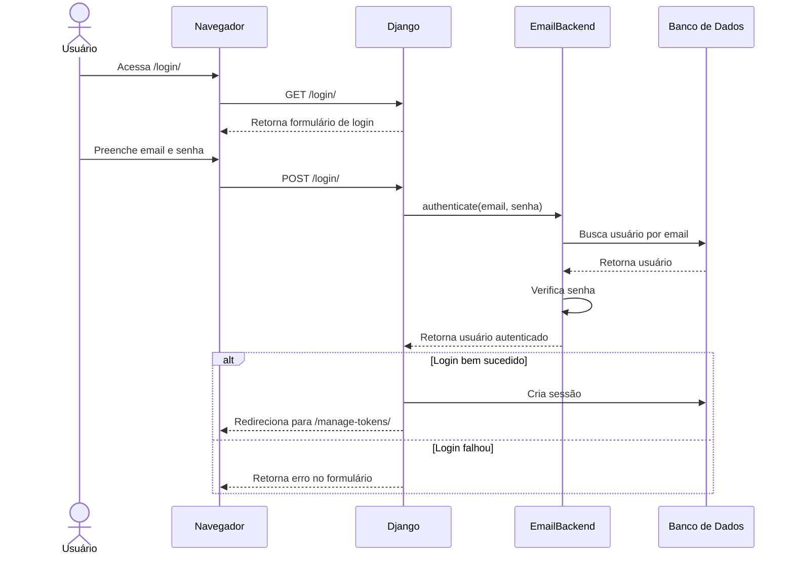
```mermaid
sequenceDiagram
    actor U as Usuário
    participant N as Navegador
    participant D as Django
    participant EB as EmailBackend
    participant DB as Banco de Dados

    U->>N: Acessa /login/
    N->>D: GET /login/
    D-->>N: Retorna formulário de login
    U->>N: Preenche email e senha
    N->>D: POST /login/
    D->>EB: authenticate(email, senha)
    EB->>DB: Busca usuário por email
    DB-->>EB: Retorna usuário
    EB->>EB: Verifica senha
    EB-->>D: Retorna usuário autenticado
    alt Login bem sucedido
        D->>DB: Cria sessão
        D-->>N: Redireciona para /manage-tokens/
    else Login falhou
        D-->>N: Retorna erro no formulário
    end
```

##### 1.3. Processo de Reset de Senha
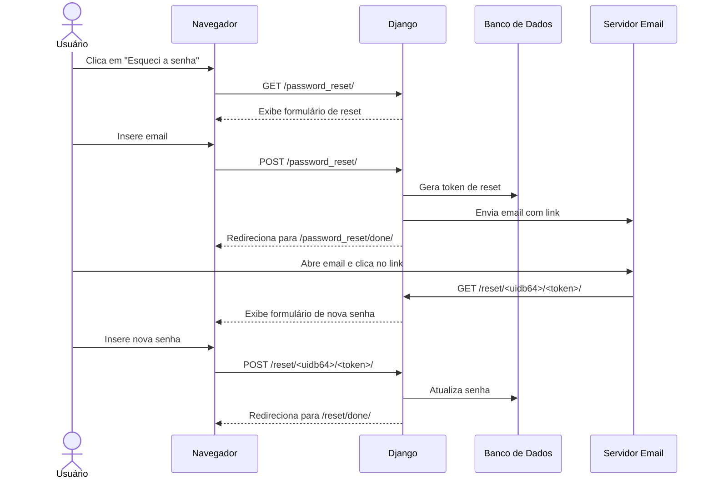
```mermaid
sequenceDiagram
    actor U as Usuário
    participant N as Navegador
    participant D as Django
    participant DB as Banco de Dados
    participant E as Servidor Email

    U->>N: Clica em "Esqueci a senha"
    N->>D: GET /password_reset/
    D-->>N: Exibe formulário de reset
    U->>N: Insere email
    N->>D: POST /password_reset/
    D->>DB: Gera token de reset
    D->>E: Envia email com link
    D-->>N: Redireciona para /password_reset/done/
    U->>E: Abre email e clica no link
    E->>D: GET /reset/<uidb64>/<token>/
    D-->>N: Exibe formulário de nova senha
    U->>N: Insere nova senha
    N->>D: POST /reset/<uidb64>/<token>/
    D->>DB: Atualiza senha
    D-->>N: Redireciona para /reset/done/
```

#### 2. Processo de Gerenciamento de Tokens

##### 2.1. Criação e Configuração de Token
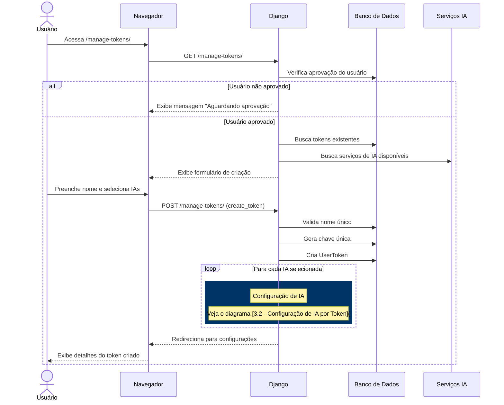
```mermaid
sequenceDiagram
    actor U as Usuário
    participant N as Navegador
    participant D as Django
    participant DB as Banco de Dados
    participant AI as Serviços IA

    U->>N: Acessa /manage-tokens/
    N->>D: GET /manage-tokens/
    D->>DB: Verifica aprovação do usuário
    alt Usuário não aprovado
        D-->>N: Exibe mensagem "Aguardando aprovação"
    else Usuário aprovado
        D->>DB: Busca tokens existentes
        D->>AI: Busca serviços de IA disponíveis
        D-->>N: Exibe formulário de criação
        
        U->>N: Preenche nome e seleciona IAs
        N->>D: POST /manage-tokens/ (create_token)
        D->>DB: Valida nome único
        D->>DB: Gera chave única
        D->>DB: Cria UserToken
        
        loop Para cada IA selecionada
            rect rgb(0, 51, 102)
                Note over D: Configuração de IA
                Note over D: Veja o diagrama [3.2 - Configuração de IA por Token](#configuração-de-ia-por-token)
            end
        end
        
        D-->>N: Redireciona para configurações
        N-->>U: Exibe detalhes do token criado
    end
```

##### 2.2. Gerenciamento de Configurações de IA
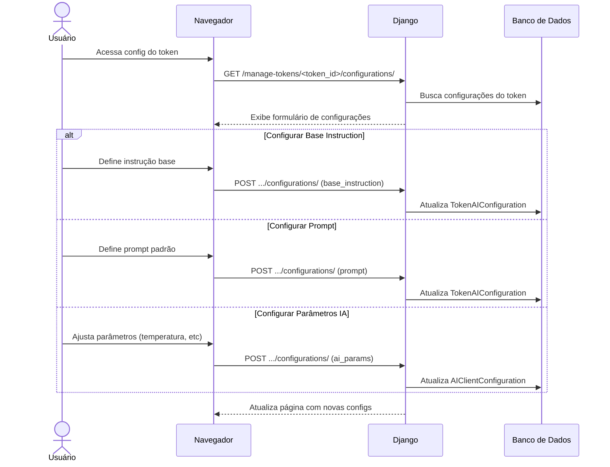
```mermaid
sequenceDiagram
    actor U as Usuário
    participant N as Navegador
    participant D as Django
    participant DB as Banco de Dados

    U->>N: Acessa config do token
    N->>D: GET /manage-tokens/<token_id>/configurations/
    D->>DB: Busca configurações do token
    D-->>N: Exibe formulário de configurações

    alt Configurar Base Instruction
        U->>N: Define instrução base
        N->>D: POST .../configurations/ (base_instruction)
        D->>DB: Atualiza TokenAIConfiguration
    else Configurar Prompt
        U->>N: Define prompt padrão
        N->>D: POST .../configurations/ (prompt)
        D->>DB: Atualiza TokenAIConfiguration
    else Configurar Parâmetros IA
        U->>N: Ajusta parâmetros (temperatura, etc)
        N->>D: POST .../configurations/ (ai_params)
        D->>DB: Atualiza AIClientConfiguration
    end
    D-->>N: Atualiza página com novas configs
```

##### 2.3. Upload de Arquivo de Treinamento
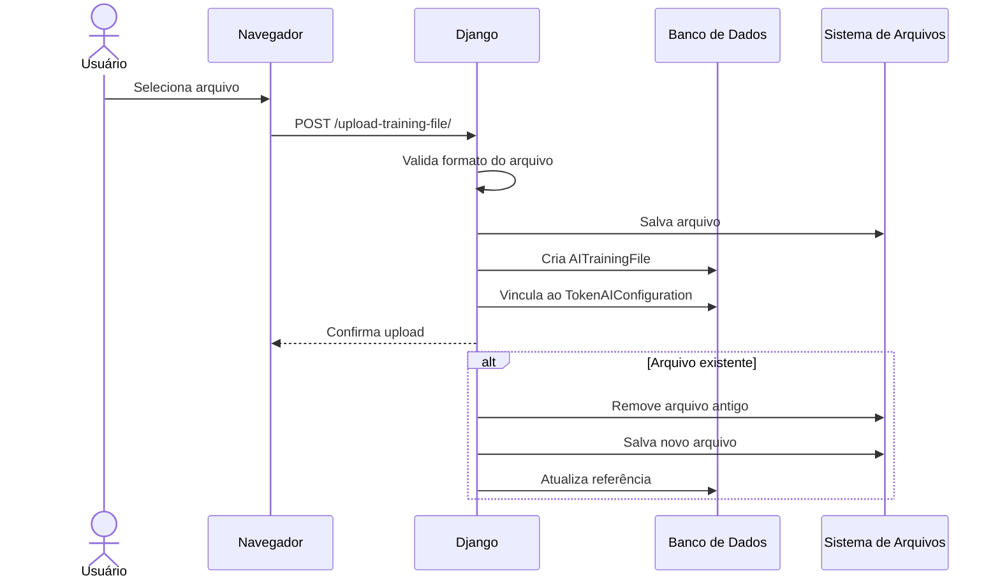
```mermaid
sequenceDiagram
    actor U as Usuário
    participant N as Navegador
    participant D as Django
    participant DB as Banco de Dados
    participant FS as Sistema de Arquivos

    U->>N: Seleciona arquivo
    N->>D: POST /upload-training-file/
    D->>D: Valida formato do arquivo
    D->>FS: Salva arquivo
    D->>DB: Cria AITrainingFile
    D->>DB: Vincula ao TokenAIConfiguration
    D-->>N: Confirma upload
    
    alt Arquivo existente
        D->>FS: Remove arquivo antigo
        D->>FS: Salva novo arquivo
        D->>DB: Atualiza referência
    end
```

##### 2.4. Exclusão de Token
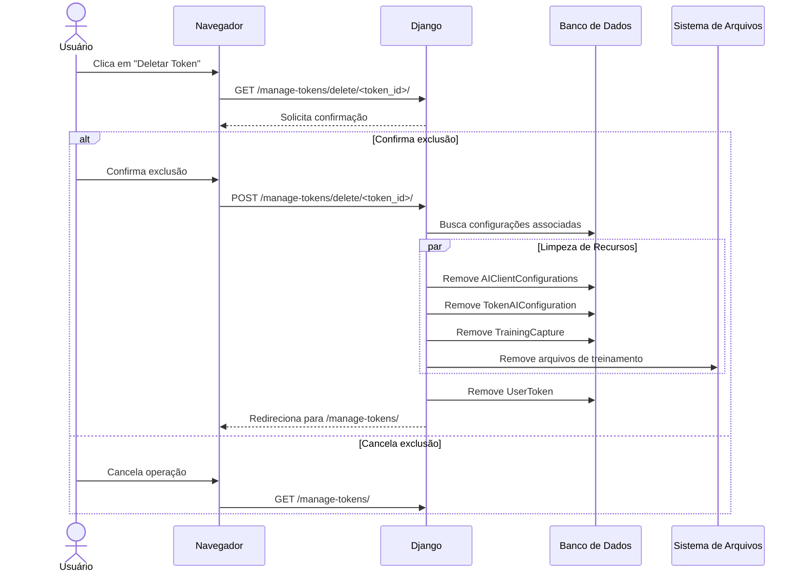
```mermaid
sequenceDiagram
    actor U as Usuário
    participant N as Navegador
    participant D as Django
    participant DB as Banco de Dados
    participant FS as Sistema de Arquivos

    U->>N: Clica em "Deletar Token"
    N->>D: GET /manage-tokens/delete/<token_id>/
    D-->>N: Solicita confirmação
    
    alt Confirma exclusão
        U->>N: Confirma exclusão
        N->>D: POST /manage-tokens/delete/<token_id>/
        D->>DB: Busca configurações associadas
        
        par Limpeza de Recursos
            D->>DB: Remove AIClientConfigurations
            D->>DB: Remove TokenAIConfiguration
            D->>DB: Remove TrainingCapture
            D->>FS: Remove arquivos de treinamento
        end
        
        D->>DB: Remove UserToken
        D-->>N: Redireciona para /manage-tokens/
    else Cancela exclusão
        U->>N: Cancela operação
        N->>D: GET /manage-tokens/
    end
```

#### 3. Configuração de IA

##### 3.1. Criação de Configuração Global de IA
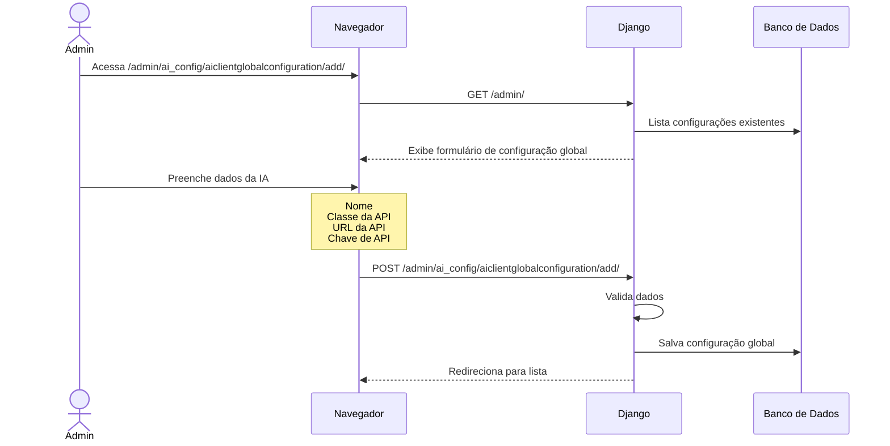
```mermaid
sequenceDiagram
    actor A as Admin
    participant N as Navegador
    participant D as Django
    participant DB as Banco de Dados

    A->>N: Acessa /admin/ai_config/aiclientglobalconfiguration/add/
    N->>D: GET /admin/
    D->>DB: Lista configurações existentes
    D-->>N: Exibe formulário de configuração global

    A->>N: Preenche dados da IA
    Note over N: Nome<br>Classe da API<br>URL da API<br>Chave de API
    N->>D: POST /admin/ai_config/aiclientglobalconfiguration/add/
    D->>D: Valida dados
    D->>DB: Salva configuração global
    D-->>N: Redireciona para lista
```

##### 3.2. Configuração de IA por Token
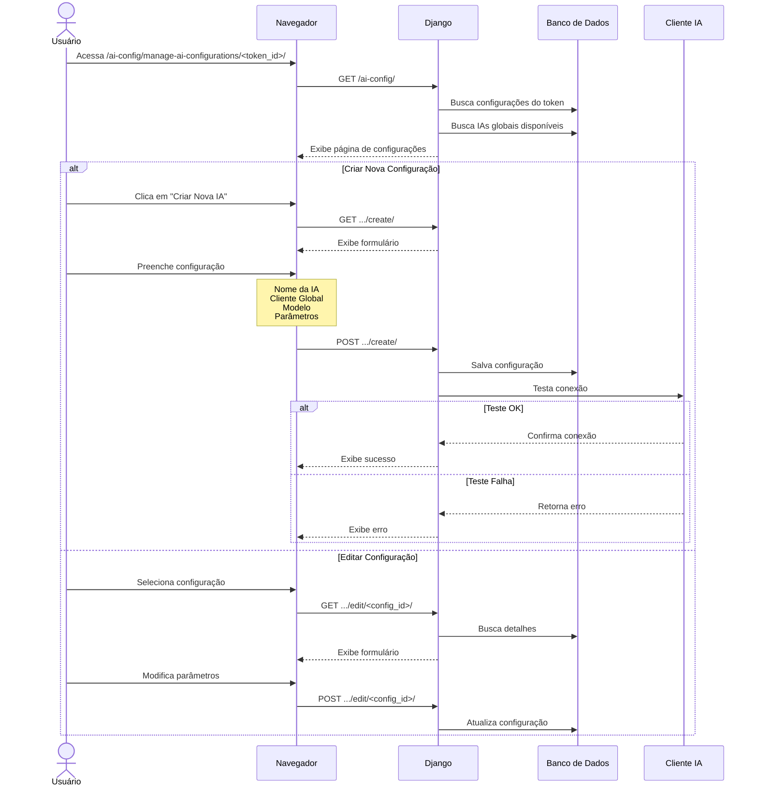
```mermaid
sequenceDiagram
    actor U as Usuário
    participant N as Navegador
    participant D as Django
    participant DB as Banco de Dados
    participant IA as Cliente IA

    U->>N: Acessa /ai-config/manage-ai-configurations/<token_id>/
    N->>D: GET /ai-config/
    D->>DB: Busca configurações do token
    D->>DB: Busca IAs globais disponíveis
    D-->>N: Exibe página de configurações

    alt Criar Nova Configuração
        U->>N: Clica em "Criar Nova IA"
        N->>D: GET .../create/
        D-->>N: Exibe formulário
        U->>N: Preenche configuração
        Note over N: Nome da IA<br>Cliente Global<br>Modelo<br>Parâmetros
        N->>D: POST .../create/
        D->>DB: Salva configuração
        D->>IA: Testa conexão
        alt Teste OK
            IA-->>D: Confirma conexão
            D-->>N: Exibe sucesso
        else Teste Falha
            IA-->>D: Retorna erro
            D-->>N: Exibe erro
        end
    else Editar Configuração
        U->>N: Seleciona configuração
        N->>D: GET .../edit/<config_id>/
        D->>DB: Busca detalhes
        D-->>N: Exibe formulário
        U->>N: Modifica parâmetros
        N->>D: POST .../edit/<config_id>/
        D->>DB: Atualiza configuração
    end
```

##### 3.3. Gestão de Instruções e Prompts
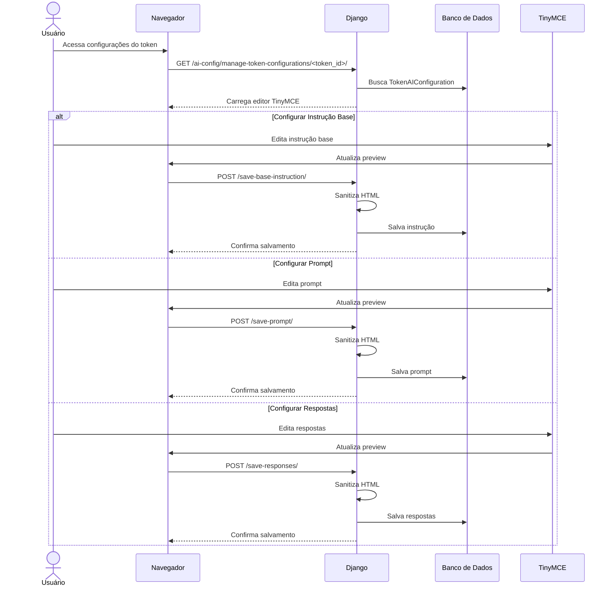
```mermaid
sequenceDiagram
    actor U as Usuário
    participant N as Navegador
    participant D as Django
    participant DB as Banco de Dados
    participant TC as TinyMCE

    U->>N: Acessa configurações do token
    N->>D: GET /ai-config/manage-token-configurations/<token_id>/
    D->>DB: Busca TokenAIConfiguration
    D-->>N: Carrega editor TinyMCE

    alt Configurar Instrução Base
        U->>TC: Edita instrução base
        TC->>N: Atualiza preview
        N->>D: POST /save-base-instruction/
        D->>D: Sanitiza HTML
        D->>DB: Salva instrução
        D-->>N: Confirma salvamento
    else Configurar Prompt
        U->>TC: Edita prompt
        TC->>N: Atualiza preview
        N->>D: POST /save-prompt/
        D->>D: Sanitiza HTML
        D->>DB: Salva prompt
        D-->>N: Confirma salvamento
    else Configurar Respostas
        U->>TC: Edita respostas
        TC->>N: Atualiza preview
        N->>D: POST /save-responses/
        D->>D: Sanitiza HTML
        D->>DB: Salva respostas
        D-->>N: Confirma salvamento
    end
```

##### 3.4. Upload de Arquivo de Treinamento
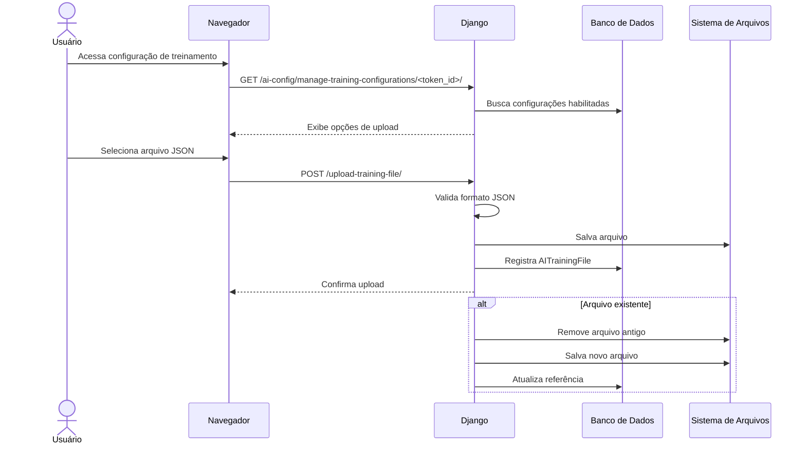
```mermaid
sequenceDiagram
    actor U as Usuário
    participant N as Navegador
    participant D as Django
    participant DB as Banco de Dados
    participant FS as Sistema de Arquivos

    U->>N: Acessa configuração de treinamento
    N->>D: GET /ai-config/manage-training-configurations/<token_id>/
    D->>DB: Busca configurações habilitadas
    D-->>N: Exibe opções de upload

    U->>N: Seleciona arquivo JSON
    N->>D: POST /upload-training-file/
    D->>D: Valida formato JSON
    D->>FS: Salva arquivo
    D->>DB: Registra AITrainingFile
    D-->>N: Confirma upload
    
    alt Arquivo existente
        D->>FS: Remove arquivo antigo
        D->>FS: Salva novo arquivo
        D->>DB: Atualiza referência
    end
```

#### 4. Processo de Treinamento

##### 4.1. Treinamento de Modelo de IA
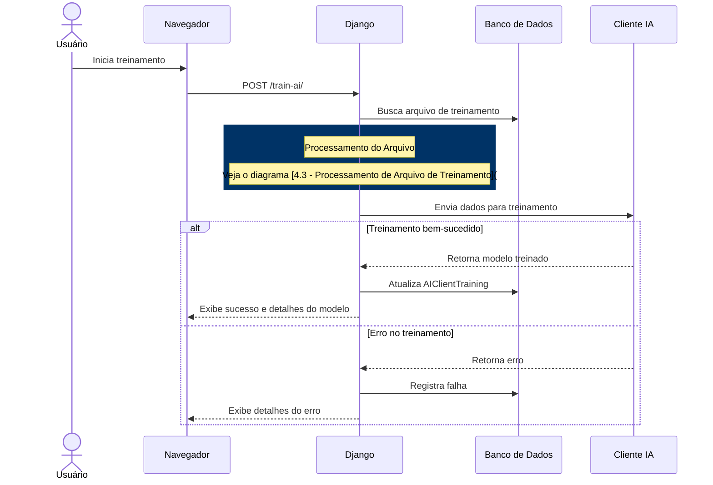
```mermaid
sequenceDiagram
    actor U as Usuário
    participant N as Navegador
    participant D as Django
    participant DB as Banco de Dados
    participant IA as Cliente IA

    U->>N: Inicia treinamento
    N->>D: POST /train-ai/
    D->>DB: Busca arquivo de treinamento
    
    rect rgb(0, 51, 102)
        Note over D: Processamento do Arquivo
        Note over D: Veja o diagrama [4.3 - Processamento de Arquivo de Treinamento](#processamento-de-arquivo-de-treinamento)
    end
    
    D->>IA: Envia dados para treinamento
    
    alt Treinamento bem-sucedido
        IA-->>D: Retorna modelo treinado
        D->>DB: Atualiza AIClientTraining
        D-->>N: Exibe sucesso e detalhes do modelo
    else Erro no treinamento
        IA-->>D: Retorna erro
        D->>DB: Registra falha
        D-->>N: Exibe detalhes do erro
    end
```

##### 4.2. Captura de Exemplos de Treinamento
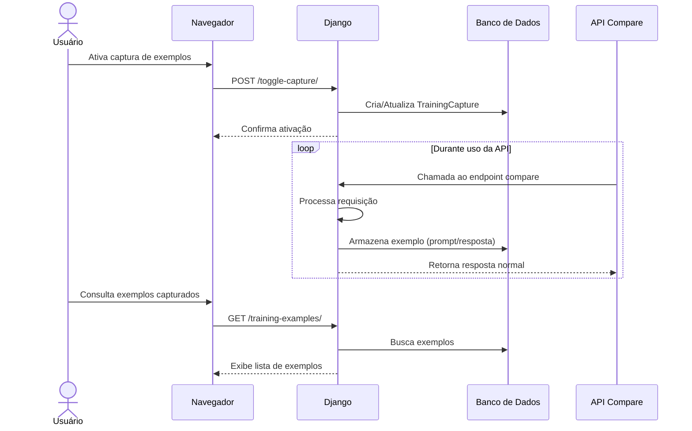
```mermaid
sequenceDiagram
    actor U as Usuário
    participant N as Navegador
    participant D as Django
    participant DB as Banco de Dados
    participant API as API Compare

    U->>N: Ativa captura de exemplos
    N->>D: POST /toggle-capture/
    D->>DB: Cria/Atualiza TrainingCapture
    D-->>N: Confirma ativação

    loop Durante uso da API
        API->>D: Chamada ao endpoint compare
        D->>D: Processa requisição
        D->>DB: Armazena exemplo (prompt/resposta)
        D-->>API: Retorna resposta normal
    end

    U->>N: Consulta exemplos capturados
    N->>D: GET /training-examples/
    D->>DB: Busca exemplos
    D-->>N: Exibe lista de exemplos
```

##### 4.3. Processamento de Arquivo de Treinamento
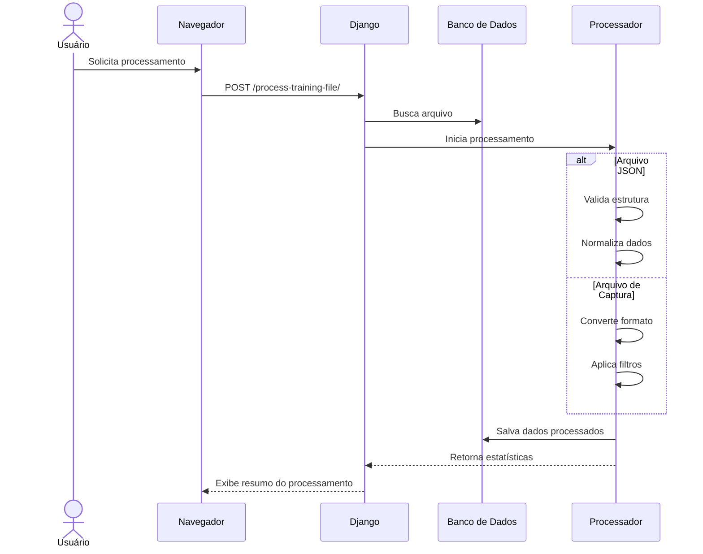
```mermaid
sequenceDiagram
    actor U as Usuário
    participant N as Navegador
    participant D as Django
    participant DB as Banco de Dados
    participant P as Processador

    U->>N: Solicita processamento
    N->>D: POST /process-training-file/
    D->>DB: Busca arquivo
    D->>P: Inicia processamento

    alt Arquivo JSON
        P->>P: Valida estrutura
        P->>P: Normaliza dados
    else Arquivo de Captura
        P->>P: Converte formato
        P->>P: Aplica filtros
    end

    P->>DB: Salva dados processados
    P-->>D: Retorna estatísticas
    D-->>N: Exibe resumo do processamento
```

#### 5. Processos da API

##### 5.1. Processo de Comparação
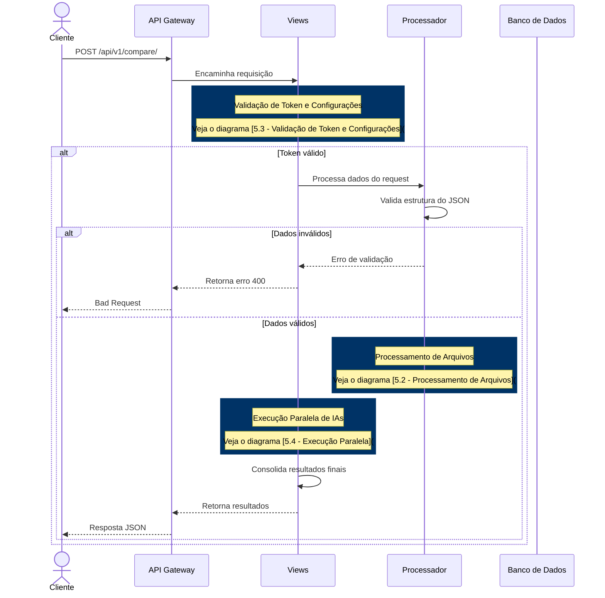
```mermaid
sequenceDiagram
    actor C as Cliente
    participant API as API Gateway
    participant V as Views
    participant P as Processador
    participant DB as Banco de Dados

    C->>API: POST /api/v1/compare/
    API->>V: Encaminha requisição
    
    rect rgb(0, 51, 102)
        Note over V: Validação de Token e Configurações
        Note over V: Veja o diagrama [5.3 - Validação de Token e Configurações](#validação-de-token-e-configurações)
    end
    
    alt Token válido
        V->>P: Processa dados do request
        P->>P: Valida estrutura do JSON
        
        alt Dados inválidos
            P-->>V: Erro de validação
            V-->>API: Retorna erro 400
            API-->>C: Bad Request
        else Dados válidos
            rect rgb(0, 51, 102)
                Note over P: Processamento de Arquivos
                Note over P: Veja o diagrama [5.2 - Processamento de Arquivos](#processamento-de-arquivos)
            end
            
            rect rgb(0, 51, 102)
                Note over V: Execução Paralela de IAs
                Note over V: Veja o diagrama [5.4 - Execução Paralela](#execução-paralela-de-múltiplas-ias)
            end
            
            V->>V: Consolida resultados finais
            V-->>API: Retorna resultados
            API-->>C: Resposta JSON
        end
    end
```

##### 5.2. Processamento de Arquivos (PDF/DOCX)
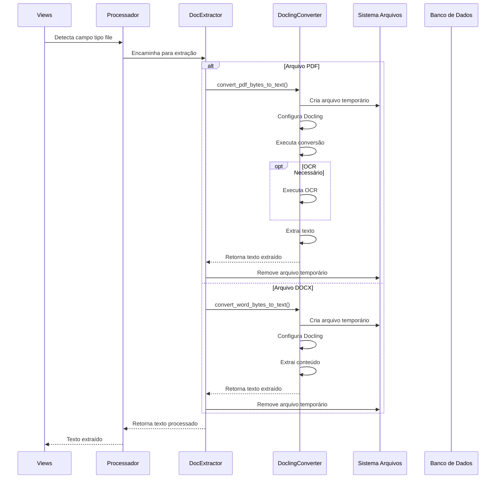
```mermaid
sequenceDiagram
    participant V as Views
    participant P as Processador
    participant DE as DocExtractor
    participant DC as DoclingConverter
    participant FS as Sistema Arquivos
    participant DB as Banco de Dados

    V->>P: Detecta campo tipo file
    P->>DE: Encaminha para extração
    
    alt Arquivo PDF
        DE->>DC: convert_pdf_bytes_to_text()
        DC->>FS: Cria arquivo temporário
        DC->>DC: Configura Docling
        DC->>DC: Executa conversão
        opt OCR Necessário
            DC->>DC: Executa OCR
        end
        DC->>DC: Extrai texto
        DC-->>DE: Retorna texto extraído
        DE->>FS: Remove arquivo temporário
    else Arquivo DOCX
        DE->>DC: convert_word_bytes_to_text()
        DC->>FS: Cria arquivo temporário
        DC->>DC: Configura Docling
        DC->>DC: Extrai conteúdo
        DC-->>DE: Retorna texto extraído
        DE->>FS: Remove arquivo temporário
    end
    
    DE-->>P: Retorna texto processado
    P-->>V: Texto extraído
```

##### 5.3. Validação de Token e Configurações
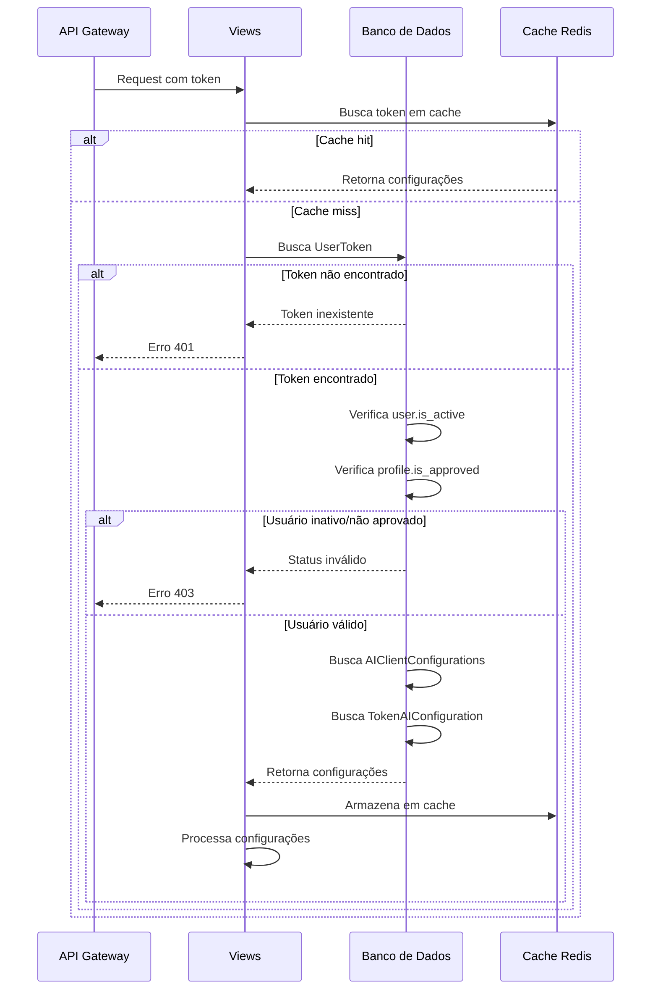
```mermaid
sequenceDiagram
    participant API as API Gateway
    participant V as Views
    participant DB as Banco de Dados
    participant Cache as Cache Redis

    API->>V: Request com token
    V->>Cache: Busca token em cache
    
    alt Cache hit
        Cache-->>V: Retorna configurações
    else Cache miss
        V->>DB: Busca UserToken
        
        alt Token não encontrado
            DB-->>V: Token inexistente
            V-->>API: Erro 401
        else Token encontrado
            DB->>DB: Verifica user.is_active
            DB->>DB: Verifica profile.is_approved
            
            alt Usuário inativo/não aprovado
                DB-->>V: Status inválido
                V-->>API: Erro 403
            else Usuário válido
                DB->>DB: Busca AIClientConfigurations
                DB->>DB: Busca TokenAIConfiguration
                DB-->>V: Retorna configurações
                V->>Cache: Armazena em cache
                V->>V: Processa configurações
            end
        end
    end
```

##### 5.4. Execução Paralela de Múltiplas IAs
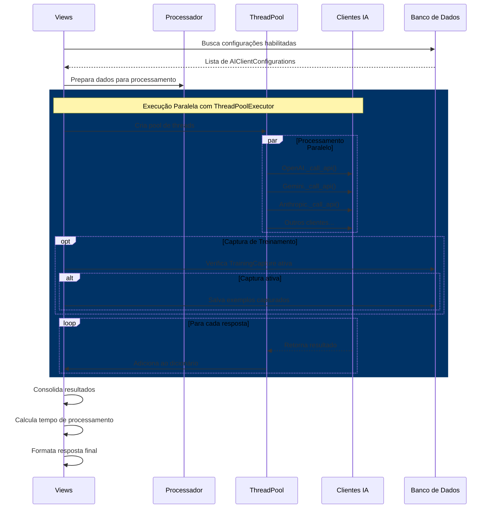
```mermaid
sequenceDiagram
    participant V as Views
    participant P as Processador
    participant Pool as ThreadPool
    participant IA as Clientes IA
    participant DB as Banco de Dados

    V->>DB: Busca configurações habilitadas
    DB-->>V: Lista de AIClientConfigurations
    V->>P: Prepara dados para processamento

    rect rgb(0, 51, 102)
        Note over V,IA: Execução Paralela com ThreadPoolExecutor

        V->>Pool: Cria pool de threads
        
        par Processamento Paralelo
            Pool->>IA: OpenAI._call_api()
            Pool->>IA: Gemini._call_api()
            Pool->>IA: Anthropic._call_api()
            Pool->>IA: Outros clientes...
        end

        opt Captura de Treinamento
            V->>DB: Verifica TrainingCapture ativa
            alt Captura ativa
                V->>DB: Salva exemplos capturados
            end
        end

        loop Para cada resposta
            IA-->>Pool: Retorna resultado
            Pool->>V: Adiciona ao dicionário
        end
    end

    V->>V: Consolida resultados
    V->>V: Calcula tempo de processamento
    V->>V: Formata resposta final
```

#### 6. Fluxos de Administração

##### 6.1. Gerenciamento de Configurações Globais
```mermaid
sequenceDiagram
    actor A as Admin
    participant N as Navegador
    participant D as Django
    participant DB as Banco de Dados
    participant AI as Clientes IA

    A->>N: Acessa /admin/ai_config/aiclientglobalconfiguration/
    N->>D: GET /admin/
    D->>DB: Lista configurações existentes

    alt Criar Nova Configuração
        A->>N: Clica em "Adicionar"
        N->>D: GET .../add/
        D-->>N: Exibe formulário
        A->>N: Preenche dados
        Note over N: Nome da IA<br>Classe da API<br>URL da API<br>Chave API
        N->>D: POST .../add/
        D->>D: Valida dados
        D->>AI: Testa conexão
        alt Teste OK
            AI-->>D: Confirma conexão
            D->>DB: Salva configuração
            D-->>N: Redireciona para lista
        else Erro na Conexão
            AI-->>D: Retorna erro
            D-->>N: Exibe erro
        end
    else Editar Configuração
        A->>N: Seleciona configuração
        N->>D: GET .../change/
        D->>DB: Busca detalhes
        D-->>N: Exibe formulário
        A->>N: Modifica dados
        N->>D: POST .../change/
        D->>D: Valida dados
        D->>DB: Atualiza configuração
    else Excluir Configuração
        A->>N: Seleciona configuração
        N->>D: POST .../delete/
        D->>DB: Verifica dependências
        alt Com Dependências
            D-->>N: Alerta sobre tokens vinculados
            A->>N: Confirma exclusão
        end
        D->>DB: Remove configuração
        D-->>N: Redireciona para lista
    end
```

##### 6.2. Aprovação de Usuários
```mermaid
sequenceDiagram
    actor A as Admin
    participant N as Navegador
    participant D as Django
    participant DB as Banco de Dados
    participant E as Servidor Email

    A->>N: Acessa /admin/accounts/profile/
    N->>D: GET /admin/
    D->>DB: Lista perfis pendentes
    D-->>N: Exibe lista filtrada

    alt Aprovar Usuário
        A->>N: Marca checkbox "is_approved"
        N->>D: POST /admin/accounts/profile/.../change/
        D->>DB: Atualiza status
        D->>E: Envia email de aprovação
        E->>E: Envia notificação
        D-->>N: Atualiza lista
    else Rejeitar Usuário
        A->>N: Desmarca checkbox "is_approved"
        N->>D: POST /admin/accounts/profile/.../change/
        D->>DB: Atualiza status
        D->>E: Envia email de rejeição
        E->>E: Envia notificação
        D-->>N: Atualiza lista
    else Excluir Usuário
        A->>N: Seleciona usuário
        N->>D: POST .../delete/
        D->>DB: Remove perfil e usuário
        D->>E: Envia notificação
        D-->>N: Atualiza lista
    end
```

##### 6.3. Monitoramento de Uso da API
```mermaid
sequenceDiagram
    actor A as Admin
    participant N as Navegador
    participant D as Django
    participant DB as Banco de Dados
    participant C as Cache Redis

    A->>N: Acessa painel de monitoramento
    N->>D: GET /admin/api/monitoring/
    
    par Consultas Paralelas
        D->>DB: Busca estatísticas de uso
        D->>C: Busca métricas em cache
        D->>DB: Busca logs de erro
    end

    D->>D: Agrega dados
    D-->>N: Exibe dashboard

    loop Monitoramento em Tempo Real
        N->>D: Polling a cada 30s
        D->>C: Atualiza métricas
        D-->>N: Atualiza dados
    end

    alt Investigar Erro
        A->>N: Seleciona log de erro
        N->>D: GET .../error/<id>/
        D->>DB: Busca detalhes
        D-->>N: Exibe detalhes do erro
    else Exportar Relatório
        A->>N: Solicita relatório
        N->>D: GET .../report/
        D->>D: Gera relatório
        D-->>N: Download do relatório
    end
```

##### 6.4. Gestão de Arquivos de Treinamento
```mermaid
sequenceDiagram
    actor A as Admin
    participant N as Navegador
    participant D as Django
    participant DB as Banco de Dados
    participant FS as Sistema de Arquivos
    participant V as Validador

    A->>N: Acessa /admin/ai_config/aitrainingfile/
    N->>D: GET /admin/
    D->>DB: Lista arquivos
    D-->>N: Exibe lista

    alt Revisar Arquivo
        A->>N: Seleciona arquivo
        N->>D: GET .../review/<id>/
        D->>FS: Lê arquivo
        D->>V: Valida estrutura
        alt Arquivo Válido
            V-->>D: Retorna estatísticas
            D-->>N: Exibe detalhes e estatísticas
        else Arquivo Inválido
            V-->>D: Retorna erros
            D-->>N: Exibe problemas encontrados
        end
    else Aprovar Arquivo
        A->>N: Marca como aprovado
        N->>D: POST .../approve/<id>/
        D->>DB: Atualiza status
        D-->>N: Atualiza lista
    else Excluir Arquivo
        A->>N: Seleciona arquivo
        N->>D: POST .../delete/<id>/
        D->>FS: Remove arquivo físico
        D->>DB: Remove registro
        D-->>N: Atualiza lista
    end

    opt Backup Automático
        Note over D,FS: Executado diariamente
        D->>FS: Cria backup
        D->>DB: Registra backup
    end
```

#### 7. Integração com IAs

##### 7.1. Fluxo OpenAI
```mermaid
sequenceDiagram
    participant C as Cliente API
    participant V as Views
    participant OAI as OpenAiClient
    participant API as OpenAI API
    participant Cache as Cache Redis

    C->>V: Requisição com dados
    V->>OAI: compare(data)

    OAI->>OAI: _prepare_prompts()

    rect rgb(0, 51, 102)
        Note over OAI: Preparação do Contexto
        OAI->>OAI: _render_template(prompt)
        OAI->>OAI: Configura system_message
    end

    OAI->>API: "client.chat.completions.create(model='gpt-3.5-turbo', messages=[...], temperature=0.7)"

    alt Resposta Bem-sucedida
        API-->>OAI: Resposta OpenAI
        OAI->>Cache: Armazena resultado (TTL=1h)
        OAI-->>V: Retorna resultado formatado
    else Erro de API
        API-->>OAI: Erro 429 (Rate Limit)
        OAI->>OAI: Aguarda 2s
        OAI->>API: "Retry (max 3x)"
    end
```

##### 7.2. Fluxo Gemini
```mermaid
sequenceDiagram
    participant C as Cliente API
    participant V as Views
    participant G as GeminiClient
    participant API as Gemini API
    participant Cache as Cache Redis

    C->>V: Requisição com dados
    V->>G: compare(data)

    G->>G: _prepare_prompts()

    rect rgb(0, 51, 102)
        Note over G: Preparação do Modelo
        G->>G: genai.configure(api_key)
        G->>G: model = genai.GenerativeModel('gemini-pro')
    end

    G->>API: "model.generate_content(contents=[prompt], generation_config={...})"

    alt Resposta Bem-sucedida
        API-->>G: Resposta Gemini
        G->>Cache: Armazena resultado (TTL=1h)
        G-->>V: Retorna resultado formatado
    else Erro de Safety
        API-->>G: BlockedPrompt
        G-->>V: Erro: "Conteúdo bloqueado por política de segurança"
    end
```

##### 7.3. Fluxo Anthropic
```mermaid
sequenceDiagram
    participant C as Cliente API
    participant V as Views
    participant A as AnthropicClient
    participant API as Anthropic API
    participant Cache as Cache Redis

    C->>V: Requisição com dados
    V->>A: compare(data)

    A->>A: _prepare_prompts()

    rect rgb(0, 51, 102)
        Note over A: Configuração Claude
        A->>A: client = anthropic.Anthropic()
        A->>A: Prepara mensagem
    end

    A->>API: "client.messages.create(model='claude-3-opus-20240229', max_tokens=1000, messages=[...])"

    alt Resposta Bem-sucedida
        API-->>A: Resposta Claude
        A->>Cache: Armazena resultado (TTL=1h)
        A-->>V: Retorna resultado formatado
    else Erro de Contexto
        API-->>A: ContextLengthError
        A->>A: Reduz tamanho do prompt
        A->>API: "Retry com prompt reduzido"
    end
```

##### 7.4. Fluxo Azure
```mermaid
sequenceDiagram
    participant C as Cliente API
    participant V as Views
    participant AZ as AzureClient
    participant API as Azure OpenAI API
    participant Cache as Cache Redis

    C->>V: Requisição com dados
    V->>AZ: compare(data)

    AZ->>AZ: _prepare_prompts()

    %% Se quiser apenas uma linha com "client = AzureOpenAI(...)":
    AZ->>AZ: "client = AzureOpenAI(azure_endpoint='...', api_key='...', api_version='2024-02-15-preview')"

    AZ->>API: "client.chat.completions.create(model='gpt-4', messages=[...], temperature=0.7)"

    alt Resposta Bem-sucedida
        API-->>AZ: Resposta Azure
        AZ->>Cache: Armazena resultado (TTL=1h)
        AZ-->>V: Retorna resultado formatado
    else Erro de Quota
        API-->>AZ: QuotaExceededError
        AZ-->>V: Erro: "Limite de uso excedido"
    end
```

##### 7.5. Fluxo Llama
```mermaid
sequenceDiagram
    participant C as Cliente API
    participant V as Views
    participant L as LlamaClient
    participant API as Llama API
    participant Cache as Cache Redis

    C->>V: Requisição com dados
    V->>L: compare(data)

    L->>L: _prepare_prompts()

    rect rgb(0, 51, 102)
        Note over L: Configuração Llama
        L->>L: client = LlamaAPI(api_key)
        L->>L: Prepara requisição
    end

    L->>API: "client.run(prompt=prompt, stream=False, max_tokens=1000)"

    alt Resposta Bem-sucedida
        API-->>L: Resposta Llama
        L->>Cache: Armazena resultado (TTL=1h)
        L-->>V: Retorna resultado formatado
    else Erro de Modelo
        API-->>L: ModelNotAvailableError
        L-->>V: Erro: "Modelo temporariamente indisponível"
    end
```

##### 7.6. Fluxo Perplexity
```mermaid
sequenceDiagram
    participant C as Cliente API
    participant V as Views
    participant P as PerplexityClient
    participant API as Perplexity API
    participant Cache as Cache Redis

    C->>V: Requisição com dados
    V->>P: compare(data)
    
    P->>P: _prepare_prompts()
    
    rect rgb(0, 51, 102)
        Note over P: Configuração Perplexity
        P->>P: headers = {"Authorization": f"Bearer {api_key}"}
        P->>P: Prepara payload
    end

    P->>API: POST /api/v1/chat/completions
    
    alt Resposta Bem-sucedida
        API-->>P: Resposta Perplexity
        P->>Cache: Armazena resultado (TTL=1h)
        P-->>V: Retorna resultado formatado
    else Erro de Autenticação
        API-->>P: 401 Unauthorized
        P-->>V: Erro: "Chave de API inválida"
    end
```

#### 8. Fluxos de Erro

##### 8.1. Tratamento de Erros de API
```mermaid
sequenceDiagram
    participant C as Cliente API
    participant V as Views
    participant H as Error Handler
    participant L as Logger
    participant M as Métricas

    C->>V: Requisição com erro
    V->>H: Captura exceção
    
    rect rgb(0, 51, 102)
        Note over H: Classificação do Erro
        H->>H: Identifica tipo de erro
        H->>L: Registra erro detalhado
        H->>M: Incrementa contador
    end
    
    alt Erro de Validação (400)
        H-->>V: ValidationError
        V-->>C: Status 400 + Detalhes
    else Erro de Autenticação (401)
        H-->>V: AuthenticationError
        V-->>C: Status 401 + Mensagem
    else Erro de Permissão (403)
        H-->>V: PermissionError
        V-->>C: Status 403 + Mensagem
    else Erro do Servidor (500)
        H-->>V: ServerError
        V-->>C: Status 500 + ID do Erro
        H->>L: Registra stack trace
    end

    H->>M: Atualiza métricas de erro
```

##### 8.2. Tratamento de Falhas de Comunicação
```mermaid
sequenceDiagram
    participant C as Cliente API
    participant V as Views
    participant IA as Cliente IA
    participant API as API Externa
    participant CM as Circuit Breaker

    C->>V: Requisição
    V->>CM: Verifica estado
    
    alt Circuit Breaker Fechado
        CM->>IA: Permite requisição
        
        rect rgb(0, 51, 102)
            Note over IA: Tentativa de Comunicação
            IA->>API: Requisição HTTP
            
            alt Timeout (5s)
                API--xIA: Sem resposta
                IA->>CM: Registra falha
            else Erro de Rede
                API--xIA: ConnectionError
                IA->>CM: Registra falha
            else Erro de DNS
                API--xIA: DNSError
                IA->>CM: Registra falha
            end
        end
        
        CM->>CM: Incrementa contador de falhas
        
        alt Limiar Atingido (5 falhas/1min)
            CM->>CM: Abre circuit breaker
            CM-->>V: Erro: "Serviço indisponível"
        end
        
    else Circuit Breaker Aberto
        CM-->>V: Erro: "Serviço temporariamente indisponível"
        
        rect rgb(0, 51, 102)
            Note over CM: Período de Recuperação
            CM->>CM: Aguarda 30s
            CM->>CM: Muda para half-open
        end
    end
```

##### 8.3. Timeout e Retry
```mermaid
sequenceDiagram
    participant C as Chamador (usuário/admin)
    participant V as View/Util
    participant O as OpenAiClient
    participant API as OpenAI FineTune

    C->>V: Solicita treinamento (train)
    V->>O: O.train(training_file, parameters)

    Note over O: Cria file JSONL c/ exemplos
    O->>API: POST /files (upload do arquivo)

    alt Falha de Upload
        API-->>O: Erro (429 ou outro)
        O-->>V: Lança APICommunicationError
        V-->>C: Retorna erro
    else Sucesso no Upload
        API-->>O: OK, file_id
        O->>API: POST /fine_tuning/jobs (model=self.model_name)
        API-->>O: Retorna job (id)
        
        loop Checa status até concluir
            O->>API: GET /fine_tuning/jobs/<id>
            alt status=succeeded
                API-->>O: Fine-tune concluído
                O-->>V: Retorna nome do modelo final
                V-->>C: "Modelo treinado: gpt-3.5-turbo-finetuned"
            else status=failed
                API-->>O: "failed"
                O-->>V: Lança APICommunicationError
                V-->>C: "Erro ao treinar o modelo"
            else
                API-->>O: "still running"
                O->>O: Aguarda 5s
            end
        end
    end
```

##### 8.4. Validação de Dados
```mermaid
sequenceDiagram
    participant C as Cliente (chamando API)
    participant V as Views
    participant P as process_request_data
    participant F as DjangoForms/ModelForms

    C->>V: POST /api/v1/compare/ (JSON)
    alt Falta 'students' ou 'instructor'
        V-->>C: HTTP 400 {"error": "A solicitação deve conter 'students' e 'instructor'."}
    else Estrutura básica presente
        V->>F: Valida token e forms
        alt Token inválido
            F-->>V: Falha
            V-->>C: HTTP 401 {"error":"Token inválido"}
        else Token válido
            V->>P: process_request_data(dados) 
            alt Conteúdo de arquivo inválido
                P-->>V: Lança FileProcessingError
                V-->>C: HTTP 400 {"error":"Erro ao processar arquivo"}
            else Tudo OK
                V->>F: (Opcional) Valida configurações extras
                alt Form Inválido
                    F-->>V: Falha de form
                    V-->>C: HTTP 400 {"error":"Formulário inválido"}
                else Form Válido
                    V-->>C: HTTP 200 {"students": {...resultados...}}
                end
            end
        end
    end
```

---

## Desenvolvimento

### Como Contribuir

Contribuições são muito bem-vindas! Para contribuir:

1. Faça um _fork_ deste repositório.
2. Crie uma branch para sua feature ou correção:
   ```bash
   git checkout -b feature/minha-feature
   ```
3. Faça _commits_ com suas alterações, seguindo as convenções de código (PEP 8).
4. Execute os testes (quando implementados):
   ```bash
   python manage.py test
   ```
5. Envie sua branch para o repositório remoto:
   ```bash
   git push origin feature/minha-feature
   ```
6. Abra um Pull Request no repositório original, descrevendo suas alterações e referências a issues (se houver).

### Testes

> **Atenção:** Atualmente, não há testes implementados. Contribuições para a criação de testes unitários e de integração são muito bem-vindas!

Para executar os testes (quando disponíveis), utilize:
```bash
python manage.py test
```

### Tecnologias Utilizadas

Updated versions based on requirements.txt:
- **Django (v4.2.7)**: Framework web principal.
- **Django REST Framework (v3.15.2)**: Criação dos endpoints REST.
- **Allauth e dj-rest-auth**: Gerenciamento de autenticação e registro de usuários.
- **Clientes de IA**: OpenAI, Azure OpenAI, Anthropic, Google Gemini, Llama, Perplexity.
- **Docling (v2.17.0)**: Extração de texto de documentos (PDF, DOCX).
- **python-dotenv (v1.0.0)**: Gerenciamento de variáveis de ambiente.
- **Requests (v2.32.3)**: Realização de requisições HTTP.
- **Gunicorn (v22.0.0)**: Servidor WSGI para produção.
- **Bootstrap (v5.3.2)**: Framework CSS para a interface.
- **TinyMCE (django-tinymce v4.1.0)**: Editor de texto (opcional).
- **Sphinx**: Geração de documentação (opcional).

---

## Testes

### Testes Unitários

O projeto contém uma suíte de testes unitários organizados por módulo:

---

## Suporte

### FAQ

**Como recuperar minha senha?**  
Utilize a opção "Esqueci minha senha" na página de login para receber instruções via email.

**Meu token não está funcionando. O que fazer?**  
- Verifique se sua conta foi aprovada pelo administrador.  
- Confirme se o token foi criado corretamente na área de gerenciamento.  
- Assegure-se de enviar o token corretamente no header `Authorization`.

**Como configurar um novo cliente de IA?**  
Acesse o painel de administração (`/admin/`), vá para a seção "Global - Clientes de IA" e adicione uma nova configuração global, informando o nome, a classe do cliente (ex.: OpenAi, Gemini) e a chave de API. Em seguida, associe essa configuração ao seu token na área de gerenciamento de tokens.

**Como carregar um arquivo de treinamento?**  
Na área de gerenciamento de tokens, selecione o token desejado e utilize o formulário de upload para enviar o arquivo de treinamento. O arquivo deve ser codificado em base64 quando enviado via API.

**Quais formatos de arquivo são suportados?**  
A API suporta a extração de texto de arquivos PDF e DOCX, utilizando Docling.

**Como funciona a captura de exemplos (TrainingCapture)?**  
Durante o uso da API, se a captura estiver ativa, os exemplos (prompt e resposta) serão salvos temporariamente para que possam ser usados no treinamento futuro.

### Documentação Adicional

A documentação completa (gerada pelo Sphinx) está disponível na pasta `_build/html/` ou online (link a ser definido). Para gerar a documentação localmente:

```bash
cd docs
make html
```

### Contato

Para dúvidas ou suporte, abra uma _issue_ no GitHub ou envie um email para [diegogrosmann@gmail.com].

---

## Informações Legais

### Licença

Este projeto está licenciado sob a **MIT License**.

```
MIT License

Copyright (c) 2025 Diego Grosmann

Permission is hereby granted, free of charge, to any person obtaining a copy
of this software and associated documentation files (the "Software"), to deal
in the Software without restriction, including without limitation the rights
to use, copy, modify, merge, publish, distribute, sublicense, and/or sell
copies of the Software, and to permit persons to whom the Software is
furnished to do so, subject to the following conditions:

[O aviso de copyright acima e
este aviso de permissão devem ser incluídos em todas as cópias ou partes significativas do Software.]
