<p align="center">

</p>

# EnsinaNet.AI


## Visão Geral

O **EnsinaNet.AI** é uma aplicação web desenvolvida em Django que permite corrigir atividades de redes de computadores utilizando múltiplos serviços de inteligência artificial (IA). A aplicação integra autenticação personalizada, gerenciamento de tokens e uma API REST robusta que orquestra chamadas a diversos provedores de IA – como OpenAI, Azure, Anthropic, Google Gemini, Llama e Perplexity – possibilitando análises detalhadas e customizáveis por usuário.

## Índice

- [Visão Geral](#visão-geral)
- [Funcionalidades Principais](#funcionalidades-principais)
  - [Autenticação e Tokens](#autenticação-e-tokens)
  - [Configuração de IA](#configuração-de-ia)
  - [API de Comparação](#api-de-comparação)
    - [Versionamento da API](#versionamento-da-api)
    - [Versão 1](#versão-1)
  - [Monitoramento e Logs da API](#monitoramento-e-logs-da-api)
  - [Interface Pública](#interface-pública)
- [Guia de Início Rápido](#guia-de-início-rápido)
  - [Pré-requisitos](#pré-requisitos)
  - [Instalação](#instalação)
  - [Configuração](#configuração)
- [Documentação da API](#documentação-da-api)
- [Arquitetura](#arquitetura)
  - [Estrutura de Diretórios](#estrutura-de-diretórios)
  - [Diagramas](#diagramas)
- [Desenvolvimento](#desenvolvimento)
  - [Como Contribuir](#como-contribuir)
  - [Testes](#testes)
  - [Tecnologias Utilizadas](#tecnologias-utilizadas)
- [Suporte](#suporte)
  - [FAQ](#faq)
  - [Documentação Adicional](#documentação-adicional)
  - [Contato](#contato)
- [Informações Legais](#informações-legais)
  - [Licença](#licença)

---

## Funcionalidades Principais

### Autenticação e Tokens
- **Autenticação via Email**  
  Utiliza um backend customizado (`accounts/backends.py`) que permite login exclusivamente com o campo de email.
- **Confirmação de Email**  
  O cadastro exige que o usuário confirme seu endereço de email (via `allauth` e view customizada `CustomConfirmEmailView`), antes de ativar a conta.
- **Perfis e Aprovação de Usuários**  
  Cada usuário tem um `Profile` vinculado (1:1), que pode ser **aprovado** manualmente pelo administrador. Somente usuários aprovados têm acesso pleno às funcionalidades.
- **Tokens de API**  
  Tokens são gerenciados via `UserToken` e vinculados a `AIClientConfiguration` através da tabela de junção `AIClientTokenConfig`, conforme implementado em `accounts/models.py` e `ai_config/models.py`.

### Configuração de IA
- **Vários Provedores de IA**  
  O projeto inclui integrações com múltiplos clientes de IA (via `AIClientGlobalConfiguration` e `AIClientConfiguration`), como:
  - OpenAI
  - Azure OpenAI
  - Anthropic (Claude 3)
  - Google Gemini
  - Llama
  - Perplexity
- **Configuração Específica por Token**  
  Para cada token (`UserToken`), é possível selecionar quais IAs estarão ativas, habilitar/desabilitar, definir parâmetros (modelo, hyperparams) e personalizar prompts (via `TokenAIConfiguration`).
- **Captura de Exemplos (TrainingCapture)**  
  Caso o usuário ative a opção, as interações realizadas podem ser capturadas em um arquivo temporário, armazenando exemplo de *prompt* e *resposta*. Isso facilita a criação de conjuntos de treinamento para *fine-tuning*.
- **Treinamento de Modelos**  
  Para IAs compatíveis (ex.: OpenAI e Gemini), o sistema permite o **upload de arquivos de treinamento** e abertura de *jobs* de *fine-tuning*, monitorando status e progresso via `AITraining` e tasks assíncronas (Celery).
- **Extração de Conteúdo de Arquivos**  
  Suporte à extração de texto de PDFs e DOCX por meio do `docling`, permitindo que o usuário envie documentos e compare seu conteúdo. (Vide `api/utils/doc_extractor.py`.)

### API de Comparação
- **Versionamento**  
  O projeto implementa versionamento de rota (exemplo: `/api/v1/compare/`) usando `URLPathVersioning`, mantendo compatibilidade em múltiplas versões.
- **Execução Paralela**  
  O endpoint `/api/v1/compare/` processa cada IA em paralelo, aplicando *circuit breaker* para controlar falhas em chamadas externas.  
- **Suporte a Arquivos**  
  Suporta extrair texto de PDFs e DOCX (via `docling`) quando recebidos no campo `"type":"file"`, convertendo-os dinamicamente para comparação.
- **Circuit Breaker**  
  Componente que monitora falhas de comunicação com provedores de IA e abre/fecha o circuito conforme o número de erros ou tempo decorrido, mitigando cascatas de falhas.
- **Captura de Exemplos**  
  Suporte a captura de exemplos via `TrainingCapture`.
- **Validação de Dados**  
  Validação de dados via `validate_request_data()`.

#### Versionamento da API
O versionamento atual é implementado nas rotas, iniciando pela versão "v1". Exemplos:
- `POST /api/v1/compare/`

#### Versão 1
A versão 1 é a principal atualmente, abrangendo o endpoint `/compare/` para comparar as atividades. Futuramente, a estrutura de versionamento facilita a adição de funcionalidades nas próximas versões.

### Monitoramento e Logs da API
- **Middleware de Monitoramento**  
  A aplicação inclui o `MonitoringMiddleware`, que registra dados de cada requisição API em `APILog`.  
- **Logs Detalhados**  
  São armazenados o método HTTP, a rota acessada, o status da resposta e o tempo de execução.  
- **Dashboard de Monitoramento**  
  Permite que usuários (especialmente administradores) visualizem os logs recentes via `/api/monitoring/`.  
- **Visualização no Django Admin**  
  O modelo `APILog` aparece na interface de administração, possibilitando filtrar por usuário, token, rota etc.

### Interface Pública
- **Página Inicial**  
  Aplicação em `public/` com view `index()`, exibindo conteúdo básico se o usuário não estiver logado.  
- **Redirecionamento**  
  Usuário autenticado é encaminhado diretamente para a área de gerenciamento de tokens, caso já possua login ativo.

---

## Guia de Início Rápido

### Pré-requisitos
- Python 3.10+
- Git
- Virtualenv (recomendado)
- Banco de Dados (por padrão, SQLite; para produção, considere PostgreSQL)
- Redis (para cache, se configurado ou para Celery, caso opte por processamento assíncrono)

### Instalação

1. **Clone o Repositório:**
   ```bash
   git clone https://github.com/diegogrosmann/EnsinaNet.AI.git
   cd EnsinaNet.AI
   ```

2. **Crie e Ative um Ambiente Virtual:**
   ```bash
   python -m venv venv
   # Linux/macOS:
   source venv/bin/activate
   # Windows:
   venv\Scripts\activate
   ```

3. **Instale as Dependências:**
   ```bash
   pip install -r requirements.txt
   ```

4. **Configure as Variáveis de Ambiente:**

    Crie um arquivo `.env` na raiz do projeto (ao lado do `manage.py`) copiando o conteúdo do arquivo `.env.example` e preencha as variáveis necessárias.

    Use o comando:

    ```bash
      # Linux/macOS:
      cp .env.example .env
      # Windows:
      copy .env.example .env
    ```

    Gere uma chave secreta forte com Django: 
    ```bash
      # Linux/macOS:
      python -c 'from django.core.management.utils import get_random_secret_key; print(get_random_secret_key())'
      # Windows:
      python -c "from django.core.management.utils import get_random_secret_key; print(get_random_secret_key())"
    ```

    Edite o arquivo `.env` e defina as variáveis:
    ```env
      SECRET_KEY=#Insira a chave gerada
      EMAIL_HOST_USER=smtp.gmail.com
      EMAIL_HOST_PASSWORD=sua_senha
      ADMIN_EMAIL=seu_email@gmail.com
      DEFAULT_FROM_EMAIL=NetEnsina.AI <seu_email@gmail.com>
    ```

5. **Configure Arquivos Estáticos:**

   No arquivo `myproject/settings.py`, configure:
   ```python
   STATIC_ROOT = os.path.join(BASE_DIR, 'staticfiles')
   ```
   E execute:
   ```bash
   python manage.py collectstatic
   ```

6. **Execute as Migrações:**
   ```bash
   python manage.py migrate
   ```

7. **Crie um Superusuário:**
   ```bash
   python manage.py createsuperuser
   ```

8. **Inicie o Servidor de Desenvolvimento:**
   ```bash
   python manage.py runserver
   ```
   Acesse a aplicação em [http://127.0.0.1:8000/](http://127.0.0.1:8000/)

---

## Documentação da API

A aplicação utiliza `DRF` (Django REST Framework) e a documentação dos endpoints pode ser mantida via docstrings ou gerada pelo `drf-yasg` (opcional, caso configurado). Também é possível gerar documentação pelo Sphinx, pois já existe um `docs/` com configuração inicial (`docs/conf.py`).

Para gerar a documentação Sphinx localmente:
```bash
cd docs
make html
```
O resultado ficará em `docs/_build/html/`.

---

## Arquitetura

### Estrutura de Diretórios

```plaintext
.
├── accounts/                                 # App de autenticação, perfis e tokens
│   ├── backends.py                           # Backend customizado (login por email)
│   ├── views.py                              # Views para registro, login/logout, tokens etc.
│   ├── models.py                             # Modelos Profile e UserToken
│   ├── forms.py                              # Formulários de criação/edição de usuários e tokens
│   ├── admin.py                              # Integração com o Django Admin
│   ├── signals.py                            # Criação de perfil e aprovação de usuários
│   ├── authentication.py                     # Autenticação por Token (DRF)
│   ├── urls.py                               # Rotas de autenticação, tokens, configurações
│   ├── apps.py                               # Configuração da aplicação accounts
│   ├── context_processors.py                 # Processadores de contexto (ex.: info do Site)
│   ├── tests/                                # Testes unitários e de integração
│   └── templates/                            # Templates HTML (cadastro, login, gerenciamento de tokens etc.)
│
├── ai_config/                                # App para gerenciar configurações de IA
│   ├── models.py                             # Modelos de config global, config por token, arquivos de treinamento
│   ├── forms.py                              # Formulários para configurar IA, uploads e captura
│   ├── views/                                # Módulo com várias views (training, token, ai_client etc.)
│   ├── tasks.py                              # Tasks Celery para atualizar status de treinamentos
│   ├── admin.py                              # Integração com o Django Admin (gerenciamento de IAs, arquivos etc.)
│   ├── urls.py                               # Rotas para criar/editar config de IA, treinamento, captura etc.
│   ├── storage.py                            # Storage customizado para sobrescrever arquivos
│   ├── validators.py                         # Schemas e validações de dados de treinamento
│   ├── apps.py                               # Configuração da aplicação ai_config
│   ├── tests/                                # Testes para as funcionalidades de IA
│   └── migrations/                           # Migrações do banco de dados
│
├── api/                                      # App principal da API REST
│   ├── v1/                                   # Versão 1 da API (views e urls)
│   │   ├── views.py                          # Lógica principal do endpoint /api/v1/compare
│   │   └── urls.py                           # Rotas (apenas compare/)
│   ├── utils/                                # Funções auxiliares (clientes IA, doc_extractor, circuit_breaker etc.)
│   │   ├── clientsIA.py                      # Implementações dos clientes de IA
│   │   ├── circuit_breaker.py                # Implementação do circuit breaker
│   │   ├── doc_extractor.py                  # Extração de texto de documentos
│   │   ├── docling_doc_converter.py          # Conversão via docling
│   │   └── queue_manager.py                  # Gerenciamento de filas de tarefas
│   ├── middleware/                           # Middleware de monitoramento (APILog) e afins
│   ├── exception_handlers.py                 # Tratamento customizado de exceções
│   ├── models.py                             # Modelo APILog para registro de chamadas
│   ├── admin.py                              # Admin para exibir logs de API
│   ├── urls.py                               # Inclui rotas v1 e monitoramento
│   ├── apps.py                               # Configuração da aplicação API
│   └── tests/                                # Testes de integração, circuit breaker, doc extraction etc.
│
├── public/                                   # App de páginas públicas
│   ├── views.py                              # View principal (index) e qualquer conteúdo público
│   ├── urls.py                               # Rotas públicas
│   ├── apps.py                               # Configuração do app public
│   └── templates/                            # Templates públicos (ex.: página inicial)
│
├── core/                                     # Funções utilitárias genéricas, exceções customizadas, middlewares
│   ├── exceptions.py                         # Exceções específicas do projeto
│   ├── middleware/                           # Middleware global (ex.: GlobalExceptionMiddleware)
│   ├── types.py                              # Tipos e dataclasses usados em vários módulos
│   └── utils.py                              # Funções helpers (ex.: conversões model->dataclass)
│
├── myproject/                                # Configurações principais do Django
│   ├── settings.py                           # Configurações gerais (INSTALLED_APPS, LOGGING, EMAIL etc.)
│   ├── urls.py                               # Rotas centrais que incluem as urls de cada app
│   ├── wsgi.py                               # Configuração WSGI para produção
│   ├── asgi.py                               # Configuração ASGI (opcional, se usar Channels)
│   ├── celery.py                             # Configuração do Celery (tarefas assíncronas)
│   └── __init__.py
│
├── manage.py                                 # Script de gerenciamento (migrar, criar superuser, runserver etc.)
├── requirements.txt                          # Lista de dependências e versões
├── README.md                                 # Documentação principal do projeto
├── static/                                   # Arquivos estáticos (CSS, JS, imagens)
│   └── ...
├── templates/                                # Templates compartilhados do Django
│   └── base.html                             # Exemplo de template base para todo o projeto
└── logs/                                     # Diretório onde são armazenados arquivos de log (criado se não existir)
```

### Diagramas

### Diagrama de Classes

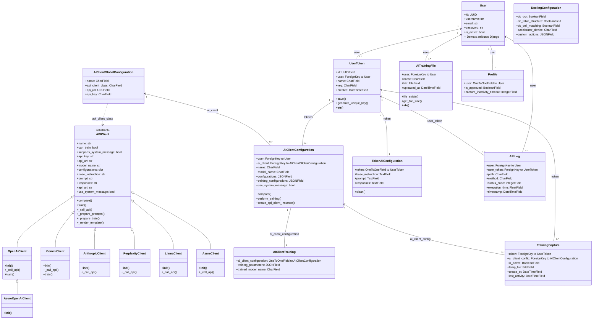
```mermaid
classDiagram
    class User {
	    +id: UUID
	    +username: str
	    +email: str
	    +password: str
	    +is_active: bool
	    -- Demais atributos Django
    }

    class AIClientGlobalConfiguration {
	    +name: CharField
	    +api_client_class: CharField
	    +api_url: URLField
	    +api_key: CharField
    }

    class APIClient {
	    +name: str
	    +can_train: bool
	    +supports_system_message: bool
	    +api_key: str
	    +api_url: str
	    +model_name: str
	    +configurations: dict
	    +base_instruction: str
	    +prompt: str
	    +responses: str
	    +api_url: str
	    +use_system_message: bool
	    +compare()
	    +train()
	    +_call_api()
	    +_prepare_prompts()
	    +_prepare_train()
	    +_render_template()
    }

    class OpenAiClient {
	    +__init__()
	    +_call_api()
	    +train()
    }

    class GeminiClient {
	    +__init__()
	    +_call_api()
	    +train()
    }

    class AnthropicClient {
	    +__init__()
	    +_call_api()
    }

    class PerplexityClient {
	    +__init__()
	    +_call_api()
    }

    class LlamaClient {
	    +__init__()
	    +_call_api()
    }

    class AzureOpenAIClient {
	    +__init__()
    }

    class AzureClient {
	    +__init__()
	    +_call_api()
    }

    class UserToken {
	    +id: UUIDField
	    +user: ForeignKey to User
	    +name: CharField
	    +key: CharField
	    +created: DateTimeField
	    +save()
	    +generate_unique_key()
	    +__str__()
    }

    class AIClientConfiguration {
	    +user: ForeignKey to User
	    +ai_client: ForeignKey to AIClientGlobalConfiguration
	    +name: CharField
	    +model_name: CharField
	    +configurations: JSONField
	    +training_configurations: JSONField
	    +use_system_message: bool
	    +compare()
	    +perform_training()
	    +create_api_client_instance()
    }

    class AIClientTraining {
	    +ai_client_configuration: OneToOneField to AIClientConfiguration
	    +training_parameters: JSONField
	    +trained_model_name: CharField
    }

    class AITrainingFile {
	    +user: ForeignKey to User
	    +name: CharField
	    +file: FileField
	    +uploaded_at: DateTimeField
	    +file_exists()
	    +get_file_size()
	    +__str__()
    }

    class TokenAIConfiguration {
	    +token: OneToOneField to UserToken
	    +base_instruction: TextField
	    +prompt: TextField
	    +responses: TextField
	    +clean()
    }

    class TrainingCapture {
	    +token: ForeignKey to UserToken
	    +ai_client_config: ForeignKey to AIClientConfiguration
	    +is_active: BooleanField
	    +temp_file: FileField
	    +create_at: DateTimeField
	    +last_activity: DateTimeField
    }

    class DoclingConfiguration {
	    +do_ocr: BooleanField
	    +do_table_structure: BooleanField
	    +do_cell_matching: BooleanField
	    +accelerator_device: CharField
	    +custom_options: JSONField
    }

    class Profile {
	    +user: OneToOneField to User
	    +is_approved: BooleanField
	    +capture_inactivity_timeout: IntegerField
    }

    class APILog {
	    +user: ForeignKey to User
	    +user_token: ForeignKey to UserToken
	    +path: CharField
	    +method: CharField
	    +status_code: IntegerField
	    +execution_time: FloatField
	    +timestamp: DateTimeField
    }

    %% Relações:
    User "1" -- "1" Profile : user
    User "1" <-- "0..*" APILog : user
    User "1" <-- "0..*" AITrainingFile : user
    User "1" <-- "0..*" UserToken : user

    UserToken "1" -- "1" TokenAIConfiguration : token
    UserToken "1" <-- "0..*" TrainingCapture : token 
    UserToken "1" <-- "0..*" AIClientConfiguration : tokens
    UserToken "1" <-- "0..*" APILog : user_token
    
    AIClientGlobalConfiguration "1" <-- "0..*" AIClientConfiguration : ai_client 
    AIClientGlobalConfiguration ..> APIClient : api_client_class

    AIClientConfiguration "1" -- "1" AIClientTraining : ai_client_configuration 
    AIClientConfiguration "1" <-- "0..*" TrainingCapture : ai_client_config

    <<abstract>> APIClient
    
    APIClient <|-- OpenAiClient
    APIClient <|-- GeminiClient
    APIClient <|-- AnthropicClient
    APIClient <|-- PerplexityClient
    APIClient <|-- LlamaClient
    APIClient <|-- AzureClient
    OpenAiClient <|-- AzureOpenAIClient
```

### Diagramas de Sequência

#### 1. Autenticação e Gerenciamento de Usuários

##### 1.1. Processo de Registro e Confirmação de Email
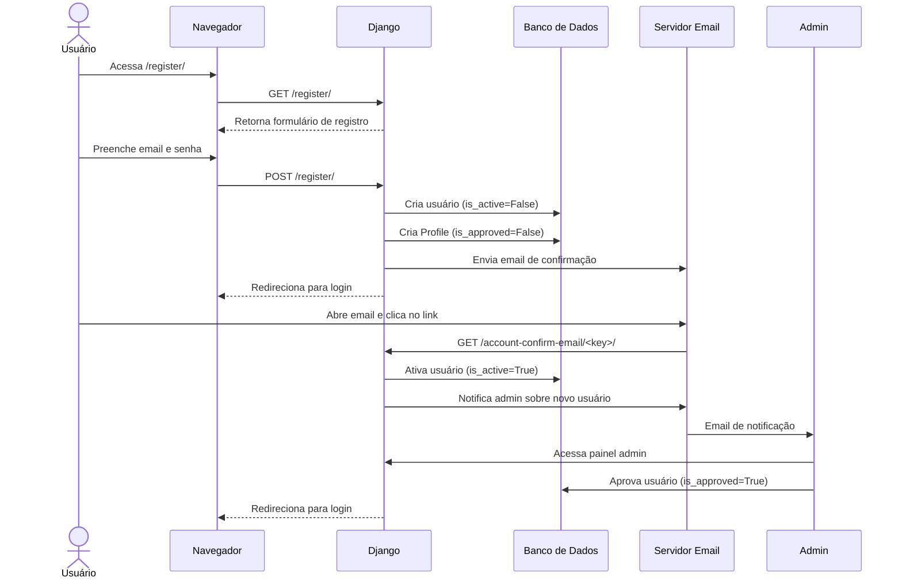
```mermaid
sequenceDiagram
    actor U as Usuário
    participant N as Navegador
    participant D as Django
    participant DB as Banco de Dados
    participant E as Servidor Email
    participant A as Admin

    U->>N: Acessa /register/
    N->>D: GET /register/
    D-->>N: Retorna formulário de registro
    U->>N: Preenche email e senha
    N->>D: POST /register/
    D->>DB: Cria usuário (is_active=False)
    D->>DB: Cria Profile (is_approved=False)
    D->>E: Envia email de confirmação
    D-->>N: Redireciona para login
    U->>E: Abre email e clica no link
    E->>D: GET /account-confirm-email/<key>/
    D->>DB: Ativa usuário (is_active=True)
    D->>E: Notifica admin sobre novo usuário
    E->>A: Email de notificação
    A->>D: Acessa painel admin
    A->>DB: Aprova usuário (is_approved=True)
    D-->>N: Redireciona para login
```

##### 1.2. Processo de Login com Email
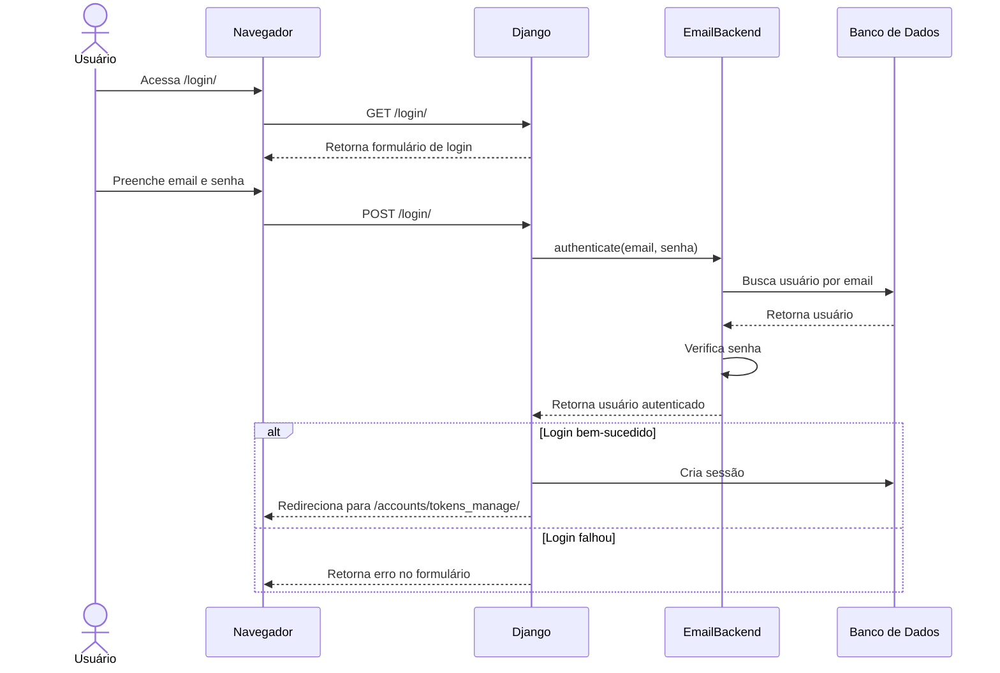
```mermaid
sequenceDiagram
    actor U as Usuário
    participant N as Navegador
    participant D as Django
    participant EB as EmailBackend
    participant DB as Banco de Dados

    U->>N: Acessa /login/
    N->>D: GET /login/
    D-->>N: Retorna formulário de login
    U->>N: Preenche email e senha
    N->>D: POST /login/
    D->>EB: authenticate(email, senha)
    EB->>DB: Busca usuário por email
    DB-->>EB: Retorna usuário
    EB->>EB: Verifica senha
    EB-->>D: Retorna usuário autenticado
    alt Login bem-sucedido
        D->>DB: Cria sessão
        D-->>N: Redireciona para /accounts/tokens_manage/
    else Login falhou
        D-->>N: Retorna erro no formulário
    end
```

##### 1.3. Processo de Reset de Senha
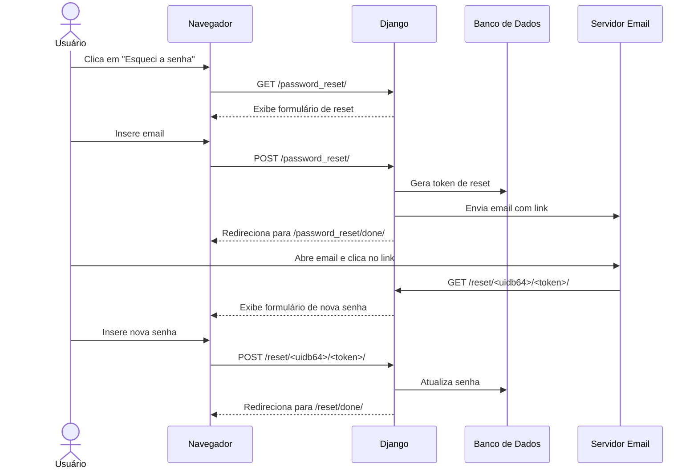
```mermaid
sequenceDiagram
    actor U as Usuário
    participant N as Navegador
    participant D as Django
    participant DB as Banco de Dados
    participant E as Servidor Email

    U->>N: Clica em "Esqueci a senha"
    N->>D: GET /password_reset/
    D-->>N: Exibe formulário de reset
    U->>N: Insere email
    N->>D: POST /password_reset/
    D->>DB: Gera token de reset
    D->>E: Envia email com link
    D-->>N: Redireciona para /password_reset/done/
    U->>E: Abre email e clica no link
    E->>D: GET /reset/<uidb64>/<token>/
    D-->>N: Exibe formulário de nova senha
    U->>N: Insere nova senha
    N->>D: POST /reset/<uidb64>/<token>/
    D->>DB: Atualiza senha
    D-->>N: Redireciona para /reset/done/
```

#### 2. Processo de Gerenciamento de Tokens

##### 2.1. Criação e Configuração de Token
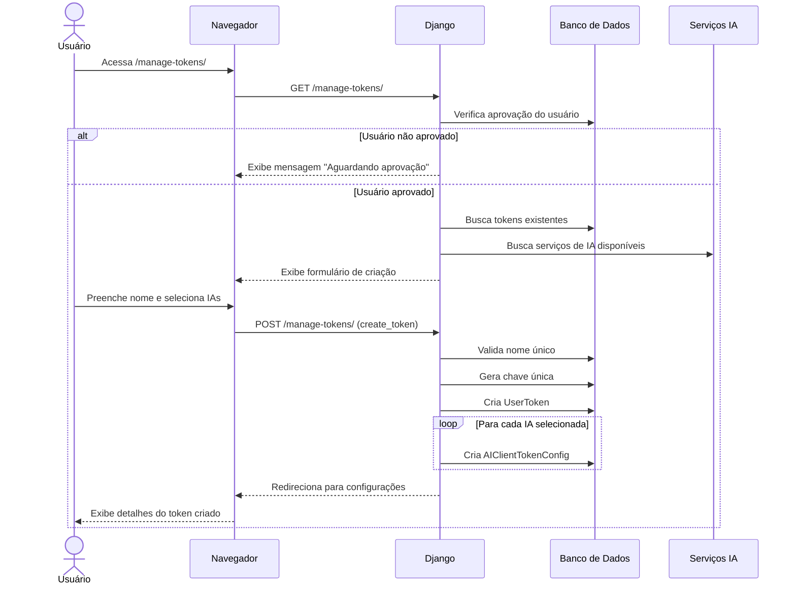
```mermaid
sequenceDiagram
    actor U as Usuário
    participant N as Navegador
    participant D as Django
    participant DB as Banco de Dados
    participant AI as Serviços IA

    U->>N: Acessa /manage-tokens/
    N->>D: GET /manage-tokens/
    D->>DB: Verifica aprovação do usuário
    alt Usuário não aprovado
        D-->>N: Exibe mensagem "Aguardando aprovação"
    else Usuário aprovado
        D->>DB: Busca tokens existentes
        D->>AI: Busca serviços de IA disponíveis
        D-->>N: Exibe formulário de criação
        
        U->>N: Preenche nome e seleciona IAs
        N->>D: POST /manage-tokens/ (create_token)
        D->>DB: Valida nome único
        D->>DB: Gera chave única
        D->>DB: Cria UserToken
        
        loop Para cada IA selecionada
            D->>DB: Cria AIClientTokenConfig
        end
        
        D-->>N: Redireciona para configurações
        N-->>U: Exibe detalhes do token criado
    end
```

##### 2.2. Gerenciamento de Configurações de IA
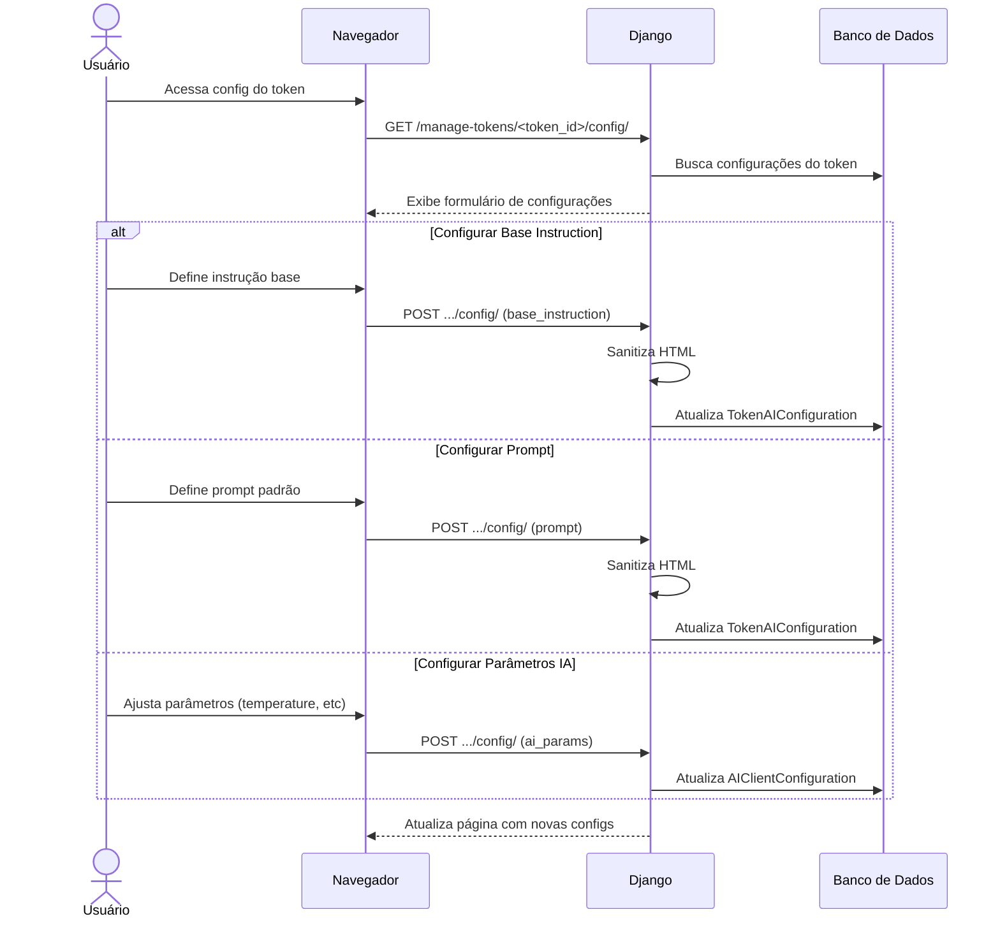
```mermaid
sequenceDiagram
    actor U as Usuário
    participant N as Navegador
    participant D as Django
    participant DB as Banco de Dados

    U->>N: Acessa config do token
    N->>D: GET /manage-tokens/<token_id>/config/
    D->>DB: Busca configurações do token
    D-->>N: Exibe formulário de configurações

    alt Configurar Base Instruction
        U->>N: Define instrução base
        N->>D: POST .../config/ (base_instruction)
        D->>D: Sanitiza HTML
        D->>DB: Atualiza TokenAIConfiguration
    else Configurar Prompt
        U->>N: Define prompt padrão
        N->>D: POST .../config/ (prompt)
        D->>D: Sanitiza HTML
        D->>DB: Atualiza TokenAIConfiguration
    else Configurar Parâmetros IA
        U->>N: Ajusta parâmetros (temperature, etc)
        N->>D: POST .../config/ (ai_params)
        D->>DB: Atualiza AIClientConfiguration
    end
    D-->>N: Atualiza página com novas configs
```

##### 2.3. Exclusão de Token
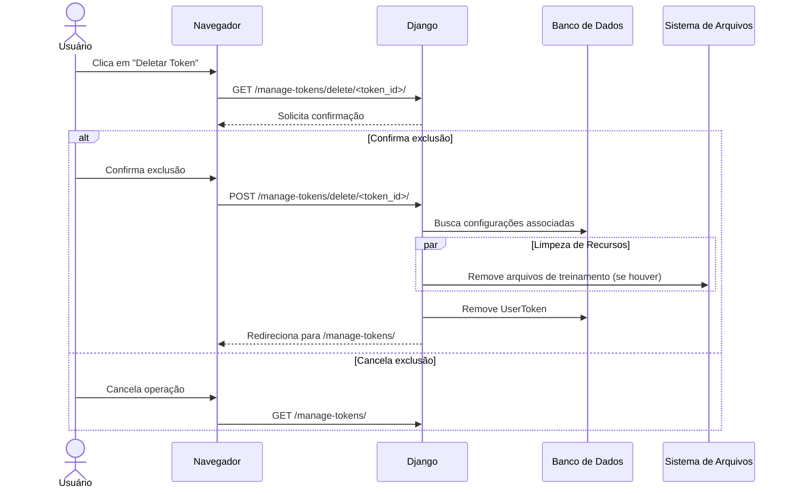
```mermaid
sequenceDiagram
    actor U as Usuário
    participant N as Navegador
    participant D as Django
    participant DB as Banco de Dados
    participant FS as Sistema de Arquivos

    U->>N: Clica em "Deletar Token"
    N->>D: GET /manage-tokens/delete/<token_id>/
    D-->>N: Solicita confirmação
    
    alt Confirma exclusão
        U->>N: Confirma exclusão
        N->>D: POST /manage-tokens/delete/<token_id>/
        D->>DB: Busca configurações associadas
        
        par Limpeza de Recursos
            D->>FS: Remove arquivos de treinamento (se houver)
        end
        
        D->>DB: Remove UserToken
        D-->>N: Redireciona para /manage-tokens/
    else Cancela exclusão
        U->>N: Cancela operação
        N->>D: GET /manage-tokens/
    end
```

#### 3. Configuração de IA

##### 3.1. Criação de Configuração Global de IA
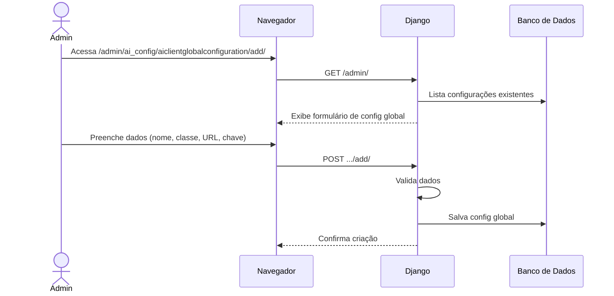
```mermaid
sequenceDiagram
    actor A as Admin
    participant N as Navegador
    participant D as Django
    participant DB as Banco de Dados

    A->>N: Acessa /admin/ai_config/aiclientglobalconfiguration/add/
    N->>D: GET /admin/
    D->>DB: Lista configurações existentes
    D-->>N: Exibe formulário de config global

    A->>N: Preenche dados (nome, classe, URL, chave)
    N->>D: POST .../add/
    D->>D: Valida dados
    D->>DB: Salva config global
    D-->>N: Confirma criação
```

##### 3.2. Configuração de IA
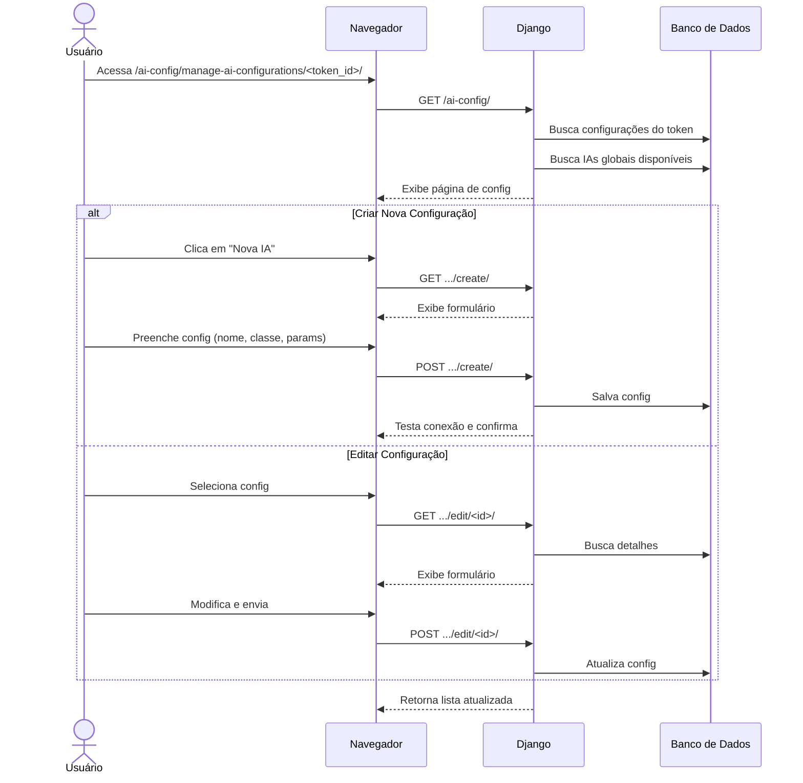
```mermaid
sequenceDiagram
    actor U as Usuário
    participant N as Navegador
    participant D as Django
    participant DB as Banco de Dados

    U->>N: Acessa /ai-config/manage-ai-configurations/<token_id>/
    N->>D: GET /ai-config/
    D->>DB: Busca configurações do token
    D->>DB: Busca IAs globais disponíveis
    D-->>N: Exibe página de config

    alt Criar Nova Configuração
        U->>N: Clica em "Nova IA"
        N->>D: GET .../create/
        D-->>N: Exibe formulário
        U->>N: Preenche config (nome, classe, params)
        N->>D: POST .../create/
        D->>DB: Salva config
        D-->>N: Testa conexão e confirma
    else Editar Configuração
        U->>N: Seleciona config
        N->>D: GET .../edit/<id>/
        D->>DB: Busca detalhes
        D-->>N: Exibe formulário
        U->>N: Modifica e envia
        N->>D: POST .../edit/<id>/
        D->>DB: Atualiza config
    end
    D-->>N: Retorna lista atualizada
```

##### 3.3. Gestão de Instruções e Prompts
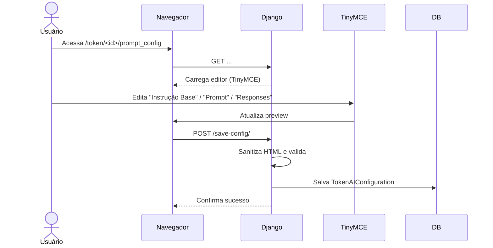
```mermaid
sequenceDiagram
    actor U as Usuário
    participant N as Navegador
    participant D as Django
    participant T as TinyMCE

    U->>N: Acessa /token/<id>/prompt_config
    N->>D: GET ...
    D-->>N: Carrega editor (TinyMCE)

    U->>T: Edita "Instrução Base" / "Prompt" / "Responses"
    T->>N: Atualiza preview
    N->>D: POST /save-config/
    D->>D: Sanitiza HTML e valida
    D->>DB: Salva TokenAIConfiguration
    D-->>N: Confirma sucesso
```

#### 4. Processo de Treinamento

##### 4.1. Treinamento de Modelo de IA
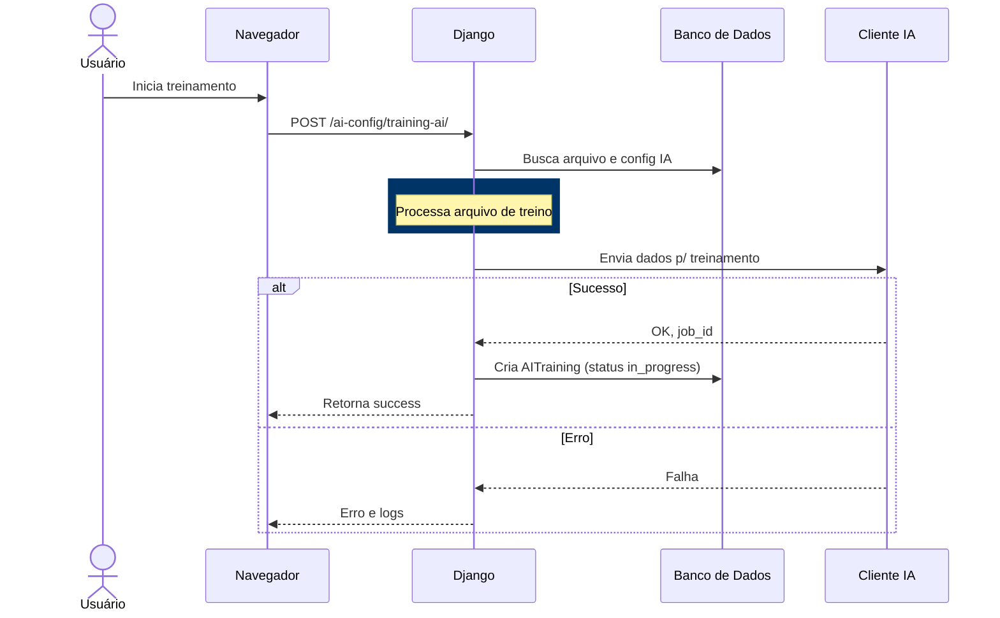
```mermaid
sequenceDiagram
    actor U as Usuário
    participant N as Navegador
    participant D as Django
    participant DB as Banco de Dados
    participant AI as Cliente IA

    U->>N: Inicia treinamento
    N->>D: POST /ai-config/training-ai/
    D->>DB: Busca arquivo e config IA
    
    rect rgb(0, 51, 102)
    Note over D: Processa arquivo de treino
    end

    D->>AI: Envia dados p/ treinamento
    alt Sucesso
        AI-->>D: OK, job_id
        D->>DB: Cria AITraining (status in_progress)
        D-->>N: Retorna success
    else Erro
        AI-->>D: Falha
        D-->>N: Erro e logs
    end
```

##### 4.2. Upload de Arquivo de Treinamento
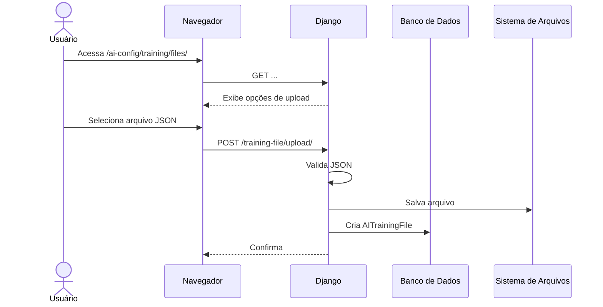
```mermaid
sequenceDiagram
    actor U as Usuário
    participant N as Navegador
    participant D as Django
    participant DB as Banco de Dados
    participant FS as Sistema de Arquivos

    U->>N: Acessa /ai-config/training/files/
    N->>D: GET ...
    D-->>N: Exibe opções de upload

    U->>N: Seleciona arquivo JSON
    N->>D: POST /training-file/upload/
    D->>D: Valida JSON
    D->>FS: Salva arquivo
    D->>DB: Cria AITrainingFile
    D-->>N: Confirma
```

##### 4.3. Captura de Exemplos de Treinamento
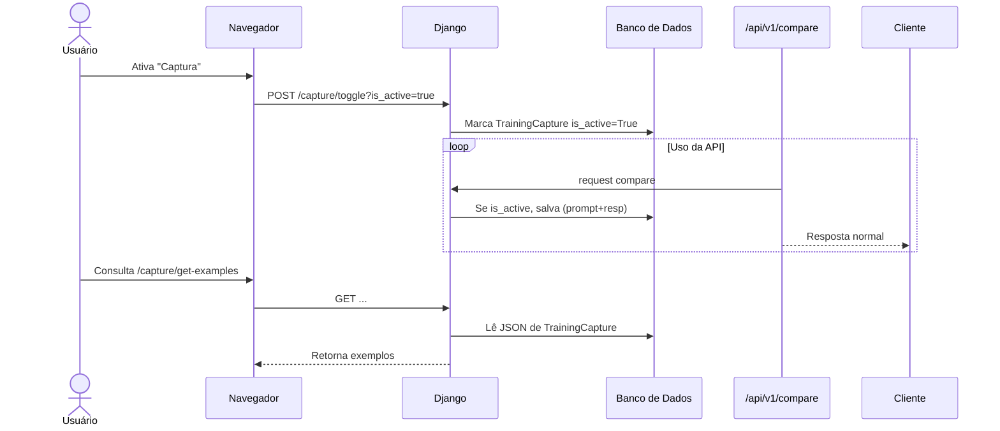
```mermaid
sequenceDiagram
    actor U as Usuário
    participant N as Navegador
    participant D as Django
    participant DB as Banco de Dados
    participant API as /api/v1/compare

    U->>N: Ativa "Captura"
    N->>D: POST /capture/toggle?is_active=true
    D->>DB: Marca TrainingCapture is_active=True

    loop Uso da API
        API->>D: request compare
        D->>DB: Se is_active, salva (prompt+resp)
        API-->>Cliente: Resposta normal
    end

    U->>N: Consulta /capture/get-examples
    N->>D: GET ...
    D->>DB: Lê JSON de TrainingCapture
    D-->>N: Retorna exemplos
```

##### 4.4. Processamento de Arquivo de Treinamento
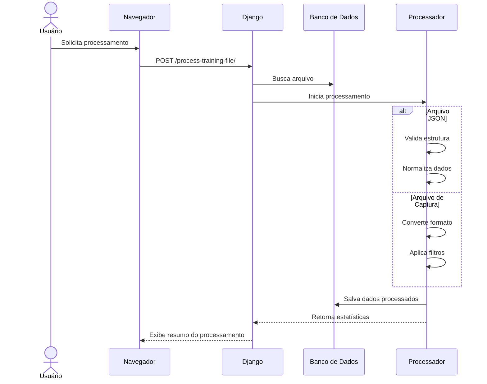
```mermaid
sequenceDiagram
    actor U as Usuário
    participant N as Navegador
    participant D as Django
    participant DB as Banco de Dados
    participant P as Processador

    U->>N: Solicita processamento
    N->>D: POST /process-training-file/
    D->>DB: Busca arquivo
    D->>P: Inicia processamento

    alt Arquivo JSON
        P->>P: Valida estrutura
        P->>P: Normaliza dados
    else Arquivo de Captura
        P->>P: Converte formato
        P->>P: Aplica filtros
    end

    P->>DB: Salva dados processados
    P-->>D: Retorna estatísticas
    D-->>N: Exibe resumo do processamento
```

#### 5. Processos da API

##### 5.1. Processo de Comparação
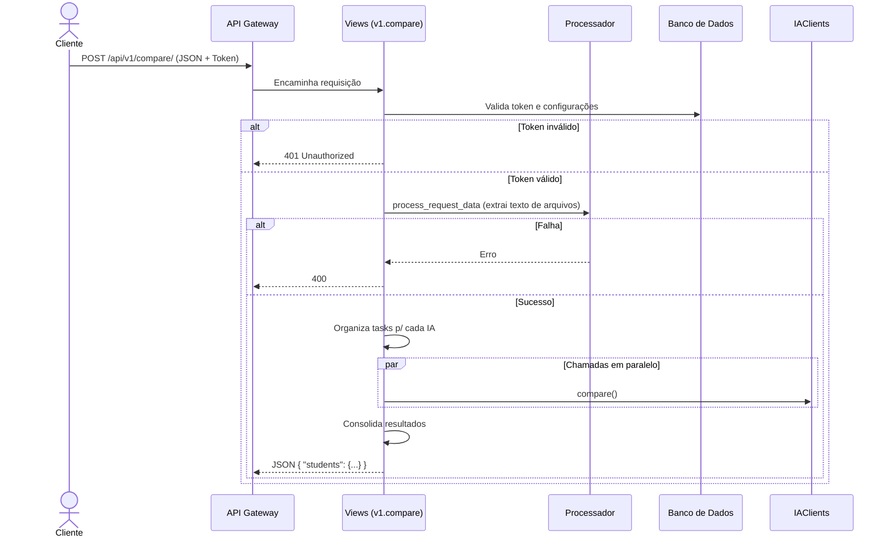
```mermaid
sequenceDiagram
    actor C as Cliente
    participant API as API Gateway
    participant V as Views (v1.compare)
    participant P as Processador
    participant DB as Banco de Dados

    C->>API: POST /api/v1/compare/ (JSON + Token)
    API->>V: Encaminha requisição
    V->>DB: Valida token e configurações
    alt Token inválido
        V-->>API: 401 Unauthorized
    else Token válido
        V->>P: process_request_data (extrai texto de arquivos)
        alt Falha
            P-->>V: Erro
            V-->>API: 400
        else Sucesso
            V->>V: Organiza tasks p/ cada IA
            par Chamadas em paralelo
                V->>IAClients: compare()
            end
            V->>V: Consolida resultados
            V-->>API: JSON { "students": {...} }
        end
    end
```

##### 5.2. Processamento de Arquivos (PDF/DOCX)
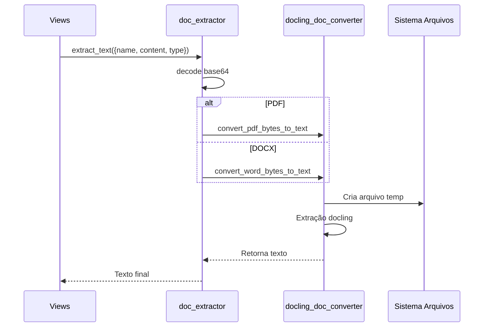
```mermaid
sequenceDiagram
    participant V as Views
    participant D as doc_extractor
    participant DC as docling_doc_converter
    participant FS as Sistema Arquivos

    V->>D: extract_text({name, content, type})
    D->>D: decode base64
    alt PDF
        D->>DC: convert_pdf_bytes_to_text
    else DOCX
        D->>DC: convert_word_bytes_to_text
    end
    DC->>FS: Cria arquivo temp
    DC->>DC: Extração docling
    DC-->>D: Retorna texto
    D-->>V: Texto final
```

##### 5.3. Validação de Token e Configurações
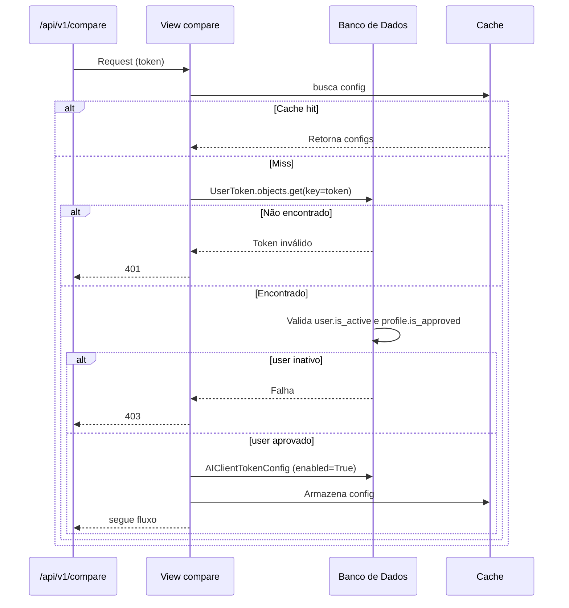
```mermaid
sequenceDiagram
    participant API as /api/v1/compare
    participant V as View compare
    participant DB as Banco de Dados
    participant Cache as Cache

    API->>V: Request (token)
    V->>Cache: busca config
    alt Cache hit
        Cache-->>V: Retorna configs
    else Miss
        V->>DB: UserToken.objects.get(key=token)
        alt Não encontrado
            DB-->>V: Token inválido
            V-->>API: 401
        else Encontrado
            DB->>DB: Valida user.is_active e profile.is_approved
            alt user inativo
                DB-->>V: Falha
                V-->>API: 403
            else user aprovado
                V->>DB: AIClientTokenConfig (enabled=True)
                V->>Cache: Armazena config
                V-->>API: segue fluxo
            end
        end
    end
```

##### 5.4. Execução Paralela de Múltiplas IAs
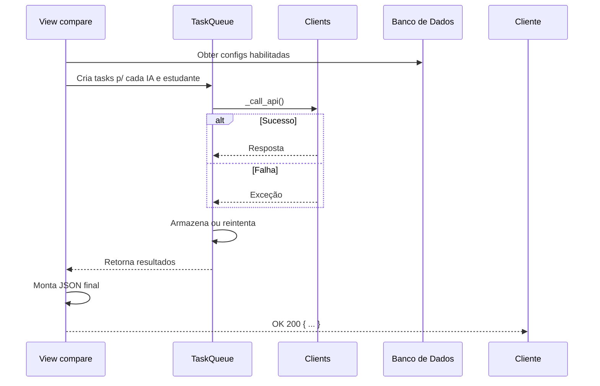
```mermaid
sequenceDiagram
    participant V as View compare
    participant TQ as TaskQueue
    participant IA as Clients
    participant DB as Banco de Dados

    V->>DB: Obter configs habilitadas
    V->>TQ: Cria tasks p/ cada IA e estudante
    TQ->>IA: _call_api()
    alt Sucesso
        IA-->>TQ: Resposta
    else Falha
        IA-->>TQ: Exceção
    end
    
    TQ->>TQ: Armazena ou reintenta
    TQ-->>V: Retorna resultados
    V->>V: Monta JSON final
    V-->>Cliente: OK 200 { ... }
```

#### 6. Fluxos de Administração

##### 6.1. Gerenciamento de Configurações Globais
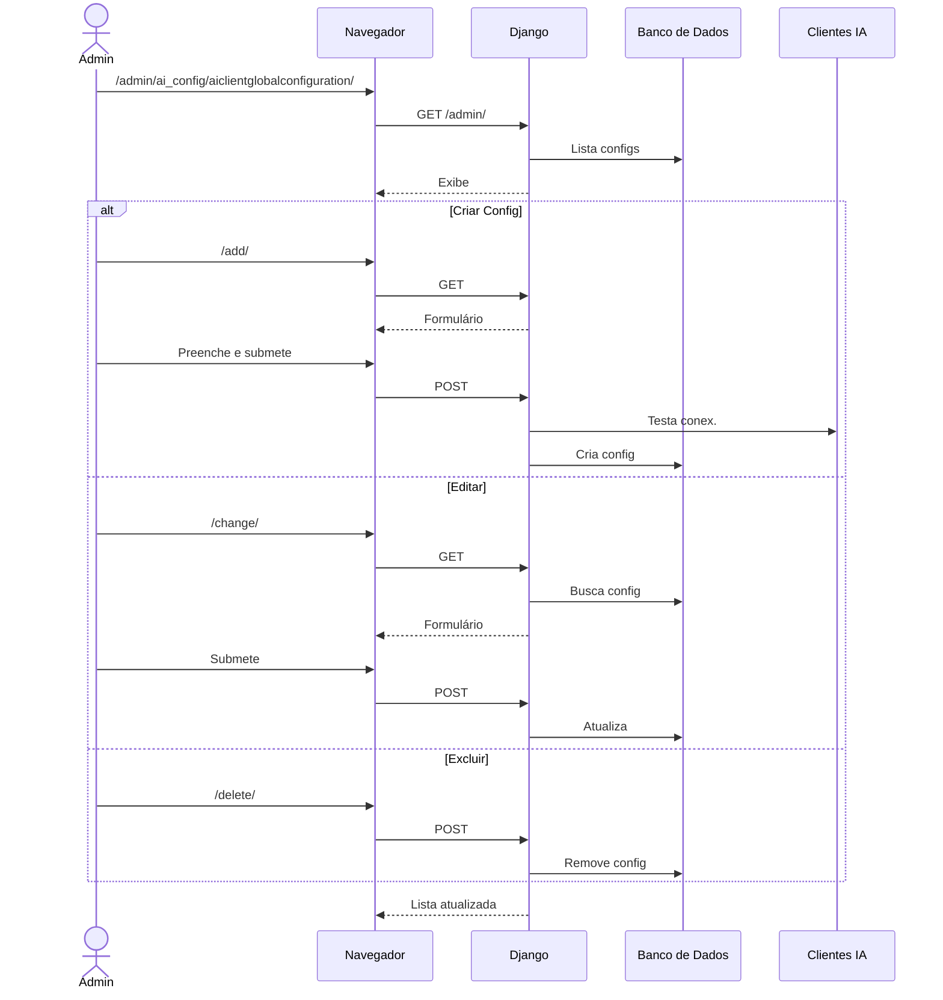
```mermaid
sequenceDiagram
    actor A as Admin
    participant N as Navegador
    participant D as Django
    participant DB as Banco de Dados
    participant AI as Clientes IA

    A->>N: /admin/ai_config/aiclientglobalconfiguration/
    N->>D: GET /admin/
    D->>DB: Lista configs
    D-->>N: Exibe

    alt Criar Config
        A->>N: /add/
        N->>D: GET
        D-->>N: Formulário
        A->>N: Preenche e submete
        N->>D: POST
        D->>AI: Testa conex. 
        D->>DB: Cria config
    else Editar
        A->>N: /change/
        N->>D: GET
        D->>DB: Busca config
        D-->>N: Formulário
        A->>N: Submete
        N->>D: POST
        D->>DB: Atualiza
    else Excluir
        A->>N: /delete/
        N->>D: POST
        D->>DB: Remove config
    end
    D-->>N: Lista atualizada
```

##### 6.2. Aprovação de Usuários
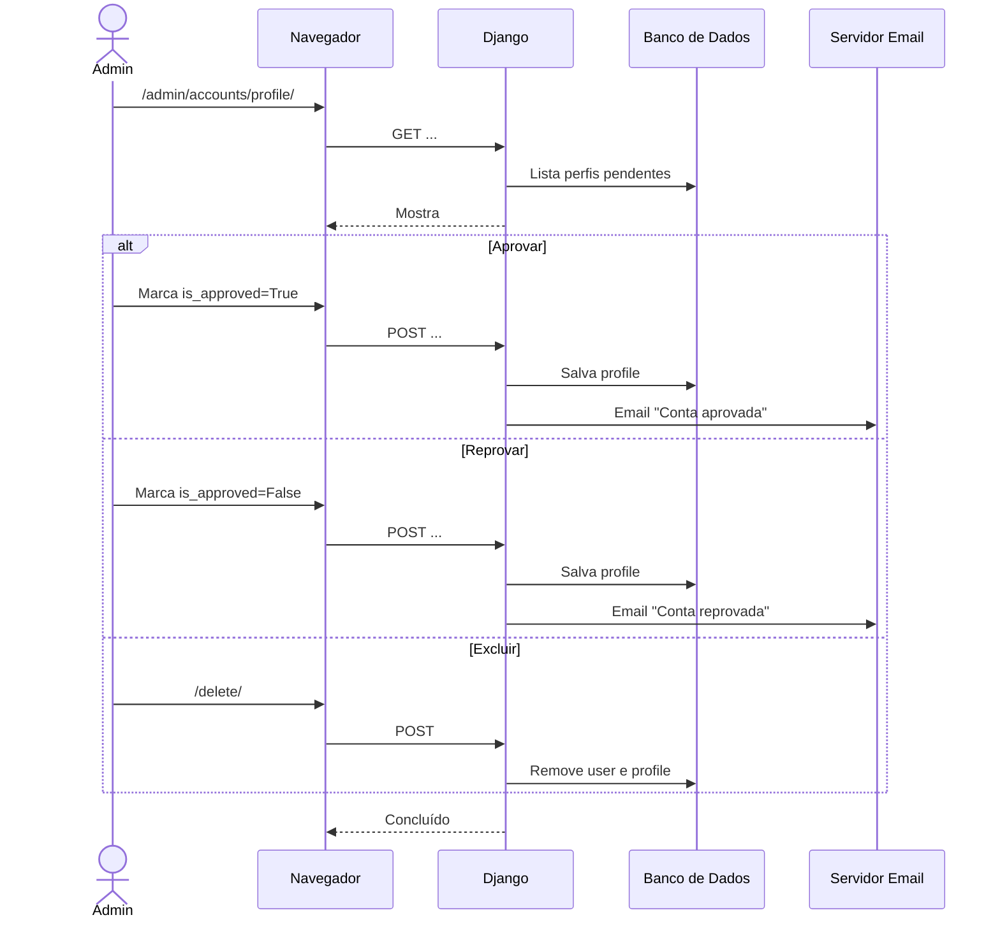
```mermaid
sequenceDiagram
    actor A as Admin
    participant N as Navegador
    participant D as Django
    participant DB as Banco de Dados
    participant E as Servidor Email

    A->>N: /admin/accounts/profile/
    N->>D: GET ...
    D->>DB: Lista perfis pendentes
    D-->>N: Mostra

    alt Aprovar
        A->>N: Marca is_approved=True
        N->>D: POST ...
        D->>DB: Salva profile
        D->>E: Email "Conta aprovada"
    else Reprovar
        A->>N: Marca is_approved=False
        N->>D: POST ...
        D->>DB: Salva profile
        D->>E: Email "Conta reprovada"
    else Excluir
        A->>N: /delete/
        N->>D: POST
        D->>DB: Remove user e profile
    end
    D-->>N: Concluído
```

##### 6.3. Monitoramento de Uso da API
```mermaid
sequenceDiagram
    actor A as Admin
    participant N as Navegador
    participant D as Django
    participant DB as Banco de Dados
    participant C as Cache

    A->>N: /api/monitoring/
    N->>D: GET ...
    D->>DB: Logs (APILog)
    D-->>N: Exibe dashboard

    loop Polling
        N->>D: /monitoring/data
        D->>DB: Filtro logs
        D-->>N: JSON logs recentes
    end

    alt Detalhar erro
        A->>N: Seleciona log
        N->>D: GET .../<id>/
        D->>DB: logs
        D-->>N: Exibe stack
    else Relatório
        A->>N: /report/
        N->>D: GET ...
        D->>D: Gera PDF
        D-->>N: Download
    end
```

##### 6.4. Gestão de Arquivos de Treinamento
```mermaid
sequenceDiagram
    actor A as Admin
    participant N as Navegador
    participant D as Django
    participant DB as Banco de Dados
    participant FS as Sistema de Arquivos

    A->>N: /admin/ai_config/aitrainingfile/
    N->>D: GET ...
    D->>DB: Lista AITrainingFile
    D-->>N: Exibe

    alt Revisar arquivo
        A->>N: Seleciona
        N->>D: GET .../review/
        D->>FS: Lê arquivo
        D->>D: Valida
        D-->>N: Exibe info
    else Aprovar
        A->>N: Marca OK
        N->>D: POST ...
        D->>DB: Altera status
    else Excluir
        A->>N: /delete/
        N->>D: POST
        D->>FS: Remove arquivo
        D->>DB: Remove registro
    end
    D-->>N: Atualizado
```

#### 7. Integração com IAs

##### 7.1. Fluxo OpenAI
```mermaid
sequenceDiagram
    participant C as Chamador
    participant V as Views
    participant OAI as OpenAiClient
    participant API as OpenAI API
    participant Cache as Cache

    C->>V: compare(data)
    V->>OAI: _prepare_prompts()

    rect rgb(0, 51, 102)
    Note over OAI: Monta system/user messages
    end

    OAI->>API: chat.completions.create(model, messages, ...)
    alt Sucesso
        API-->>OAI: {choices: [...]}
        OAI->>Cache: Armazena (TTL=1h)
        OAI-->>V: Retorna texto
    else Erro
        API-->>OAI: 429 ou outro
        OAI->>OAI: retry 3x
        OAI-->>V: Lança exceção c/ log
    end
```

##### 7.2. Fluxo Gemini
```mermaid
sequenceDiagram
    participant C as Chamador
    participant V as Views
    participant G as GeminiClient
    participant API as Gemini
    participant Cache as Cache

    C->>V: compare(data)
    V->>G: _prepare_prompts()

    rect rgb(0, 51, 102)
    Note over G: base_instruction -> system_instruction
    end

    G->>API: models.generate_content(model, contents, config)
    alt OK
        API-->>G: texto
        G->>Cache: store
        G-->>V: Resposta
    else Erro
        API-->>G: Falha
        G-->>V: Exceção
    end
```

##### 7.3. Fluxo Anthropic
```mermaid
sequenceDiagram
    participant C as Cliente API
    participant V as Views
    participant A as AnthropicClient
    participant API as Anthropic API
    participant Cache as Cache Redis

    C->>V: Requisição com dados
    V->>A: compare(data)

    A->>A: _prepare_prompts()

    rect rgb(0, 51, 102)
        Note over A: Configuração Claude
        A->>A: client = anthropic.Anthropic()
        A->>A: Prepara mensagem
    end

    A->>API: "client.messages.create(model='claude-3-opus-20240229', max_tokens=1000, messages=[...])"

    alt Resposta Bem-sucedida
        API-->>A: Resposta Claude
        A->>Cache: Armazena resultado (TTL=1h)
        A-->>V: Retorna resultado formatado
    else Erro de Contexto
        API-->>A: ContextLengthError
        A->>A: Reduz tamanho do prompt
        A->>API: "Retry com prompt reduzido"
    end
```

##### 7.4. Fluxo Azure
```mermaid
sequenceDiagram
    participant C as Chamador
    participant V as Views
    participant AZ as AzureClient
    participant API as Azure Chat
    participant Cache as Cache

    C->>V: compare(data)
    V->>AZ: _prepare_prompts()
    AZ->>API: complete(**configurations)

    alt Resposta
        API-->>AZ: { choices: [...] }
        AZ->>Cache: store
        AZ-->>V: texto
    else Erro
        API-->>AZ: error
        AZ-->>V: Exceção
    end
```

##### 7.5. Fluxo Llama
```mermaid
sequenceDiagram
    participant C as Chamador
    participant V as Views
    participant L as LlamaClient
    participant API as Llama API
    participant Cache as Cache

    C->>V: compare(data)
    V->>L: _prepare_prompts()
    L->>API: run(configurations)

    alt OK
        API-->>L: { choices: [...] }
        L->>Cache: store
        L-->>V: texto
    else Erro
        API-->>L: Falha
        L-->>V: Exceção
    end
```

##### 7.6. Fluxo Perplexity
```mermaid
sequenceDiagram
    participant C as Chamador
    participant V as Views
    participant P as PerplexityClient
    participant API as Perplexity
    participant Cache as Cache

    C->>V: compare(data)
    V->>P: _prepare_prompts()
    P->>API: POST /chat/completions

    alt Sucesso
        API-->>P: {choices: [...]}
        P->>Cache: store
        P-->>V: texto
    else Erro
        API-->>P: 401 ou falha
        P-->>V: Exceção
    end
```

#### 8. Fluxos de Erro

##### 8.1. Tratamento de Erros de API
```mermaid
sequenceDiagram
    participant C as Cliente
    participant V as Views
    participant H as Handler
    participant L as Logger

    C->>V: Request com erro
    V->>H: exception_handler(exc)
    H->>L: logger.error(stacktrace)
    alt Erro de Validação (400)
        H-->>V: 400
    else Erro de Autenticação (401)
        H-->>V: 401
    else Erro de Permissão (403)
        H-->>V: 403
    else Erro de Servidor (500)
        H-->>V: 500
    end
    V-->>C: Retorna JSON com detalhes
```

##### 8.2. Tratamento de Falhas de Comunicação
```mermaid
sequenceDiagram
    participant C as Cliente
    participant V as Views
    participant IA as IAClient
    participant CB as CircuitBreaker

    C->>V: Chamada de IA
    V->>CB: attempt_call(api_name)
    alt Circuito Aberto
        CB-->>V: CircuitOpenError
        V-->>C: 503 "Service Unavailable"
    else Circuito Fechado/Half-Open
        V->>IA: _call_api()
        alt Sucesso
            IA-->>V: OK
            V->>CB: record_success(api_name)
            V-->>C: Resposta normal
        else Falha
            IA-->>V: Exceção
            V->>CB: record_failure(api_name)
            V-->>C: Erro
        end
    end
```

##### 8.3. Timeout e Retry
```mermaid
sequenceDiagram
    participant C as Chamador
    participant O as OpenAiClient
    participant API as OpenAI
    participant T as Timer

    C->>O: train()
    O->>API: files.upload
    alt Falha
        API-->>O: 429 rate-limit
        O->>T: aguarda 2s
        O->>API: retry
        alt Falha final
            O-->>C: Exceção
        else Sucesso
            O->>API: fine_tuning.jobs.create
            
        end
    else Sucesso
        API-->>O: file_id
        O->>API: fine_tuning.jobs.create
        API-->>O: job_id
        loop Poll job status
            O->>API: retrieve(job_id)
            alt Succeeded
                API-->>O: fine_tuned_model
                O-->>C: "Treinamento OK"
            else Failed
                API-->>O: erro
                O-->>C: "Falha no treinamento"
            else Em progresso
                O->>T: sleep(5s)
            end
        end
    end
```

##### 8.4. Validação de Dados
```mermaid
sequenceDiagram
    participant C as Cliente
    participant V as Views
    participant F as DjangoForms
    participant L as Logger

    C->>V: POST /api/v1/compare
    V->>F: validate(fields)
    alt Falta 'instructor' ou 'students'
        F-->>V: Erro
        V-->>C: 400
    else Email / Token faltando
        F-->>V: Erro
        V-->>C: 401
    else Form OK
        V->>L: logger.info
        V-->>C: 200
    end
```

#### 9. Fluxo de Tarrefas

##### 9.1. Fluxos Celery e Tarefas de Treinamento
```mermaid
sequenceDiagram
    participant Sch as Celery Scheduler
    participant T as Celery Worker
    participant DB as DB
    participant AI as AI Client
    participant S as Sistema

    rect rgb(0, 51, 102)
    Note over Sch: Beat agenda <br> update_training_status a cada 1min
    end

    Sch->>T: Tarefa: update_training_status
    T->>DB: Busca AITraining (status=in_progress)
    loop Para cada job
        T->>AI: get_training_status(job_id)
        alt Concluído
            AI-->>T: status=success + model
            T->>DB: training.status=completed, model_name=...
        else Falha
            AI-->>T: erro
            T->>DB: training.status=failed
        else Em Andamento
            AI-->>T: Progresso
            T->>DB: training.progress = ...
        end
    end
    T-->>Sch: OK
    Sch-->>S: Logs
```

---

## Desenvolvimento

### Como Contribuir

Contribuições são muito bem-vindas! Para contribuir:

1. Faça um _fork_ deste repositório.
2. Crie uma branch para sua feature ou correção:
   ```bash
   git checkout -b feature/minha-feature
   ```
3. Faça _commits_ com suas alterações, seguindo as convenções de código (PEP 8).
4. Execute os testes:
   ```bash
   python manage.py test
   ```
5. Envie sua branch para o repositório remoto:
   ```bash
   git push origin feature/minha-feature
   ```
6. Abra um Pull Request no repositório original, descrevendo suas alterações e referências a issues (se houver).

### Testes

> **Importante:** O projeto **possui** testes implementados para diversos módulos, incluindo `accounts/`, `ai_config/` e `api/`. Os testes abrangem autenticação, views, formulários, modelos e funcionalidades principais (como o *circuit breaker* e extração de arquivos).

Para executar todos os testes do projeto:
```bash
python manage.py test
```

> Se você desejar rodar testes de um app específico (ex.: só os testes de `accounts`):
```bash
python manage.py test accounts
```

### Tecnologias Utilizadas

Updated versions based on requirements.txt (exemplos):
- **Django (v4.2.7)**: Framework web principal.
- **Django REST Framework (v3.15.2)**: Criação dos endpoints REST.
- **Allauth e dj-rest-auth**: Gerenciamento de autenticação e registro de usuários.
- **Docling (v2.17.0)**: Extração de texto de documentos (PDF, DOCX).
- **python-dotenv (v1.0.0)**: Gerenciamento de variáveis de ambiente.
- **Requests (v2.32.3)**: Realização de requisições HTTP.
- **Gunicorn (v22.0.0)**: Servidor WSGI para produção.
- **Bootstrap (v5.3.2)**: Framework CSS para a interface.
- **TinyMCE (django-tinymce v4.1.0)**: Editor de texto (opcional).
- **Sphinx**: Geração de documentação (opcional).
- **Celery (última versão compatível)**: Para execução de tarefas assíncronas.

---

## Suporte

### FAQ

**Como recuperar minha senha?**  
Utilize a opção "Esqueci minha senha" na página de login para receber instruções via email.

**Meu token não está funcionando. O que fazer?**  
- Verifique se sua conta foi aprovada pelo administrador.  
- Confirme se o token foi criado corretamente na área de gerenciamento.  
- Assegure-se de enviar o token corretamente no header `Authorization`.

**Como configurar um novo cliente de IA?**  
Acesse o painel de administração (`/admin/`), vá para a seção "Global - Clientes de IA" e adicione uma nova configuração global, informando o nome, a classe do cliente (ex.: OpenAi, Gemini) e a chave de API. Em seguida, associe essa configuração ao seu token na área de gerenciamento de tokens.

**Como carregar um arquivo de treinamento?**  
Na área de gerenciamento de tokens, selecione o token desejado e utilize o formulário de upload para enviar o arquivo de treinamento. O arquivo deve ser codificado em base64 quando enviado via API.

**Quais formatos de arquivo são suportados?**  
A API suporta a extração de texto de arquivos PDF e DOCX, utilizando Docling.

**Como funciona a captura de exemplos (TrainingCapture)?**  
Durante o uso da API, se a captura estiver ativa, os exemplos (prompt e resposta) serão salvos temporariamente para que possam ser usados no treinamento futuro.

### Documentação Adicional

A documentação completa (gerada pelo Sphinx) está disponível na pasta `_build/html/` ou online (link a ser definido). Para gerar a documentação localmente:

```bash
cd docs
make html
```

### Contato

Para dúvidas ou suporte, abra uma _issue_ no GitHub ou envie um email para [diegogrosmann@gmail.com].

---

## Informações Legais

### Licença

Este projeto está licenciado sob a **MIT License**.

```
MIT License

Copyright (c) 2025 Diego Grosmann

Permission is hereby granted, free of charge, to any person obtaining a copy
of this software and associated documentation files (the "Software"), to deal
in the Software without restriction, including without limitation the rights
to use, copy, modify, merge, publish, distribute, sublicense, and/or sell
copies of the Software, and to permit persons to whom the Software is
furnished to do so, subject to the following conditions:

[O aviso de copyright acima e
este aviso de permissão devem ser incluídos em todas as cópias ou partes significativas do Software.]
```

*(Abaixo, constam também licenças de terceiros utilizadas em `staticfiles/` do admin, como a biblioteca Select2:)*

```
=== staticfiles/admin/js/vendor/select2/LICENSE.md ===
The MIT License (MIT)
... (conteúdo da licença da biblioteca)
```
