<p align="center">

</p>

# EnsinaNet.AI


## Visão Geral

O **EnsinaNet.AI** é uma aplicação web desenvolvida em Django que permite corrigir atividades de redes de computadores utilizando múltiplos serviços de inteligência artificial (IA). A aplicação integra autenticação personalizada, gerenciamento de tokens e uma API REST robusta que orquestra chamadas a diversos provedores de IA – como OpenAI, Azure, Anthropic, Google Gemini, Llama e Perplexity – possibilitando análises detalhadas e customizáveis por usuário.

## Índice

- [Visão Geral](#visão-geral)
- [Funcionalidades Principais](#funcionalidades-principais)
  - [Autenticação e Tokens](#autenticação-e-tokens)
  - [Configuração de IA](#configuração-de-ia)
  - [API de Comparação](#api-de-comparação)
    - [Versionamento da API](#versionamento-da-api)
    - [Versão 1](#versão-1)
  - [Monitoramento e Logs da API](#monitoramento-e-logs-da-api)
  - [Interface Pública](#interface-pública)
- [Guia de Início Rápido](#guia-de-início-rápido)
  - [Pré-requisitos](#pré-requisitos)
  - [Instalação](#instalação)
  - [Configuração](#configuração)
- [Documentação da API](#documentação-da-api)
- [Arquitetura](#arquitetura)
  - [Estrutura de Diretórios](#estrutura-de-diretórios)
  - [Diagramas](#diagramas)
- [Desenvolvimento](#desenvolvimento)
  - [Como Contribuir](#como-contribuir)
  - [Testes](#testes)
  - [Tecnologias Utilizadas](#tecnologias-utilizadas)
- [Suporte](#suporte)
  - [FAQ](#faq)
  - [Documentação Adicional](#documentação-adicional)
  - [Contato](#contato)
- [Informações Legais](#informações-legais)
  - [Licença](#licença)

---

## Funcionalidades Principais

### Autenticação e Tokens

- **Autenticação via Email**  
  Utiliza um backend customizado (`accounts/backends.py`) que permite login exclusivamente com o campo de email.

- **Confirmação de Email**  
  O cadastro exige que o usuário confirme seu endereço de email (via `allauth` e view customizada `CustomConfirmEmailView`), antes de ativar a conta.

- **Perfis e Aprovação de Usuários**  
  Cada usuário tem um `Profile` vinculado (1:1), que pode ser **aprovado** manualmente pelo administrador. Somente usuários aprovados têm acesso pleno às funcionalidades.  
  **Observação Adicional:** Além de `is_approved`, o perfil inclui o campo `capture_inactivity_timeout`. O usuário pode ajustar esse valor na tela de configurações (`/accounts/settings/`), junto com nome, sobrenome e email, usando o `UserSettingsForm`. Isso influencia o tempo de inatividade permitido para a captura de exemplos de treinamento.

- **Tokens de API**  
  Tokens são gerenciados via `UserToken` e vinculados a `AIClientConfiguration` através da tabela de junção `AIClientTokenConfig`, conforme implementado em `accounts/models.py` e `ai_config/models.py`.

### Configuração de IA
- **Vários Provedores de IA**  
  O projeto inclui integrações com múltiplos clientes de IA (via `AIClientGlobalConfiguration` e `AIClientConfiguration`), como:
  - OpenAI
  - Azure OpenAI
  - Anthropic (Claude 3)
  - Google Gemini
  - Llama
  - Perplexity
- **Configuração Específica por Token**  
  Para cada token (`UserToken`), é possível selecionar quais IAs estarão ativas, habilitar/desabilitar, definir parâmetros (modelo, hyperparams) e personalizar prompts (via `TokenAIConfiguration`).
- **Captura de Exemplos (TrainingCapture)**  
  Caso o usuário ative a opção, as interações realizadas podem ser capturadas em um arquivo temporário, armazenando exemplo de *prompt* e *resposta*. Isso facilita a criação de conjuntos de treinamento para *fine-tuning*.
- **Treinamento de Modelos**  
  Para IAs compatíveis (ex.: OpenAI e Gemini), o sistema permite o **upload de arquivos de treinamento** e abertura de *jobs* de *fine-tuning*, monitorando status e progresso via `AITraining` e tasks assíncronas (Celery).
- **Extração de Conteúdo de Arquivos**  
  Suporte à extração de texto de PDFs e DOCX por meio do `docling`, permitindo que o usuário envie documentos e compare seu conteúdo. (Vide `api/utils/doc_extractor.py`.)

### API de Comparação
- **Versionamento**  
  O projeto implementa versionamento de rota (exemplo: `/api/v1/compare/`) usando `URLPathVersioning`, mantendo compatibilidade em múltiplas versões.
- **Execução Paralela**  
  O endpoint `/api/v1/compare/` processa cada IA em paralelo, aplicando *circuit breaker* para controlar falhas em chamadas externas.  
- **Suporte a Arquivos**  
  Suporta extrair texto de PDFs e DOCX (via `docling`) quando recebidos no campo `"type":"file"`, convertendo-os dinamicamente para comparação.
- **Circuit Breaker**  
  Componente que monitora falhas de comunicação com provedores de IA e abre/fecha o circuito conforme o número de erros ou tempo decorrido, mitigando cascatas de falhas.
- **Captura de Exemplos**  
  Suporte a captura de exemplos via `TrainingCapture`.
- **Validação de Dados**  
  Validação de dados via `validate_request_data()`.

#### Versionamento da API
O versionamento atual é implementado nas rotas, iniciando pela versão "v1". Exemplos:
- `POST /api/v1/compare/`

#### Versão 1
A versão 1 é a principal atualmente, abrangendo o endpoint `/compare/` para comparar as atividades. Futuramente, a estrutura de versionamento facilita a adição de funcionalidades nas próximas versões.

### Monitoramento e Logs da API
- **Middleware de Monitoramento**  
  A aplicação inclui o `MonitoringMiddleware`, que registra dados de cada requisição API em `APILog`.  
- **Logs Detalhados**  
  São armazenados o método HTTP, a rota acessada, o status da resposta e o tempo de execução.  
- **Dashboard de Monitoramento**  
  Permite que usuários (especialmente administradores) visualizem os logs recentes via `/api/monitoring/`.  
- **Visualização no Django Admin**  
  O modelo `APILog` aparece na interface de administração, possibilitando filtrar por usuário, token, rota etc.

### Interface Pública
- **Página Inicial**  
  Aplicação em `public/` com view `index()`, exibindo conteúdo básico se o usuário não estiver logado.  
- **Redirecionamento**  
  Usuário autenticado é encaminhado diretamente para a área de gerenciamento de tokens, caso já possua login ativo.

---

## Guia de Início Rápido

### Pré-requisitos
- Python 3.10+
- Git
- Virtualenv (recomendado)
- Banco de Dados (por padrão, SQLite; para produção, considere PostgreSQL)
- Redis (para cache, se configurado ou para Celery, caso opte por processamento assíncrono)

### Instalação

1. **Clone o Repositório:**
   ```bash
   git clone https://github.com/diegogrosmann/EnsinaNet.AI.git
   cd EnsinaNet.AI
   ```

2. **Crie e Ative um Ambiente Virtual:**
   ```bash
   python -m venv venv
   # Linux/macOS:
   source venv/bin/activate
   # Windows:
   venv\Scripts\activate
   ```

3. **Instale as Dependências:**
   ```bash
   pip install -r requirements.txt
   ```

4. **Configure as Variáveis de Ambiente:**

    Crie um arquivo `.env` na raiz do projeto (ao lado do `manage.py`) copiando o conteúdo do arquivo `.env.example` e preencha as variáveis necessárias.

    Use o comando:

    ```bash
      # Linux/macOS:
      cp .env.example .env
      # Windows:
      copy .env.example .env
    ```

    Gere uma chave secreta forte com Django: 
    ```bash
      # Linux/macOS:
      python -c 'from django.core.management.utils import get_random_secret_key; print(get_random_secret_key())'
      # Windows:
      python -c "from django.core.management.utils import get_random_secret_key; print(get_random_secret_key())"
    ```

    Edite o arquivo `.env` e defina as variáveis:
    ```env
      SECRET_KEY=#Insira a chave gerada
      EMAIL_HOST_USER=smtp.gmail.com
      EMAIL_HOST_PASSWORD=sua_senha
      ADMIN_EMAIL=seu_email@gmail.com
      DEFAULT_FROM_EMAIL=NetEnsina.AI <seu_email@gmail.com>
    ```

5. **Configure Arquivos Estáticos:**

   No arquivo `myproject/settings.py`, configure:
   ```python
   STATIC_ROOT = os.path.join(BASE_DIR, 'staticfiles')
   ```
   E execute:
   ```bash
   python manage.py collectstatic
   ```

6. **Execute as Migrações:**
   ```bash
   python manage.py migrate
   ```

7. **Crie um Superusuário:**
   ```bash
   python manage.py createsuperuser
   ```

8. **Inicie o Servidor de Desenvolvimento:**
   ```bash
   python manage.py runserver
   ```
   Acesse a aplicação em [http://127.0.0.1:8000/](http://127.0.0.1:8000/)

---

## Documentação da API

A aplicação utiliza `DRF` (Django REST Framework) e a documentação dos endpoints pode ser mantida via docstrings ou gerada pelo `drf-yasg` (opcional, caso configurado). Também é possível gerar documentação pelo Sphinx, pois já existe um `docs/` com configuração inicial (`docs/conf.py`).

Para gerar a documentação Sphinx localmente:
```bash
cd docs
make html
```
O resultado ficará em `docs/_build/html/`.

---

## Arquitetura

### Estrutura de Diretórios

```plaintext
.
├── accounts/
│   ├── __init__.py
│   ├── admin.py
│   ├── apps.py
│   ├── authentication.py
│   ├── backends.py
│   ├── context_processors.py
│   ├── forms.py
│   ├── models.py
│   ├── signals.py
│   ├── urls.py
│   ├── views.py
│   ├── tests/
│   └── templates/
│
├── ai_config/
│   ├── __init__.py
│   ├── admin.py
│   ├── apps.py
│   ├── forms.py
│   ├── models.py
│   ├── storage.py
│   ├── tasks.py
│   ├── urls.py
│   ├── validators.py
│   ├── views/
│   │   ├── __init__.py
│   │   ├── ai_client.py
│   │   ├── token.py
│   │   ├── training.py
│   │   ├── training_capture.py
│   │   └── training_files.py
│   ├── tests/
│   └── migrations/
│
├── api/
│   ├── __init__.py
│   ├── admin.py
│   ├── apps.py
│   ├── exception_handlers.py
│   ├── middleware/
│   │   └── monitoring_middleware.py
│   ├── models.py
│   ├── tests/
│   ├── urls.py
│   ├── utils/
│   │   ├── circuit_breaker.py
│   │   ├── clientsIA.py
│   │   ├── doc_extractor.py
│   │   ├── docling_doc_converter.py
│   │   └── queue_manager.py
│   ├── v1/
│   │   ├── urls.py
│   │   └── views.py
│   └── views/
│       └── monitoring.py
│
├── public/
│   ├── apps.py
│   ├── templates/
│   ├── urls.py
│   └── views.py
│
├── core/
│   ├── __init__.py
│   ├── document.py
│   ├── exceptions.py
│   ├── middleware/
│   │   └── global_exception_middleware.py
│   ├── types/
│   │   ├── __init__.py
│   │   ├── ai.py
│   │   ├── api.py
│   │   ├── api_response.py
│   │   ├── base.py
│   │   ├── circuit_breaker.py
│   │   ├── comparison.py
│   │   ├── monitoring.py
│   │   ├── queue.py
│   │   ├── training.py
│   │   └── validation.py
│   ├── utils/
│   │   ├── __init__.py
│   │   ├── doc_extractor.py
│   │   └── docling_doc_converter.py
│   ├── validators.py
│   └── utils.py
│
├── myproject/
│   ├── __init__.py
│   ├── asgi.py
│   ├── celery.py
│   ├── settings.py
│   ├── urls.py
│   └── wsgi.py
│
├── manage.py
├── requirements.txt
├── README.md
├── static/
│   └── ...
├── templates/
│   └── base.html
└── logs/
```
## Diagramas

### Diagrama de Classes

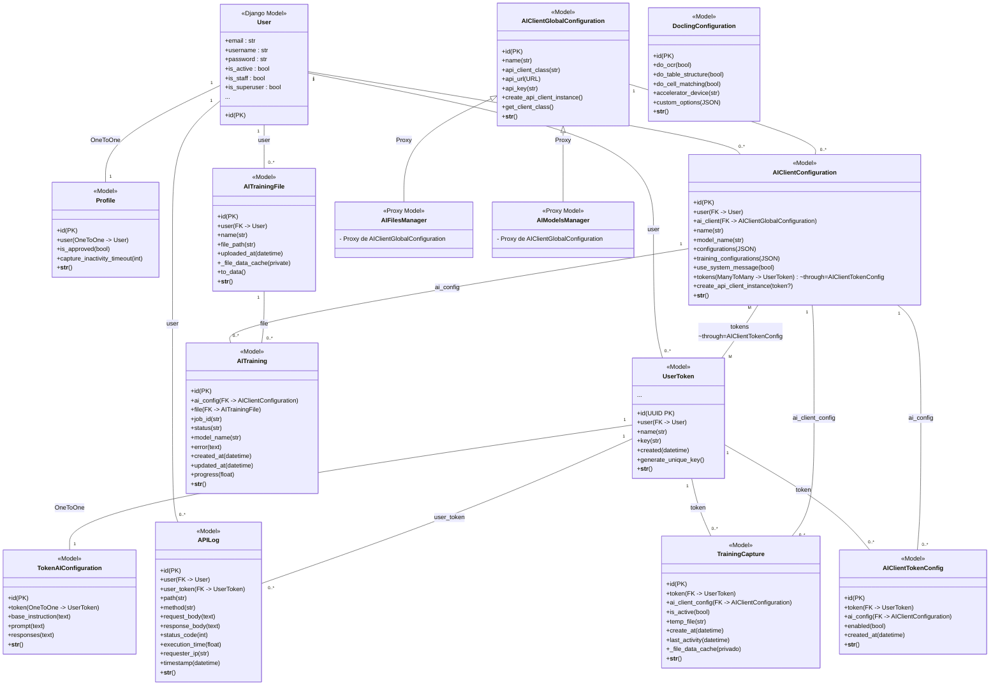
```mermaid
classDiagram

%% =========================
%% ENTIDADES DE ACCOUNTS
%% =========================
class User {
  <<Django Model>>
  +id (PK)
  +email : str
  +username : str
  +password : str
  +is_active : bool
  +is_staff : bool
  +is_superuser : bool
  ...
}

class Profile {
  <<Model>>
  +id (PK)
  +user (OneToOne -> User)
  +is_approved (bool)
  +capture_inactivity_timeout (int)
  +__str__()
}

class UserToken {
  <<Model>>
  +id (UUID PK)
  +user (FK -> User)
  +name (str)
  +key (str)
  +created (datetime)
  +generate_unique_key()
  +__str__()
  ...
}

%% =========================
%% ENTIDADES DE AI_CONFIG
%% =========================
class AIClientGlobalConfiguration {
  <<Model>>
  +id (PK)
  +name (str)
  +api_client_class (str)
  +api_url (URL)
  +api_key (str)
  +create_api_client_instance()
  +get_client_class()
  +__str__()
}

class AIClientConfiguration {
  <<Model>>
  +id (PK)
  +user (FK -> User)
  +ai_client (FK -> AIClientGlobalConfiguration)
  +name (str)
  +model_name (str)
  +configurations (JSON)
  +training_configurations (JSON)
  +use_system_message (bool)
  +tokens (ManyToMany -> UserToken) ~through=AIClientTokenConfig
  +create_api_client_instance(token?)
  +__str__()
}

class AIClientTokenConfig {
  <<Model>>
  +id (PK)
  +token (FK -> UserToken)
  +ai_config (FK -> AIClientConfiguration)
  +enabled (bool)
  +created_at (datetime)
  +__str__()
}

class AITrainingFile {
  <<Model>>
  +id (PK)
  +user (FK -> User)
  +name (str)
  +file_path (str)
  +uploaded_at (datetime)
  +_file_data_cache (private)
  +to_data()
  +__str__()
}

class AIFilesManager {
  <<Proxy Model>>
  - Proxy de AIClientGlobalConfiguration
}

class AIModelsManager {
  <<Proxy Model>>
  - Proxy de AIClientGlobalConfiguration
}

class TokenAIConfiguration {
  <<Model>>
  +id (PK)
  +token (OneToOne -> UserToken)
  +base_instruction (text)
  +prompt (text)
  +responses (text)
  +__str__()
}

class TrainingCapture {
  <<Model>>
  +id (PK)
  +token (FK -> UserToken)
  +ai_client_config (FK -> AIClientConfiguration)
  +is_active (bool)
  +temp_file (str)
  +create_at (datetime)
  +last_activity (datetime)
  +_file_data_cache (privado)
  +__str__()
}

class DoclingConfiguration {
  <<Model>>
  +id (PK)
  +do_ocr (bool)
  +do_table_structure (bool)
  +do_cell_matching (bool)
  +accelerator_device (str)
  +custom_options (JSON)
  +__str__()
}

class AITraining {
  <<Model>>
  +id (PK)
  +ai_config (FK -> AIClientConfiguration)
  +file (FK -> AITrainingFile)
  +job_id (str)
  +status (str)
  +model_name (str)
  +error (text)
  +created_at (datetime)
  +updated_at (datetime)
  +progress (float)
  +__str__()
}

%% =========================
%% ENTIDADES DE API
%% =========================
class APILog {
  <<Model>>
  +id (PK)
  +user (FK -> User)
  +user_token (FK -> UserToken)
  +path (str)
  +method (str)
  +request_body (text)
  +response_body (text)
  +status_code (int)
  +execution_time (float)
  +requester_ip (str)
  +timestamp (datetime)
  +__str__()
}

%% =========================
%% RELAÇÕES ENTRE AS CLASSES
%% =========================

User "1" -- "1" Profile : OneToOne
User "1" -- "0..*" UserToken : user
User "1" -- "0..*" AITrainingFile : user
User "1" -- "0..*" AIClientConfiguration : user
User "1" -- "0..*" APILog : user

UserToken "1" -- "1" TokenAIConfiguration : OneToOne
UserToken "1" -- "0..*" APILog : user_token
UserToken "1" -- "0..*" TrainingCapture : token
UserToken "1" -- "0..*" AIClientTokenConfig : token

AIClientGlobalConfiguration "1" -- "0..*" AIClientConfiguration : ai_client
AIClientGlobalConfiguration <|-- AIFilesManager : Proxy
AIClientGlobalConfiguration <|-- AIModelsManager : Proxy

AIClientConfiguration "1" -- "0..*" TrainingCapture : ai_client_config
AIClientConfiguration "1" -- "0..*" AITraining : ai_config
AIClientConfiguration "1" -- "0..*" AIClientTokenConfig : ai_config
AIClientConfiguration "M" -- "M" UserToken : tokens ~through=AIClientTokenConfig

AITrainingFile "1" -- "0..*" AITraining : file
```

---

### Diagramas de Sequência

### 1. Autenticação e Gerenciamento de Usuários

#### 1.1. Processo de Registro e Confirmação de Email

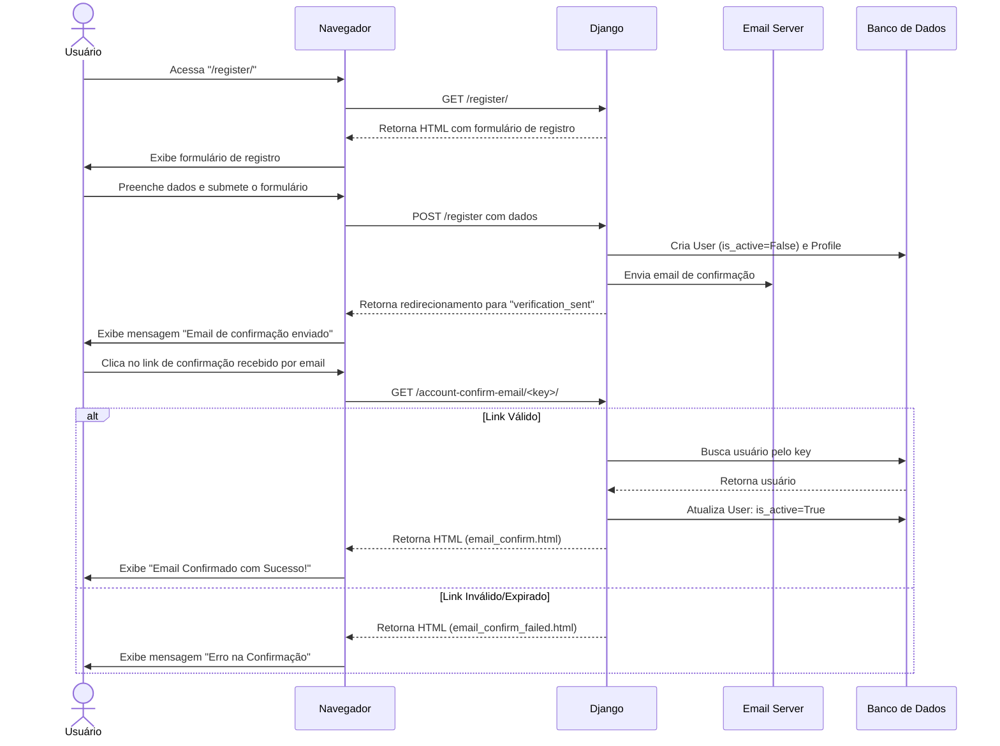
```mermaid
sequenceDiagram
    actor U as Usuário
    participant N as Navegador
    participant D as Django
    participant E as Email Server
    participant DB as Banco de Dados

    U->>N: Acessa "/register/"
    N->>D: GET /register/
    D-->>N: Retorna HTML com formulário de registro
    N->>U: Exibe formulário de registro
    U->>N: Preenche dados e submete o formulário
    N->>D: POST /register com dados
    D->>DB: Cria User (is_active=False) e Profile
    D->>E: Envia email de confirmação
    D-->>N: Retorna redirecionamento para "verification_sent"
    N->>U: Exibe mensagem "Email de confirmação enviado"
    U->>N: Clica no link de confirmação recebido por email
    N->>D: GET /account-confirm-email/<key>/
    alt Link Válido
        D->>DB: Busca usuário pelo key
        DB-->>D: Retorna usuário
        D->>DB: Atualiza User: is_active=True
        D-->>N: Retorna HTML (email_confirm.html)
        N->>U: Exibe "Email Confirmado com Sucesso!"
    else Link Inválido/Expirado
        D-->>N: Retorna HTML (email_confirm_failed.html)
        N->>U: Exibe mensagem "Erro na Confirmação"
    end
```

#### 1.2. Processo de Login com Email

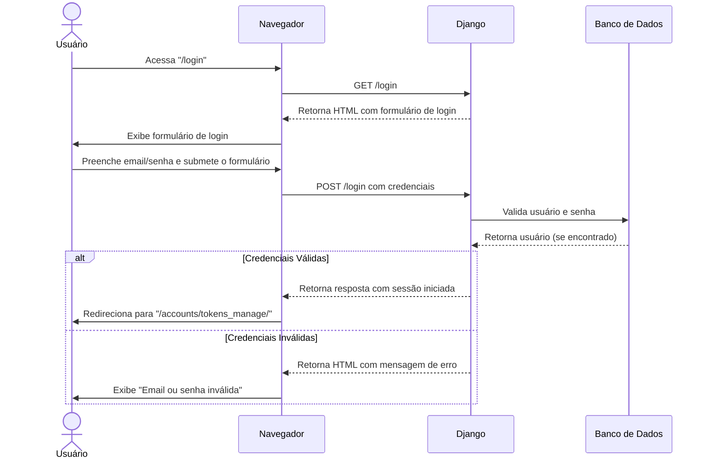
```mermaid
sequenceDiagram
    actor U as Usuário
    participant N as Navegador
    participant D as Django
    participant DB as Banco de Dados

    U->>N: Acessa "/login"
    N->>D: GET /login
    D-->>N: Retorna HTML com formulário de login
    N->>U: Exibe formulário de login
    U->>N: Preenche email/senha e submete o formulário
    N->>D: POST /login com credenciais
    D->>DB: Valida usuário e senha
    DB-->>D: Retorna usuário (se encontrado)
    alt Credenciais Válidas
        D-->>N: Retorna resposta com sessão iniciada
        N->>U: Redireciona para "/accounts/tokens_manage/"
    else Credenciais Inválidas
        D-->>N: Retorna HTML com mensagem de erro
        N->>U: Exibe "Email ou senha inválida"
    end
```

#### 1.3. Processo de Reset de Senha

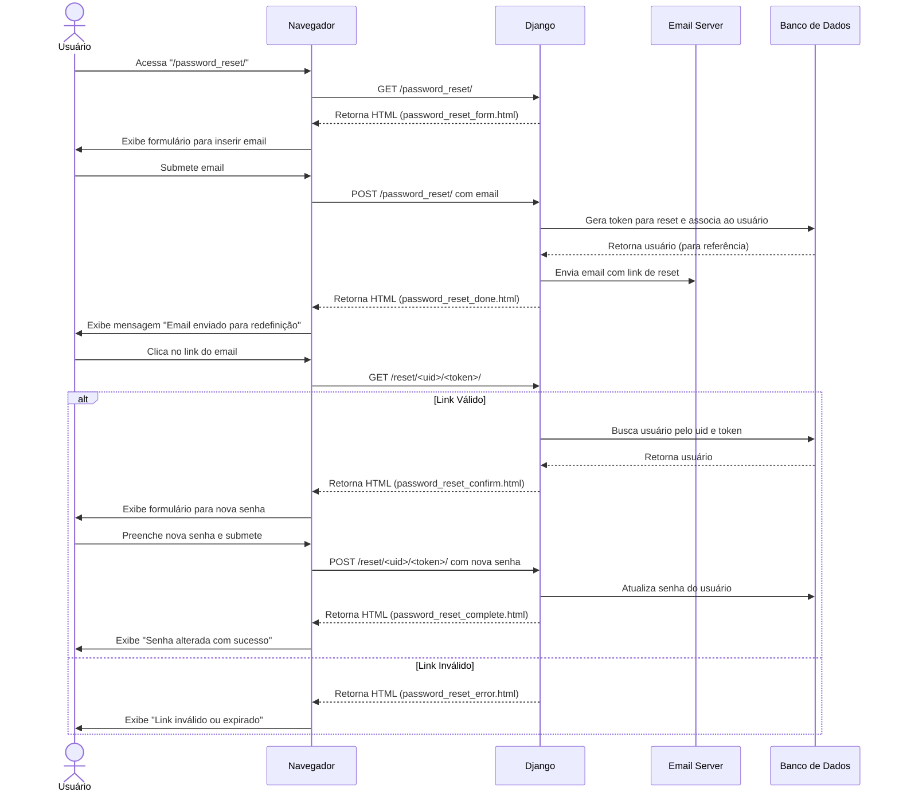
```mermaid
sequenceDiagram
    actor U as Usuário
    participant N as Navegador
    participant D as Django
    participant E as Email Server
    participant DB as Banco de Dados

    U->>N: Acessa "/password_reset/"
    N->>D: GET /password_reset/
    D-->>N: Retorna HTML (password_reset_form.html)
    N->>U: Exibe formulário para inserir email
    U->>N: Submete email
    N->>D: POST /password_reset/ com email
    D->>DB: Gera token para reset e associa ao usuário
    DB-->>D: Retorna usuário (para referência)
    D->>E: Envia email com link de reset
    D-->>N: Retorna HTML (password_reset_done.html)
    N->>U: Exibe mensagem "Email enviado para redefinição"
    U->>N: Clica no link do email
    N->>D: GET /reset/<uid>/<token>/
    alt Link Válido
        D->>DB: Busca usuário pelo uid e token
        DB-->>D: Retorna usuário
        D-->>N: Retorna HTML (password_reset_confirm.html)
        N->>U: Exibe formulário para nova senha
        U->>N: Preenche nova senha e submete
        N->>D: POST /reset/<uid>/<token>/ com nova senha
        D->>DB: Atualiza senha do usuário
        D-->>N: Retorna HTML (password_reset_complete.html)
        N->>U: Exibe "Senha alterada com sucesso"
    else Link Inválido
        D-->>N: Retorna HTML (password_reset_error.html)
        N->>U: Exibe "Link inválido ou expirado"
    end
```

---

### 2. Processo de Gerenciamento de Tokens

#### 2.1. Criação de Token

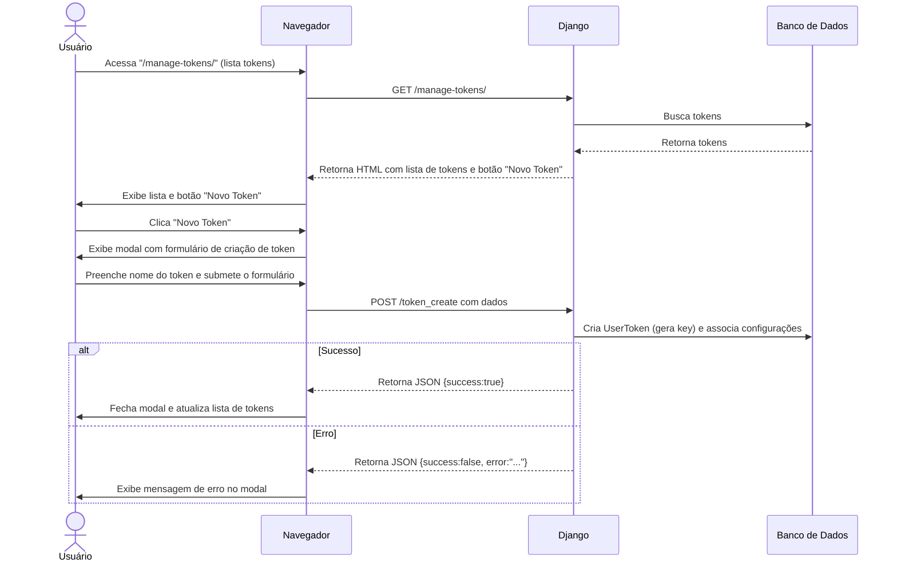
```mermaid
sequenceDiagram
    actor U as Usuário
    participant N as Navegador
    participant D as Django
    participant DB as Banco de Dados

    U->>N: Acessa "/manage-tokens/" (lista tokens)
    N->>D: GET /manage-tokens/
    D->>DB: Busca tokens
    DB-->>D: Retorna tokens
    D-->>N: Retorna HTML com lista de tokens e botão "Novo Token"
    N->>U: Exibe lista e botão "Novo Token"
    U->>N: Clica "Novo Token"
    N->>U: Exibe modal com formulário de criação de token
    U->>N: Preenche nome do token e submete o formulário
    N->>D: POST /token_create com dados
    D->>DB: Cria UserToken (gera key) e associa configurações
    alt Sucesso
        D-->>N: Retorna JSON {success:true}
        N->>U: Fecha modal e atualiza lista de tokens
    else Erro
        D-->>N: Retorna JSON {success:false, error:"..."}
        N->>U: Exibe mensagem de erro no modal
    end
```

#### 2.2. Exclusão de Token

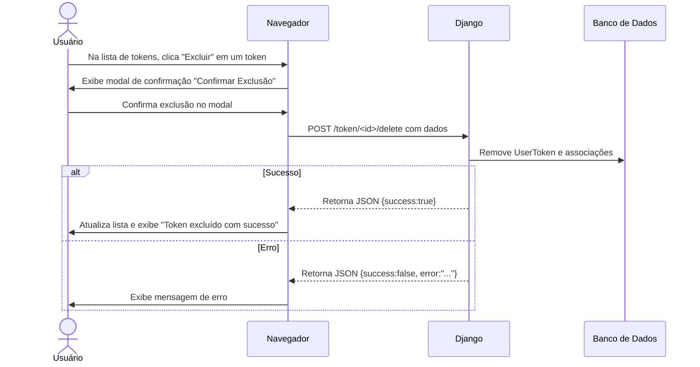
```mermaid
sequenceDiagram
    actor U as Usuário
    participant N as Navegador
    participant D as Django
    participant DB as Banco de Dados

    U->>N: Na lista de tokens, clica "Excluir" em um token
    N->>U: Exibe modal de confirmação "Confirmar Exclusão"
    U->>N: Confirma exclusão no modal
    N->>D: POST /token/<id>/delete com dados
    D->>DB: Remove UserToken e associações
    alt Sucesso
        D-->>N: Retorna JSON {success:true}
        N->>U: Atualiza lista e exibe "Token excluído com sucesso"
    else Erro
        D-->>N: Retorna JSON {success:false, error:"..."}
        N->>U: Exibe mensagem de erro
    end
```

---

### 3. Configuração de IA

#### 3.1. Criação de Configuração Global de IA

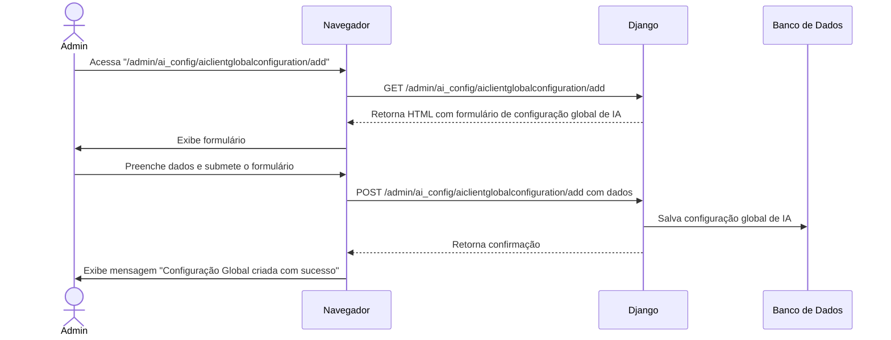
```mermaid
sequenceDiagram
    actor A as Admin
    participant N as Navegador
    participant D as Django
    participant DB as Banco de Dados

    A->>N: Acessa "/admin/ai_config/aiclientglobalconfiguration/add"
    N->>D: GET /admin/ai_config/aiclientglobalconfiguration/add
    D-->>N: Retorna HTML com formulário de configuração global de IA
    N->>A: Exibe formulário
    A->>N: Preenche dados e submete o formulário
    N->>D: POST /admin/ai_config/aiclientglobalconfiguration/add com dados
    D->>DB: Salva configuração global de IA
    D-->>N: Retorna confirmação
    N->>A: Exibe mensagem "Configuração Global criada com sucesso"
```

#### 3.2. Configuração de IA

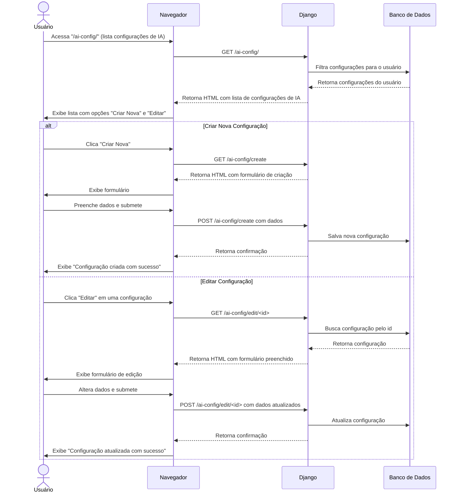
```mermaid
sequenceDiagram
    actor U as Usuário
    participant N as Navegador
    participant D as Django
    participant DB as Banco de Dados

    U->>N: Acessa "/ai-config/" (lista configurações de IA)
    N->>D: GET /ai-config/
    D->>DB: Filtra configurações para o usuário
    DB-->>D: Retorna configurações do usuário
    D-->>N: Retorna HTML com lista de configurações de IA
    N->>U: Exibe lista com opções "Criar Nova" e "Editar"
    alt Criar Nova Configuração
        U->>N: Clica "Criar Nova"
        N->>D: GET /ai-config/create
        D-->>N: Retorna HTML com formulário de criação
        N->>U: Exibe formulário
        U->>N: Preenche dados e submete
        N->>D: POST /ai-config/create com dados
        D->>DB: Salva nova configuração
        D-->>N: Retorna confirmação
        N->>U: Exibe "Configuração criada com sucesso"
    else Editar Configuração
        U->>N: Clica "Editar" em uma configuração
        N->>D: GET /ai-config/edit/<id>
        D->>DB: Busca configuração pelo id
        DB-->>D: Retorna configuração
        D-->>N: Retorna HTML com formulário preenchido
        N->>U: Exibe formulário de edição
        U->>N: Altera dados e submete
        N->>D: POST /ai-config/edit/<id> com dados atualizados
        D->>DB: Atualiza configuração
        D-->>N: Retorna confirmação
        N->>U: Exibe "Configuração atualizada com sucesso"
    end
```

#### 3.3. Gestão de Instruções e Prompts

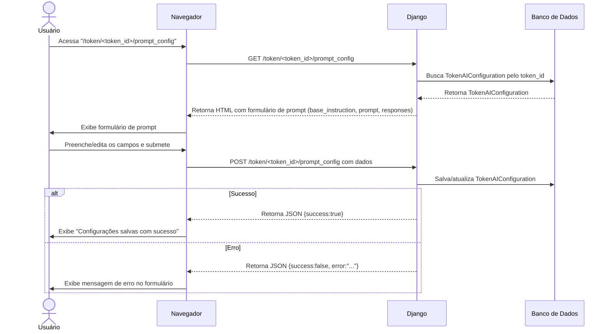
```mermaid
sequenceDiagram
    actor U as Usuário
    participant N as Navegador
    participant D as Django
    participant DB as Banco de Dados

    U->>N: Acessa "/token/<token_id>/prompt_config"
    N->>D: GET /token/<token_id>/prompt_config
    D->>DB: Busca TokenAIConfiguration pelo token_id
    DB-->>D: Retorna TokenAIConfiguration
    D-->>N: Retorna HTML com formulário de prompt (base_instruction, prompt, responses)
    N->>U: Exibe formulário de prompt
    U->>N: Preenche/edita os campos e submete
    N->>D: POST /token/<token_id>/prompt_config com dados
    D->>DB: Salva/atualiza TokenAIConfiguration
    alt Sucesso
        D-->>N: Retorna JSON {success:true}
        N->>U: Exibe "Configurações salvas com sucesso"
    else Erro
        D-->>N: Retorna JSON {success:false, error:"..."}
        N->>U: Exibe mensagem de erro no formulário
    end
```

---

### 4. Processo de Treinamento

#### 4.1. Treinamento de Modelo de IA

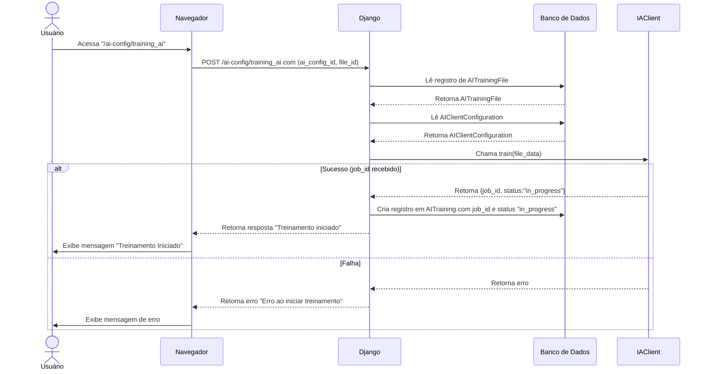
```mermaid
sequenceDiagram
    actor U as Usuário
    participant N as Navegador
    participant D as Django
    participant DB as Banco de Dados
    participant IA as IAClient

    U->>N: Acessa "/ai-config/training_ai"
    N->>D: POST /ai-config/training_ai com (ai_config_id, file_id)
    D->>DB: Lê registro de AITrainingFile
    DB-->>D: Retorna AITrainingFile
    D->>DB: Lê AIClientConfiguration
    DB-->>D: Retorna AIClientConfiguration
    D->>IA: Chama train(file_data)
    alt Sucesso (job_id recebido)
        IA-->>D: Retorna {job_id, status:"in_progress"}
        D->>DB: Cria registro em AITraining com job_id e status "in_progress"
        D-->>N: Retorna resposta "Treinamento iniciado"
        N->>U: Exibe mensagem "Treinamento Iniciado"
    else Falha
        IA-->>D: Retorna erro
        D-->>N: Retorna erro "Erro ao iniciar treinamento"
        N->>U: Exibe mensagem de erro
    end
```

#### 4.2. Upload de Arquivo de Treinamento

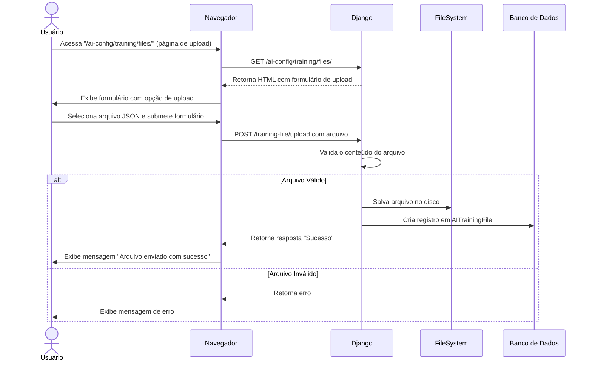
```mermaid
sequenceDiagram
    actor U as Usuário
    participant N as Navegador
    participant D as Django
    participant FS as FileSystem
    participant DB as Banco de Dados

    U->>N: Acessa "/ai-config/training/files/" (página de upload)
    N->>D: GET /ai-config/training/files/
    D-->>N: Retorna HTML com formulário de upload
    N->>U: Exibe formulário com opção de upload
    U->>N: Seleciona arquivo JSON e submete formulário
    N->>D: POST /training-file/upload com arquivo
    D->>D: Valida o conteúdo do arquivo
    alt Arquivo Válido
        D->>FS: Salva arquivo no disco
        D->>DB: Cria registro em AITrainingFile
        D-->>N: Retorna resposta "Sucesso"
        N->>U: Exibe mensagem "Arquivo enviado com sucesso"
    else Arquivo Inválido
        D-->>N: Retorna erro
        N->>U: Exibe mensagem de erro
    end
```

#### 4.3. Captura de Exemplos de Treinamento

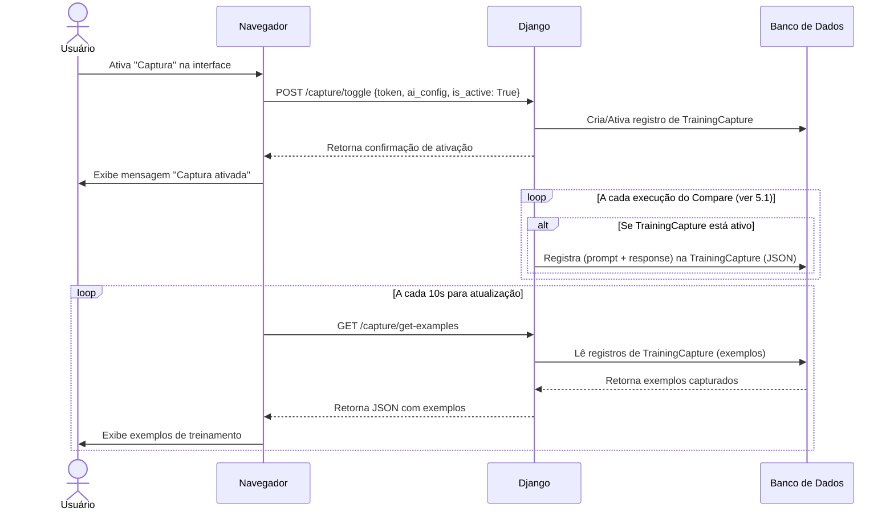
```mermaid
sequenceDiagram
    actor U as Usuário
    participant N as Navegador
    participant D as Django
    participant DB as Banco de Dados

    U->>N: Ativa "Captura" na interface
    N->>D: POST /capture/toggle {token, ai_config, is_active: True}
    D->>DB: Cria/Ativa registro de TrainingCapture
    D-->>N: Retorna confirmação de ativação
    N->>U: Exibe mensagem "Captura ativada"
    
    loop A cada execução do Compare (ver 5.1)
        alt Se TrainingCapture está ativo
            D->>DB: Registra (prompt + response) na TrainingCapture (JSON)
        end
    end

    loop A cada 10s para atualização
        N->>D: GET /capture/get-examples
        D->>DB: Lê registros de TrainingCapture (exemplos)
        DB-->>D: Retorna exemplos capturados
        D-->>N: Retorna JSON com exemplos
        N->>U: Exibe exemplos de treinamento
    end
```

#### 4.4. Processamento de Arquivo de Treinamento

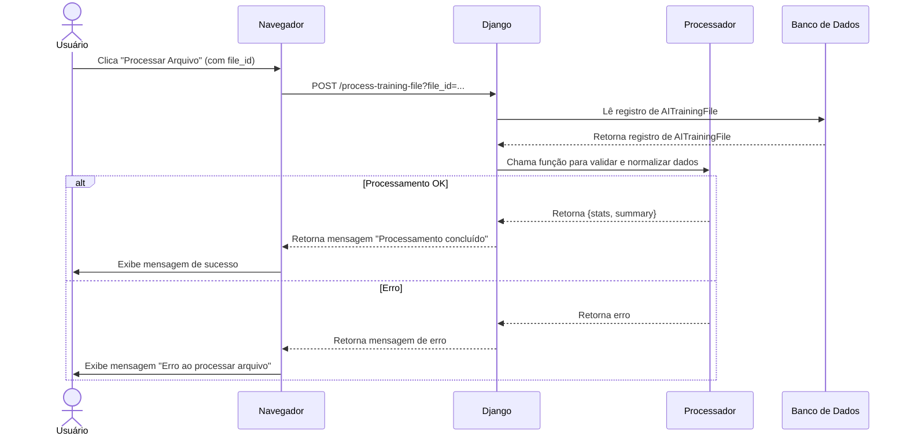
```mermaid
sequenceDiagram
    actor U as Usuário
    participant N as Navegador
    participant D as Django
    participant P as Processador
    participant DB as Banco de Dados

    U->>N: Clica "Processar Arquivo" (com file_id)
    N->>D: POST /process-training-file?file_id=...
    D->>DB: Lê registro de AITrainingFile
    DB-->>D: Retorna registro de AITrainingFile
    D->>P: Chama função para validar e normalizar dados
    alt Processamento OK
        P-->>D: Retorna {stats, summary}
        D-->>N: Retorna mensagem "Processamento concluído"
        N->>U: Exibe mensagem de sucesso
    else Erro
        P-->>D: Retorna erro
        D-->>N: Retorna mensagem de erro
        N->>U: Exibe mensagem "Erro ao processar arquivo"
    end
```

---

### 5. Processos da API

#### 5.1. Processo de Comparação

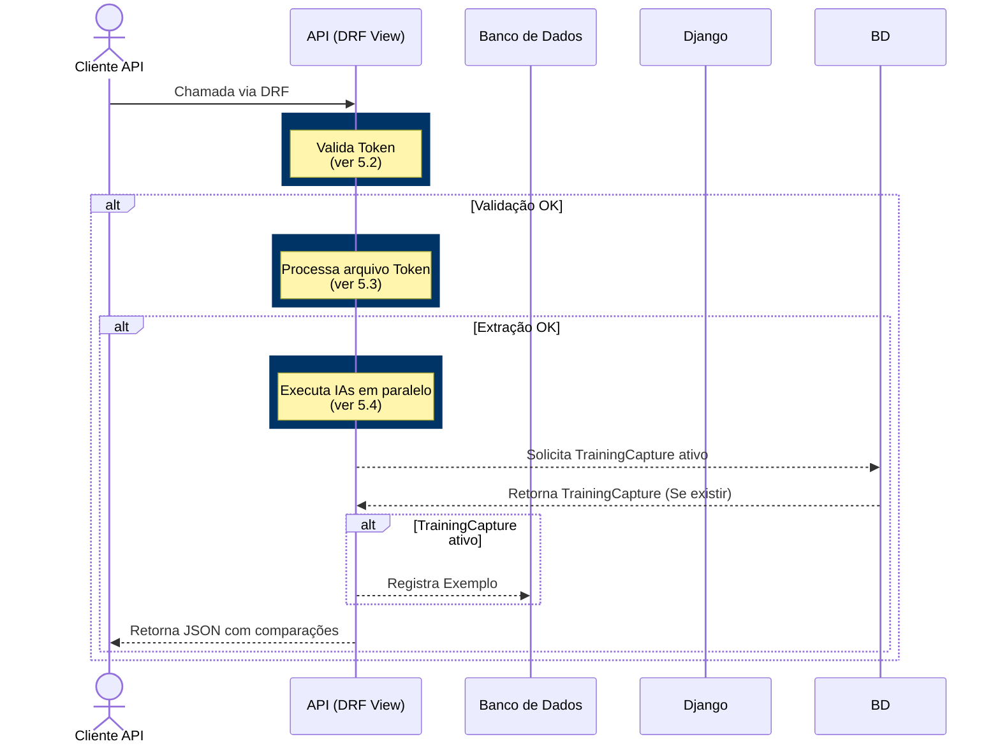
```mermaid
sequenceDiagram
    actor C as Cliente API
    participant E as API (DRF View)
    participant DB as Banco de Dados
    participant D as Django

   
    C->>E: Chamada via DRF
    rect rgb(0, 51, 102)
      Note over E: Valida Token<br>(ver 5.2)
    end
    alt Validação OK
        rect rgb(0, 51, 102)
            Note over E: Processa arquivo Token<br>(ver 5.3)
        end
        alt Extração OK
            rect rgb(0, 51, 102)
                Note over E: Executa IAs em paralelo<br>(ver 5.4)
            end
            E-->>BD: Solicita TrainingCapture ativo
            BD-->>E: Retorna TrainingCapture (Se existir)
            alt TrainingCapture ativo
                E-->>DB: Registra Exemplo
            end
            E-->>C: Retorna JSON com comparações
        end
    end
```

#### 5.2. Validação de Token e Configurações

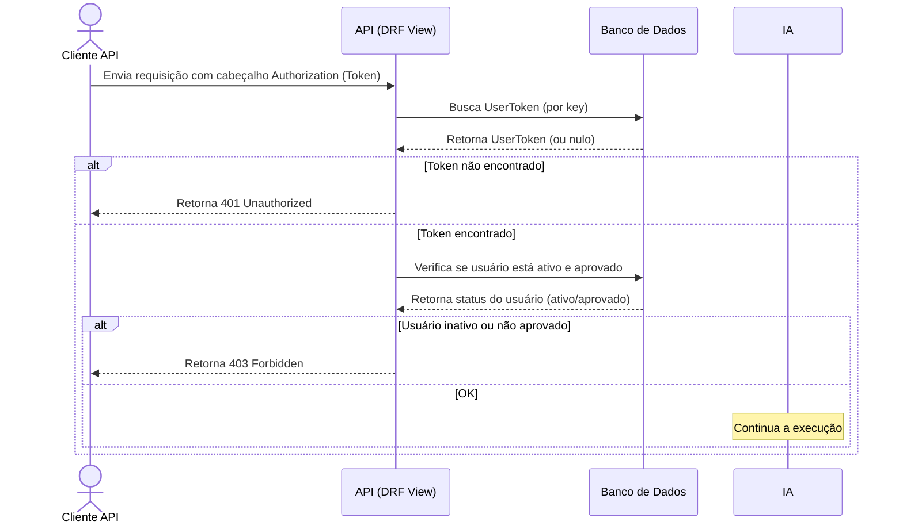
```mermaid
sequenceDiagram
    actor C as Cliente API
    participant D as API (DRF View)
    participant DB as Banco de Dados

    C->>D: Envia requisição com cabeçalho Authorization (Token)
    D->>DB: Busca UserToken (por key)
    DB-->>D: Retorna UserToken (ou nulo)
    alt Token não encontrado
        D-->>C: Retorna 401 Unauthorized
    else Token encontrado
        D->>DB: Verifica se usuário está ativo e aprovado
        DB-->>D: Retorna status do usuário (ativo/aprovado)
        alt Usuário inativo ou não aprovado
            D-->>C: Retorna 403 Forbidden
        else OK
           Note over IA: Continua a execução
        end
    end
```

#### 5.3. Processamento de Arquivos (PDF/DOCX)

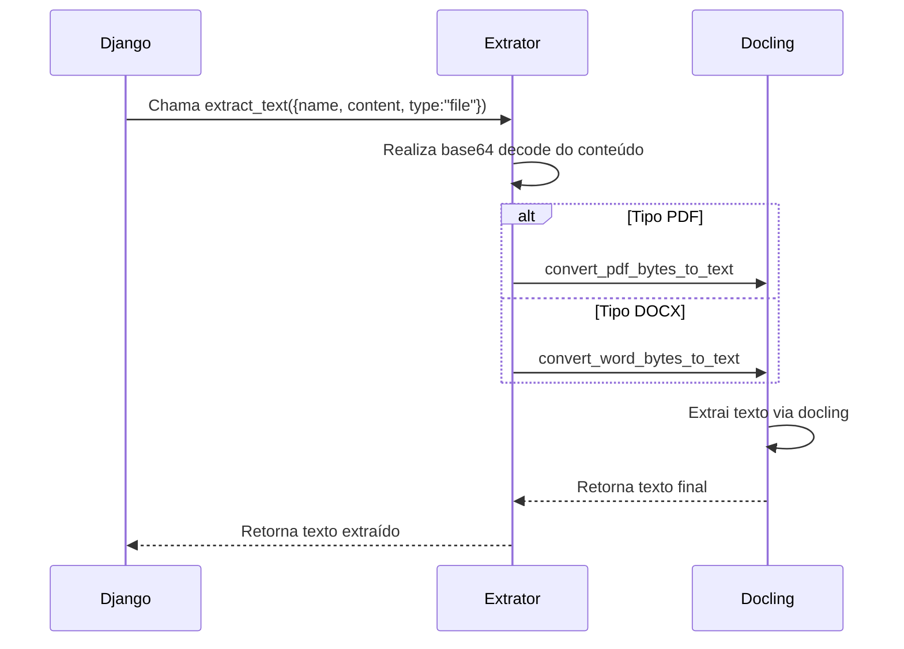
```mermaid
sequenceDiagram
    participant D as Django
    participant EX as Extrator
    participant DC as Docling

    D->>EX: Chama extract_text({name, content, type:"file"})
    EX->>EX: Realiza base64 decode do conteúdo
    alt Tipo PDF
        EX->>DC: convert_pdf_bytes_to_text
    else Tipo DOCX
        EX->>DC: convert_word_bytes_to_text
    end
    DC->>DC: Extrai texto via docling
    DC-->>EX: Retorna texto final
    EX-->>D: Retorna texto extraído
```


#### 5.4. Execução Paralela de IAs

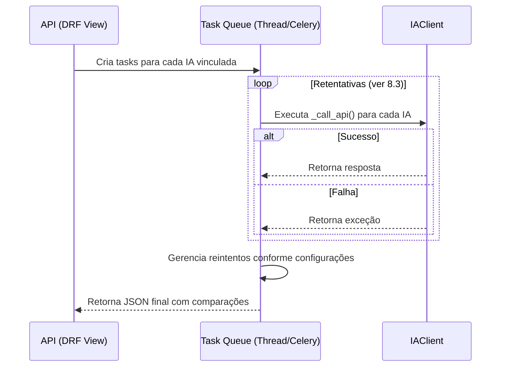
```mermaid
sequenceDiagram
    participant D as API (DRF View)
    participant TQ as Task Queue (Thread/Celery)
    participant IA as IAClient

    D->>TQ: Cria tasks para cada IA vinculada
    loop Retentativas (ver 8.3)
        TQ->>IA: Executa _call_api() para cada IA
        alt Sucesso
            IA-->>TQ: Retorna resposta
        else Falha
            IA-->>TQ: Retorna exceção
        end
    end
    TQ->>TQ: Gerencia reintentos conforme configurações
    TQ-->>D: Retorna JSON final com comparações
```

---

### 6. Fluxos de Administração

#### 6.1. Gerenciamento de Configurações Globais

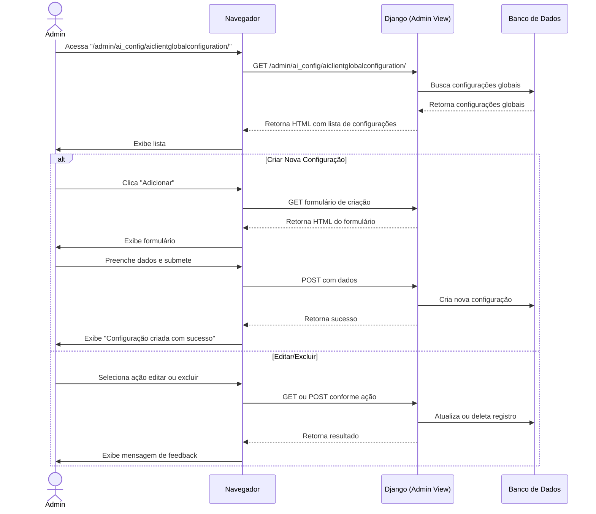
```mermaid
sequenceDiagram
    actor A as Admin
    participant N as Navegador
    participant D as Django (Admin View)
    participant DB as Banco de Dados

    A->>N: Acessa "/admin/ai_config/aiclientglobalconfiguration/"
    N->>D: GET /admin/ai_config/aiclientglobalconfiguration/
    D->>DB: Busca configurações globais
    DB-->>D: Retorna configurações globais
    D-->>N: Retorna HTML com lista de configurações
    N->>A: Exibe lista
    alt Criar Nova Configuração
        A->>N: Clica "Adicionar"
        N->>D: GET formulário de criação
        D-->>N: Retorna HTML do formulário
        N->>A: Exibe formulário
        A->>N: Preenche dados e submete
        N->>D: POST com dados
        D->>DB: Cria nova configuração
        D-->>N: Retorna sucesso
        N->>A: Exibe "Configuração criada com sucesso"
    else Editar/Excluir
        A->>N: Seleciona ação editar ou excluir
        N->>D: GET ou POST conforme ação
        D->>DB: Atualiza ou deleta registro
        D-->>N: Retorna resultado
        N->>A: Exibe mensagem de feedback
    end
```

#### 6.2. Aprovação de Usuários

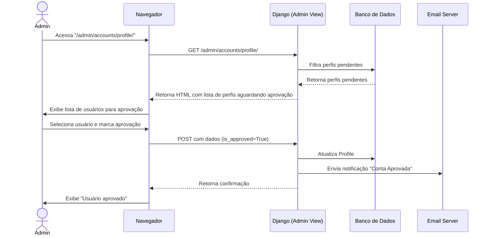
```mermaid
sequenceDiagram
    actor A as Admin
    participant N as Navegador
    participant D as Django (Admin View)
    participant DB as Banco de Dados
    participant E as Email Server

    A->>N: Acessa "/admin/accounts/profile/"
    N->>D: GET /admin/accounts/profile/
    D->>DB: Filtra perfis pendentes
    DB-->>D: Retorna perfis pendentes
    D-->>N: Retorna HTML com lista de perfis aguardando aprovação
    N->>A: Exibe lista de usuários para aprovação
    A->>N: Seleciona usuário e marca aprovação
    N->>D: POST com dados (is_approved=True)
    D->>DB: Atualiza Profile
    D->>E: Envia notificação "Conta Aprovada"
    D-->>N: Retorna confirmação
    N->>A: Exibe "Usuário aprovado"
```

#### 6.3. Monitoramento de Uso da API

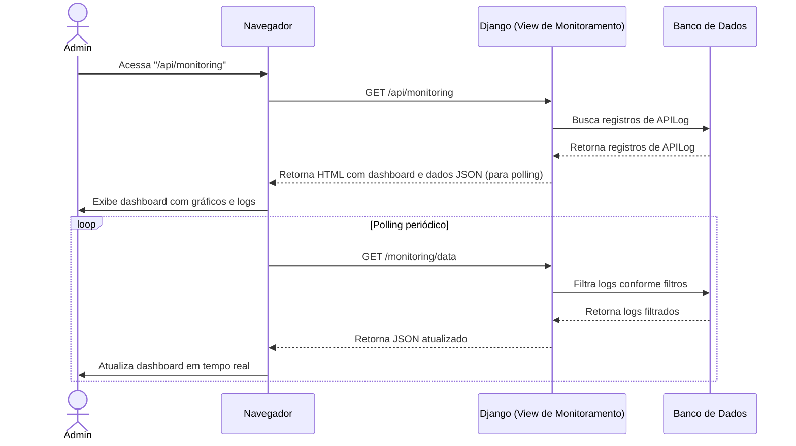
```mermaid
sequenceDiagram
    actor A as Admin
    participant N as Navegador
    participant D as Django (View de Monitoramento)
    participant DB as Banco de Dados

    A->>N: Acessa "/api/monitoring"
    N->>D: GET /api/monitoring
    D->>DB: Busca registros de APILog
    DB-->>D: Retorna registros de APILog
    D-->>N: Retorna HTML com dashboard e dados JSON (para polling)
    N->>A: Exibe dashboard com gráficos e logs
    loop Polling periódico
        N->>D: GET /monitoring/data
        D->>DB: Filtra logs conforme filtros
        DB-->>D: Retorna logs filtrados
        D-->>N: Retorna JSON atualizado
        N->>A: Atualiza dashboard em tempo real
    end
```

#### 6.4. Gestão de Arquivos de Treinamento

```mermaid
sequenceDiagram
    actor A as Admin
    participant N as Navegador
    participant D as Django
    participant FS as FileSystem
    participant DB as Banco de Dados

    A->>N: Acessa "/admin/ai_config/aitrainingfile/"
    N->>D: GET /admin/ai_config/aitrainingfile/
    D->>DB: Busca registros de arquivos de treinamento
    DB-->>D: Retorna registros de arquivos
    D-->>N: Retorna HTML com lista de arquivos
    N->>A: Exibe lista com opções "Revisar" e "Excluir"
    alt Revisar Arquivo
        A->>N: Clica "Revisar"
        N->>D: GET /aitrainingfile/<id>/
        D->>FS: Lê arquivo do disco
        FS-->>D: Retorna conteúdo do arquivo
        D-->>N: Retorna HTML com detalhes do arquivo
        N->>A: Exibe detalhes do arquivo
    else Excluir Arquivo
        A->>N: Clica "Excluir"
        N->>D: POST /aitrainingfile/<id>/delete
        D->>FS: Remove arquivo
        D->>DB: Deleta registro
        D-->>N: Retorna confirmação
        N->>A: Exibe "Arquivo excluído"
    end
```

---

### 7. Fluxo Genérico de Integração com IAs

```mermaid
sequenceDiagram
    actor C as Cliente
    participant D as Django
    participant IA as IAClient
    participant API as Serviço Externo
    participant Cache as Sistema de Cache

    C->>D: Envia requisição (/api/v1/compare)
    D->>IA: Chama compare()
    rect rgb(0, 51, 102)
      Note over IA: Verifica se o CircuitBreaker está Aberto (se OPEN, interrompe chamada)
    end
    IA->>IA: Prepara prompts e dados de entrada
    IA->>API: Chama endpoint de comparação
    alt Resposta bem-sucedida
        API-->>IA: Retorna resposta com dados de comparação
        IA->>Cache: Armazena resposta (se habilitado)
        IA-->>D: Retorna resposta final
        D->>C: Envia JSON com dados da comparação
    else Falha na chamada
        API-->>IA: Retorna erro (4xx/5xx)
        IA-->>D: Propaga exceção
        D->>C: Retorna erro "Serviço Indisponível"
    end
```

---

### 8. Fluxos de Erro

#### 8.1. Tratamento de Erros de API

```mermaid
sequenceDiagram
    actor C as Cliente
    participant D as Django
    participant H as Handler de Exceções (Django)
    participant L as Logger

    C->>D: Envia requisição que gera erro
    D->>H: Captura exceção durante o processamento
    H->>L: Registra stack trace do erro
    alt Erro de Validação (400)
        H-->>D: Retorna 400 com mensagem de erro
    else Erro de Autenticação (401)
        H-->>D: Retorna 401 Unauthorized
    else Erro de Permissão (403)
        H-->>D: Retorna 403 Forbidden
    else Erro Interno (500)
        H-->>D: Retorna 500 Internal Server Error
    end
    D->>C: Envia JSON com mensagem de erro
```

#### 8.2. Tratamento de Falhas de Comunicação (CircuitBreaker)

```mermaid
sequenceDiagram
    actor D as Django
    participant IA as IAClient
    participant CB as CircuitBreaker

    D->>CB: Tenta chamada à IA
    alt Circuit OPEN
        CB-->>D: Lança CircuitOpenError
    else Circuit CLOSED/HALF_OPEN
        D->>IA: Chama _call_api()
        alt Sucesso
            IA-->>D: Retorna resposta
        else Falha
            IA-->>D: Lança exceção
            D->>CB: Registra falha
        end
        IA->>D: Retorna resposta ou erro conforme resultado
    end
```

#### 8.3. Timeout e Retry

```mermaid
sequenceDiagram
    actor C as Cliente
    participant N as Navegador
    participant API as Serviço Externo (Comparação)
    participant T as Timer

    C->>N: Envia requisição para comparação
    N->>API: Chama endpoint de comparação
    alt Recebe timeout ou 429 (rate limit)
        API-->>N: Retorna timeout/429
        N->>T: Aguarda 2s
        N->>API: Tenta novamente (retry)
        alt Retry bem-sucedido
            API-->>N: Retorna resposta com dados de comparação
            N-->>C: Envia JSON com dados de comparação
        else Falha final
            N-->>C: Retorna erro "Serviço Indisponível"
        end
    else Sucesso na primeira tentativa
        API-->>N: Retorna resposta com dados de comparação
        N-->>C: Envia JSON com dados de comparação
    end
```

---

### 9. Fluxo de Tarefas (Celery)

#### 9.1. Atualização de Status de Treinamentos

```mermaid
sequenceDiagram
    participant Sch as Celery Beat
    participant W as Celery Worker
    participant DB as Banco de Dados
    participant IA as IAClient

    rect rgb(0, 51, 102)
      Note over Sch: Agenda tarefa update_training_status()
    end
    Sch->>W: Executa tarefa update_training_status()
    W->>DB: Busca registros de AITraining com status "in_progress"
    DB-->>W: Retorna registros de AITraining
    loop Para cada job
        W->>IA: Chama get_training_status(job_id)
        alt Job Concluído
            IA-->>W: Retorna {status:"succeeded", model_name:"..."}
            W->>DB: Atualiza registro para "completed" e salva model_name
        else Job Falhou
            IA-->>W: Retorna {status:"failed", error:"..."}
            W->>DB: Atualiza registro para "failed" e salva erro
        else Em Andamento
            IA-->>W: Retorna progresso
            W->>DB: Atualiza campo progress
        end
    end
    W-->>Sch: Retorna "OK"
```

---

## Desenvolvimento

### Como Contribuir

Contribuições são muito bem-vindas! Para contribuir:

1. Faça um _fork_ deste repositório.
2. Crie uma branch para sua feature ou correção:
   ```bash
   git checkout -b feature/minha-feature
   ```
3. Faça _commits_ com suas alterações, seguindo as convenções de código (PEP 8).
4. Execute os testes:
   ```bash
   python manage.py test
   ```
5. Envie sua branch para o repositório remoto:
   ```bash
   git push origin feature/minha-feature
   ```
6. Abra um Pull Request no repositório original, descrevendo suas alterações e referências a issues (se houver).

### Testes

> **Importante:** O projeto **possui** testes implementados para diversos módulos, incluindo `accounts/`, `ai_config/` e `api/`. Os testes abrangem autenticação, views, formulários, modelos e funcionalidades principais (como o *circuit breaker* e extração de arquivos).

Para executar todos os testes do projeto:
```bash
python manage.py test
```

> Se você desejar rodar testes de um app específico (ex.: só os testes de `accounts`):
```bash
python manage.py test accounts
```

### Tecnologias Utilizadas

Updated versions based on requirements.txt (exemplos):
- **Django (v4.2.7)**: Framework web principal.
- **Django REST Framework (v3.15.2)**: Criação dos endpoints REST.
- **Allauth e dj-rest-auth**: Gerenciamento de autenticação e registro de usuários.
- **Docling (v2.17.0)**: Extração de texto de documentos (PDF, DOCX).
- **python-dotenv (v1.0.0)**: Gerenciamento de variáveis de ambiente.
- **Requests (v2.32.3)**: Realização de requisições HTTP.
- **Gunicorn (v22.0.0)**: Servidor WSGI para produção.
- **Bootstrap (v5.3.2)**: Framework CSS para a interface.
- **TinyMCE (django-tinymce v4.1.0)**: Editor de texto (opcional).
- **Sphinx**: Geração de documentação (opcional).
- **Celery (última versão compatível)**: Para execução de tarefas assíncronas.

---

## Suporte

### FAQ

**Como recuperar minha senha?**  
Utilize a opção "Esqueci minha senha" na página de login para receber instruções via email.

**Meu token não está funcionando. O que fazer?**  
- Verifique se sua conta foi aprovada pelo administrador.  
- Confirme se o token foi criado corretamente na área de gerenciamento.  
- Assegure-se de enviar o token corretamente no header `Authorization`.

**Como configurar um novo cliente de IA?**  
Acesse o painel de administração (`/admin/`), vá para a seção "Global - Clientes de IA" e adicione uma nova configuração global, informando o nome, a classe do cliente (ex.: OpenAi, Gemini) e a chave de API. Em seguida, associe essa configuração ao seu token na área de gerenciamento de tokens.

**Como carregar um arquivo de treinamento?**  
Na área de gerenciamento de tokens, selecione o token desejado e utilize o formulário de upload para enviar o arquivo de treinamento. O arquivo deve ser codificado em base64 quando enviado via API.

**Quais formatos de arquivo são suportados?**  
A API suporta a extração de texto de arquivos PDF e DOCX, utilizando Docling.

**Como funciona a captura de exemplos (TrainingCapture)?**  
Durante o uso da API, se a captura estiver ativa, os exemplos (prompt e resposta) serão salvos temporariamente para que possam ser usados no treinamento futuro.

### Documentação Adicional

A documentação completa (gerada pelo Sphinx) está disponível na pasta `_build/html/` ou online (link a ser definido). Para gerar a documentação localmente:

```bash
cd docs
make html
```

### Contato

Para dúvidas ou suporte, abra uma _issue_ no GitHub ou envie um email para [diegogrosmann@gmail.com].

---

## Informações Legais

### Licença

Este projeto está licenciado sob a **MIT License**.

```
MIT License

Copyright (c) 2025 Diego Grosmann

Permission is hereby granted, free of charge, to any person obtaining a copy
of this software and associated documentation files (the "Software"), to deal
in the Software without restriction, including without limitation the rights
to use, copy, modify, merge, publish, distribute, sublicense, and/or sell
copies of the Software, and to permit persons to whom the Software is
furnished to do so, subject to the following conditions:

[O aviso de copyright acima e
este aviso de permissão devem ser incluídos em todas as cópias ou partes significativas do Software.]
```
